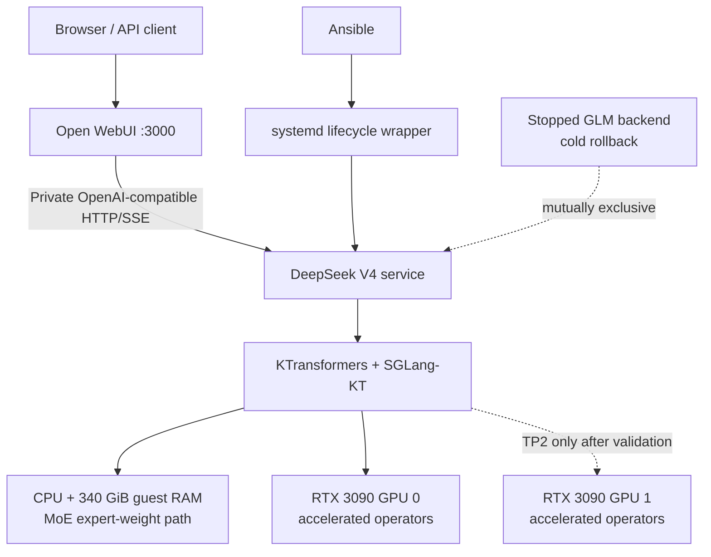
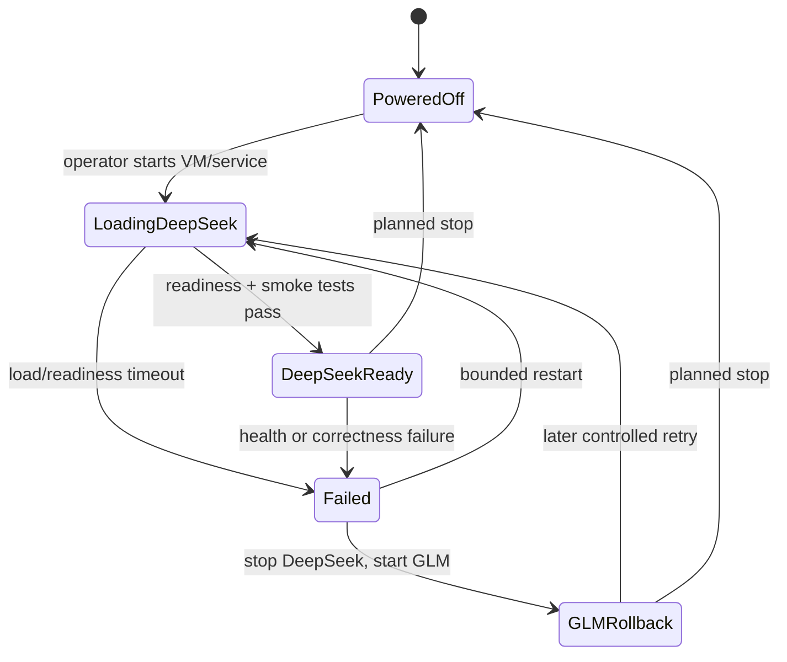
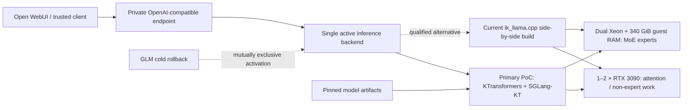

# Research Report: Technical

**Date:** 2026-08-13
**Author:** Will
**Research Type:** Technical

---

## Research Overview

本研究评估在现有 ESXi `llm-server` VM 中部署 `deepseek-ai/DeepSeek-V4-Flash-0731` 的技术与运维可行性。研究结合了本地 IaC、Ansible 角色和既有运行记录的只读审查，以及 DeepSeek、KTransformers、SGLang、NVIDIA、Broadcom 和 llama.cpp 系上游资料的实时核验；研究期间 VM 始终保持关机，未执行部署、下载或模型删除。

结论是“有条件可行”：两张 RTX 3090 的 48GB 总显存无法承载全 GPU 推理，但现有 340GiB 全预留 VM 内存可支撑 CPU/RAM 承载 MoE 专家、GPU 加速其余算子的异构路径。推荐以 KTransformers/SGLang-KT 的单卡 TP1、16K context、并发 1 作为首个正确性基线，再把当前版 `ik_llama.cpp` 的 Q4 CPU-MoE 路径作为交叉验证与回退候选；TP2、推测解码和更长上下文必须分别通过验收后才能提升。

最大的未知数不是“能否加载”，而是双 E5-2686 v4、DDR4-2133、ESXi NUMA 与实际 eGPU 拓扑下的速度、稳定性及 API 语义完整度。完整决策、门槛、路线图和来源见文末“Research Synthesis”。

---

<!-- Content will be appended sequentially through research workflow steps -->

## Technical Research Scope Confirmation

**Research Topic:** DeepSeek V4 Flash deployment feasibility on the existing ESXi LLM VM
**Research Goals:** Verify the target model and assess whether it can be deployed by reusing the existing ESXi LLM VM with 384 GB DDR4-2133 RAM and two RTX 3090 24 GB GPUs

**Technical Research Scope:**

- Architecture Analysis - model architecture, weight format, inference architecture, and ESXi GPU passthrough constraints
- Implementation Approaches - reuse of the existing LLM VM, deployment runtimes, quantization, and multi-GPU strategies
- Technology Stack - ESXi, guest operating system, NVIDIA driver/CUDA stack, inference server, and model tooling
- Integration Patterns - existing VM services, API compatibility, storage, networking, and operational integration
- Performance Considerations - VRAM/RAM capacity, PCIe/eGPU topology, memory bandwidth, context length, throughput, and latency

**Research Methodology:**

- Current web data with rigorous source verification
- Multi-source validation for critical technical claims
- Confidence level framework for uncertain information
- Comprehensive technical coverage with architecture-specific insights

**Scope Confirmed:** 2026-08-13

## Technology Stack Analysis

### 1. Target model identity and deployment meaning

The target is the official Hugging Face model [`deepseek-ai/DeepSeek-V4-Flash`](https://huggingface.co/deepseek-ai/DeepSeek-V4-Flash), not the similarly named GLM Flash model already present in the local inventory. For a new deployment, the preferred target is the newer official [`deepseek-ai/DeepSeek-V4-Flash-0731`](https://huggingface.co/deepseek-ai/DeepSeek-V4-Flash-0731), which supersedes the preview release.

The preview model card, the newer 0731 model card, and the preview [`config.json`](https://huggingface.co/deepseek-ai/DeepSeek-V4-Flash/blob/main/config.json) establish the capacity-critical facts:

- The preview/core model is a Mixture-of-Experts model with approximately 284 billion total parameters and 13 billion active parameters per token.
- 43 layers, 256 routed experts, and 6 routed experts selected per token.
- Native context limit of 1,048,576 tokens.
- Mixed FP4/FP8 checkpoint: routed expert weights are primarily FP4 and most remaining weights are FP8.
- The 0731 release adds an attached DSpark speculative-decoding module. Hugging Face reports approximately 304 billion parameters when this attached module is counted; the underlying Flash core retains the 284B/13B architecture.
- Official preview repository size is approximately 160 GB; the 0731 checkpoint is approximately 167 GB.
- MIT license.

The 13-billion “active parameter” figure describes core-model compute per generated token, not the amount of weight data that must remain accessible. Capacity planning must therefore use the roughly 160–167 GB checkpoint plus runtime workspace, not 13 GB.

**Preliminary fit:** the model cannot reside fully in the combined 48 GB VRAM of two RTX 3090 cards. A viable deployment must keep most expert weights in system RAM and use the GPUs for selected non-expert layers, attention, and other supported kernels. This is heterogeneous CPU/GPU inference, not a conventional full-GPU tensor-parallel deployment.

**Confidence:** High for model identity, architecture, checkpoint format, and the impossibility of full VRAM residency; medium for exact steady-state memory use because it depends on the selected runtime, quantization, context, and cache format.

### 2. Existing ESXi and VM stack

The repository already defines an appropriate base VM and does not justify provisioning a second VM:

| Layer | Existing implementation | DeepSeek V4 Flash assessment |
|---|---|---|
| Hypervisor | VMware ESXi with two GPUs assigned through DirectPath I/O | Reusable; passthrough is already configured rather than theoretical |
| Guest | Ubuntu 24.04-based `llm-server` VM | Reusable |
| Compute | 36 vCPU on a dual-Xeon E5-2686 v4 host | Functionally sufficient; likely the main throughput constraint |
| Memory | 340 GiB assigned, limited and fully reserved | Passes the 200 GB minimum published by KTransformers; leaves little host RAM for other workloads while powered on |
| GPU | Two RTX 3090 24 GB, 48 GB aggregate VRAM | Suitable only for heterogeneous acceleration |
| Firmware/MMIO | EFI, 64-bit MMIO enabled, 128 GB MMIO aperture, memory hot-add disabled | Correct baseline for dual-GPU passthrough |
| Storage | 600 GB thin-provisioned PVSCSI system disk on `Intel800GSSD`; models stored under `/data/models` | Capacity risk; current free space is unknown while the VM is powered off |
| Driver/toolkit | NVIDIA driver auto-installed and held; CUDA Toolkit 12.8 declared | Broadly compatible with current heterogeneous runtimes; installed driver version must be checked later |

Local evidence: [`terraform/esxi/llm-server.tf`](../../../terraform/esxi/llm-server.tf), [`terraform/esxi/variables.tf`](../../../terraform/esxi/variables.tf), [`ansible/roles/llm-server/defaults/main.yml`](../../../ansible/roles/llm-server/defaults/main.yml), and [`ansible/roles/llm-server/files/launch-llama.sh`](../../../ansible/roles/llm-server/files/launch-llama.sh).

VMDirectPath requires all configured VM memory to be reserved; the current Terraform already enforces this. Broadcom also documents UEFI/64-bit MMIO requirements and NUMA-locality risks for passthrough VMs with preallocated memory: [DirectPath configuration](https://knowledge.broadcom.com/external/article/309986/configuring-vmdirectpath-io-passthrough.html), [64-bit MMIO guidance](https://knowledge.broadcom.com/external/article/312208/vsphere-vmdirectpath-io-and-dynamic-dire.html), and [preallocated-memory NUMA behavior](https://knowledge.broadcom.com/external/article/326198/virtual-machines-with-preallocated-memor.html).

Because this workload reads CPU-resident MoE weights continuously, the dual-socket DDR4-2133 memory subsystem and virtual NUMA placement are more important than they would be for a fully GPU-resident model. The existing `numactl --interleave=all` policy is a reasonable baseline, but it is not evidence that ESXi has placed vCPUs, RAM, and both GPU PCI roots optimally. This must eventually be measured using guest NUMA data, `nvidia-smi topo -m`, and ESXi NUMA-locality counters.

The term “eGPU” remains an implementation risk. The stored PCI addresses indicate that ESXi currently sees two assignable PCI functions. If the cards use PCIe risers or OCuLink, that is materially safer than Thunderbolt enclosures; Thunderbolt hot-plug, reset, and PCI-address re-enumeration would reduce production reliability.

**Confidence:** High for the IaC-defined VM resources and current passthrough design; medium for physical topology and live driver/storage state because the VM is intentionally powered off and no live inspection has been performed.

### 3. GPU precision compatibility

RTX 3090 is an Ampere GA102 device with compute capability 8.6. It provides FP16/BF16/TF32/INT8/INT4 acceleration but not native FP8 or FP4 tensor-core execution. NVIDIA's current [TensorRT RTX support matrix](https://docs.nvidia.com/deeplearning/tensorrt-rtx/latest/getting-started/support-matrix-1/1.5.html) reflects this limitation.

Consequences:

- The official FP4/FP8 checkpoint cannot use the same optimized kernels used on Hopper or Blackwell GPUs.
- A runtime must provide Ampere-compatible fallback kernels, dequantization, or CPU execution.
- Generic claims that vLLM or SGLang “supports DeepSeek V4” do not imply that the model fits or performs correctly on 48 GB of SM86 VRAM.
- Joining two cards does not create a transparent 48 GB memory pool; the runtime must explicitly partition work and pay PCIe communication costs.

### 4. Runtime options

#### Option A — Current-generation `ik_llama.cpp` in a side-by-side installation

This option offers the lowest integration cost because the existing VM already uses `ikawrakow/ik_llama.cpp`, systemd instance services, an OpenAI-compatible endpoint on port 8080, model switching, and Open WebUI.

However, the installed source revision is pinned to `f7923739` for known-good MiniMax M2.5 behavior. DeepSeek V4 support was merged later in [`ik_llama.cpp` PR #2165](https://github.com/ikawrakow/ik_llama.cpp/pull/2165) on 2026-07-22, with follow-up optimizations in [PR #2169](https://github.com/ikawrakow/ik_llama.cpp/pull/2169) and [PR #2179](https://github.com/ikawrakow/ik_llama.cpp/pull/2179). Therefore:

- The VM and operational framework are reusable.
- The currently pinned binary is not reusable for DeepSeek V4.
- It should not be upgraded in place because doing so could regress the existing MiniMax service.
- The safe pattern is a separate checkout, binary, model configuration, systemd unit, and port, pinned to an explicitly tested revision.

The maintainer has published an unusually relevant benchmark using two RTX 3090 cards, a Threadripper Pro 3995WX, a Q4-class DeepSeek V4 GGUF, and CPU-resident MoE experts. Reported generation was approximately 16–20 tokens/s over the tested context range. This demonstrates that the architecture works on two 3090s, but it does not predict this host's performance: the dual E5-2686 v4 and DDR4-2133 platform has substantially less memory bandwidth and CPU capability, and ESXi adds another placement layer.

For a first correctness test, the conservative configuration is CPU-MoE, one request, 16K context, FP16 cache, no MTP/speculative decoding, and no aggressive graph or quantized-cache tuning. Existing MiniMax-specific defaults such as graph split and Q8 K/V cache must be revalidated rather than inherited blindly.

**Strengths:** maximum reuse of the current service model; exact dual-3090 evidence; GGUF storage footprint can be materially smaller than the official working set.

**Risks:** support is recent; suitable GGUF files may lag the latest 0731 release; model-specific parser/tool-call behavior and long-context correctness require testing; the existing pinned binary cannot simply load the model.

**Assessment:** Strong proof-of-concept candidate when operational reuse is the priority. High confidence that an isolated current build can start a supported GGUF; medium-to-low confidence in production throughput and long-context behavior on this exact CPU platform.

#### Option B — KTransformers with its SGLang integration

KTransformers publishes a dedicated [DeepSeek-V4-Flash heterogeneous deployment guide](https://github.com/kvcache-ai/ktransformers/blob/main/doc/en/DeepSeek-V4-Flash.md). It is the clearest documented path for the latest official 0731 safetensors checkpoint on consumer GPUs. The guide states:

- x86 CPU with AVX2 and FMA; AVX-512/AMX optional.
- At least 200 GB RAM.
- Approximately 340 GB storage for model weights and working data.
- CUDA 12.8 or newer.
- A validated RTX 3090/SM86 path using Triton fallback kernels for MXFP4 MoE and sparse attention.
- A conservative default of 16,384-token context and two maximum running requests.

The existing VM passes the CPU-instruction, RAM, CUDA-declaration, and GPU-architecture prerequisites. It does not yet pass the storage check: the 600 GB root disk already contains other large models, and current free space is unknown. This path should use a pinned container image or locked dependency set because its SGLang fork, Transformers, FlashInfer, TileLang, TVM-FFI, and Triton versions are tightly coupled.

KTransformers exposes an OpenAI-compatible API and can therefore sit behind the existing Open WebUI, but it is not a drop-in replacement for the current `llama-server@.service`. It needs a separate container/service, port, model volume, health check, parser/template configuration, and controlled backend-switching mechanism.

**Strengths:** explicit 3090 validation; direct alignment with the newest official 0731 safetensors; purpose-built CPU/GPU heterogeneous architecture.

**Risks:** larger disk working set; a second and more fragile Python/CUDA kernel stack; local performance on the old dual-socket host is unpublished; dual-GPU tensor parallelism should not be assumed to outperform a single-GPU configuration without topology tests.

**Assessment:** Best compatibility-first path for the latest official checkpoint. High confidence that the hardware meets documented capacity requirements except unverified disk space; medium confidence that achieved speed will be operationally useful.

#### Option C — Upstream `llama.cpp`

DeepSeek V4 support was merged in [`llama.cpp` PR #24162](https://github.com/ggml-org/llama.cpp/pull/24162). Quantized GGUF variants range from roughly 80 GB to more than 160 GB depending on quantization. This fits system RAM, with selected tensors and caches offloaded to the GPUs.

The main caution is correctness. An open [`llama.cpp` issue #25582](https://github.com/ggml-org/llama.cpp/issues/25582) reports the same two-RTX-3090 configuration producing silently degraded output when any MoE expert layers are computed on CUDA; keeping all experts on CPU produced correct output. Recent issues have also involved quantized K-cache correctness and long-context buffers.

**Assessment:** Useful fallback and cross-check runtime. Do not use GPU-resident expert layers in the initial test, and accept no result based solely on successful loading or HTTP 200 responses.

#### Options not suited to this host

| Runtime | Reason not selected |
|---|---|
| Native vLLM/SGLang full-GPU deployment | Current DeepSeek V4 recipes target Hopper/Blackwell-class systems with enough aggregate VRAM; 48 GB SM86 cannot hold the checkpoint and lacks the preferred FP8/FP4 kernels |
| Hugging Face Transformers with `device_map=auto` | Architecturally useful as a reference smoke test, but generic CPU offload is not an efficient serving architecture for a 160+ GB MoE model |
| TensorRT-LLM | DeepSeek V4-specific optimization is primarily aimed at Blackwell and other datacenter GPU configurations |
| ExLlama | No sufficiently mature DeepSeek V4 production path was verified for this research date |
| DwarfStar/ds4 GPU mode | Designed around enough GPU memory to avoid layer spill; two 24 GB cards do not satisfy that model |

### 5. Model artifact and storage choices

Two deployment families must be kept distinct:

1. **Official 0731 safetensors with KTransformers:** approximately 167 GB download, with about 340 GB recommended working storage. This provides the cleanest lineage to the latest official release.
2. **GGUF with current `ik_llama.cpp` or `llama.cpp`:** community quantizations currently range from approximately 82 GB at extreme low-bit settings to approximately 155–162 GB for Q4/Q8-class variants. Q4-class is a more defensible first quality target than IQ1/IQ2 given the available 340 GiB VM RAM.

Examples include [Unsloth's DeepSeek-V4-Flash GGUF collection](https://huggingface.co/unsloth/DeepSeek-V4-Flash-GGUF), [bartowski's MXFP4 conversion](https://huggingface.co/bartowski/DeepSeek-V4-Flash-GGUF), and [antirez's GGUF builds](https://huggingface.co/antirez/deepseek-v4-gguf). These artifacts must not be assumed equivalent to the latest 0731 checkpoint; the source revision and conversion metadata need explicit verification before selection.

The existing disk is the immediate capacity uncertainty. The repository declares several current models, including a large MiniMax model, on the same 600 GB root filesystem. Before any download, a later implementation phase must perform only these read-only checks after the user chooses to power on the VM: `df -h /data/models`, `du -sh /data/models/*`, and filesystem/mount inspection. If free space is insufficient, adding or expanding a dedicated model disk is safer than deleting working model artifacts.

### 6. Integration with the current LLM service

The following components can be reused regardless of the selected runtime:

- Existing ESXi VM, reserved memory, EFI/MMIO, and dual-GPU passthrough.
- Ubuntu guest, CUDA 12.8 toolchain baseline, Hugging Face credentials/download workflow, and `/data/models` convention.
- Open WebUI, provided the new backend exposes a compatible OpenAI API and uses the correct DeepSeek reasoning/tool-call parser.
- Ansible inventory and role structure, extended with an isolated backend rather than replacing the known-good MiniMax engine.

The following must not be treated as directly reusable:

- The pinned `ik_llama.cpp` binary at `f7923739`.
- MiniMax-specific graph split, tensor overrides, and Q8 cache tuning.
- The current assumption that port 8080 always represents one `llama-server` implementation.
- A generic Jinja chat template: the official DeepSeek V4 model repository provides custom encoding logic and requires runtime-specific parser/template support.

A safe future integration pattern is parallel installation with explicit backend selection:

```text
Open WebUI
    -> existing MiniMax/Qwen llama-server endpoint (unchanged)
    -> isolated DeepSeek V4 endpoint
         -> current ik_llama build + matched GGUF, or
         -> KTransformers/SGLang-KT + official 0731 safetensors
```

This preserves rollback and allows correctness/performance comparison before any default model switch.

### 7. Technology trends and feasibility finding from this step

DeepSeek V4 serving support is evolving rapidly. Architecture support landed across runtimes only in mid-2026, followed by model-specific fixes for caches, graph reuse, long context, parsers, and speculative decoding. Consequently, floating `main`/`latest` versions are inappropriate for a reproducible deployment; the model revision, quantization revision, runtime commit or image digest, CUDA base, and parser settings must all be pinned together.

**Technology-stack feasibility finding:** reuse of the existing ESXi LLM VM is technically feasible for an experimental heterogeneous deployment. A full-GPU deployment is not feasible on two RTX 3090 cards. The two leading stacks serve different priorities:

- **Lowest integration cost:** isolated current-generation `ik_llama.cpp` with a verified GGUF and CPU-MoE.
- **Strongest alignment with the latest official 0731 checkpoint:** KTransformers/SGLang-KT with the official safetensors.

The current evidence is sufficient to proceed to integration-pattern analysis, but insufficient to promise a production token rate. The decisive unknowns are live disk free space, guest driver version, GPU interconnect/topology, ESXi NUMA placement, exact GGUF-to-0731 lineage, and correctness under long context and tool/reasoning modes.

### Sources used in this step

- [Official DeepSeek V4 Flash preview model card](https://huggingface.co/deepseek-ai/DeepSeek-V4-Flash)
- [Official DeepSeek V4 Flash 0731 model card](https://huggingface.co/deepseek-ai/DeepSeek-V4-Flash-0731)
- [Official DeepSeek V4 configuration](https://huggingface.co/deepseek-ai/DeepSeek-V4-Flash/blob/main/config.json)
- [Hugging Face Transformers DeepSeek V4 documentation](https://github.com/huggingface/transformers/blob/main/docs/source/en/model_doc/deepseek_v4.md)
- [KTransformers DeepSeek V4 Flash deployment guide](https://github.com/kvcache-ai/ktransformers/blob/main/doc/en/DeepSeek-V4-Flash.md)
- [`ik_llama.cpp` DeepSeek V4 support](https://github.com/ikawrakow/ik_llama.cpp/pull/2165)
- [`llama.cpp` DeepSeek V4 support](https://github.com/ggml-org/llama.cpp/pull/24162)
- [NVIDIA TensorRT RTX precision support matrix](https://docs.nvidia.com/deeplearning/tensorrt-rtx/latest/getting-started/support-matrix-1/1.5.html)
- [Broadcom VMDirectPath configuration guidance](https://knowledge.broadcom.com/external/article/309986/configuring-vmdirectpath-io-passthrough.html)

## Integration Patterns Analysis

### Updated integration constraint

The user has confirmed that the existing MiniMax and Qwen models do not need to be retained. No files are deleted during research, but this changes the target architecture in two important ways:

- DeepSeek V4 Flash can become the sole production boot backend instead of being permanently added beside MiniMax and Qwen.
- Retiring the MiniMax and Qwen artifacts would release an estimated 180–185 GB inside the guest filesystem, materially improving the storage position for DeepSeek. Live free space must still be measured before downloading because KTransformers recommends approximately 340 GB of storage, the Docker image and temporary downloads need additional headroom, and guest file deletion does not guarantee immediate thin-VMDK datastore reclamation.

GLM is treated as a powered-off cold fallback unless the user later chooses to retire it as well. The old `ik_llama.cpp` binary can remain solely to support that fallback while DeepSeek uses an isolated runtime.

This new constraint shifts the preferred production integration toward **KTransformers/SGLang-KT with the official 0731 checkpoint**. A current `ik_llama.cpp` build remains valuable as a GGUF performance comparison, but its incomplete DeepSeek V4 chat/tool/SSE compatibility is less attractive for the primary service.

### API design pattern

The required external contract is a small, synchronous REST API modeled on OpenAI Chat Completions:

| Purpose | Method and route | Required behavior |
|---|---|---|
| Liveness | `GET /health` | Process reachable; distinguish loading from ready where supported |
| Model discovery | `GET /v1/models` | Return the actual served model ID used by clients |
| Chat | `POST /v1/chat/completions` | Accept OpenAI-style `messages`, sampling options, reasoning controls, and optional tools |
| Streaming chat | `POST /v1/chat/completions` with `stream=true` | Return Server-Sent Events in ordered incremental chunks |
| Runtime-native diagnostics | `POST /generate`, `/docs`, `/openapi.json` | Administrative/testing use only; not the stable client contract |

KTransformers' [DeepSeek V4 Flash guide](https://github.com/kvcache-ai/ktransformers/blob/main/doc/en/DeepSeek-V4-Flash.md) explicitly exposes an OpenAI-compatible API on container port 30000 and uses `GET /v1/models` as its readiness check. SGLang documents the OpenAI endpoint, native generation endpoint, and generated OpenAPI schema in its [quick start](https://docs.sglang.io/get-started/quickstart).

For a current `ik_llama.cpp` comparison backend, `llama-server` exposes `/health`, `/v1/models`, `/v1/chat/completions`, synchronous and streaming responses, optional API-key authentication, and Prometheus-compatible metrics. Its own [server documentation](https://github.com/ikawrakow/ik_llama.cpp/blob/main/examples/server/README.md) also states that it does not make a strong claim of complete OpenAI specification compatibility; successful basic chat is therefore not sufficient evidence for agentic compatibility.

GraphQL, gRPC, webhooks, and a bespoke gateway API add no value for this single-host deployment. Existing clients already speak OpenAI-style JSON over HTTP. If an API gateway is later needed for multiple external clients, authentication, quotas, or stable aliases, it should preserve this contract rather than introduce a second application protocol.

**Confidence:** High for the basic REST contract; medium for full reasoning/tool/streaming equivalence until the exact KTransformers image is contract-tested.

### Communication protocols

The integration uses three communication layers:

1. **HTTP/1.1 within the VM** for request/response API calls.
2. **Server-Sent Events over HTTP** for incremental token delivery. A message queue is unnecessary because each token stream belongs to one request and must retain strict order.
3. **Docker bridge networking** between Open WebUI and a KTransformers container. Docker Compose provides stable service-name discovery on a shared network, so Open WebUI can use `http://deepseek-v4:30000/v1` without depending on a changing container IP. See Docker's [Compose networking documentation](https://docs.docker.com/compose/how-tos/networking/).

The KTransformers quick-start command publishes `30000:30000`, which binds to all host interfaces by default. Docker warns that published ports are externally reachable unless a specific address is used: [port publishing security](https://docs.docker.com/engine/network/port-publishing/). The recommended integration therefore separates two cases:

- Initial host-only smoke tests may bind `127.0.0.1:30000:30000`.
- Open WebUI and DeepSeek should subsequently share an explicit Docker network and communicate by container service name. The inference port need not be exposed to the LAN.

If direct LAN API access is later required, expose a controlled endpoint with an API key, firewall scope, and preferably TLS. Do not expose the unauthenticated official quick-start endpoint on every VM interface.

No WebSocket, AMQP, MQTT, Kafka, or RabbitMQ layer is justified. SSE is sufficient for one-way token streaming, and systemd/Docker lifecycle events remain local operational concerns rather than application messages.

### Data formats and standards

The public API uses JSON in OpenAI-compatible shapes, but DeepSeek V4 has a model-specific encoding layer:

- Requests contain `messages`, optional `tools`, and optional reasoning controls.
- Normal responses use `content`; thinking responses should separate `reasoning_content` from final `content`.
- Tool output must become structured `tool_calls`, with each function's `arguments` represented as a JSON string in the OpenAI response schema.
- Streaming uses `text/event-stream` chunks, with reasoning, content, and tool-call deltas kept structurally distinct where the runtime supports them.

The official 0731 release does **not** provide a Jinja chat template. Its [`encoding` reference implementation](https://huggingface.co/deepseek-ai/DeepSeek-V4-Flash-0731/blob/main/encoding/README.md) converts OpenAI-style messages to DeepSeek-specific tokens and DSML tool markup, and parses complete model output back into `reasoning_content`, `content`, and `tool_calls`. It supports `low`, `high`, and `max` reasoning effort. Tool results are re-encoded inside `<tool_result>` blocks and ordered to match the preceding calls.

This creates an important interoperability boundary:

```text
OpenAI JSON
   -> DeepSeek V4 encoder
      -> model tokens / DSML generation
         -> DeepSeek V4 reasoning + tool parser
            -> OpenAI JSON or SSE
```

Raw DSML must never leak to Open WebUI as ordinary assistant text. The official parser only promises to parse complete, well-formed output and does not recover malformed or truncated DSML. For streaming tool calls, the serving runtime needs its own incremental parser/state machine; applying the official whole-response parser independently to each SSE delta is incorrect.

SGLang's current DeepSeek V4 cookbook documents `--reasoning-parser deepseek-v4` and `--tool-call-parser deepseekv4`, mapping generated output into `reasoning_content` and `message.tool_calls`: [SGLang DeepSeek V4 cookbook](https://docs.sglang.io/cookbook/autoregressive/DeepSeek/DeepSeek-V4). The KTransformers `DSV4-specific` quick start does not state whether its entrypoint enables both parsers by default. This is an explicit PoC acceptance gate, not an assumed feature.

`ik_llama.cpp` supports Jinja-based function calling, but its upstream native format list does not yet provide strong evidence of exact DeepSeek V4 DSML compatibility, and its reasoning parser has streaming limitations. If used, it should initially serve ordinary non-streaming chat or sit behind an adapter that uses the official encoder/parser; agentic tool turns must not be declared production-ready without contract tests.

Model files are not an interchange protocol:

- KTransformers consumes the official 0731 safetensors checkpoint and tightly matched runtime dependencies.
- `ik_llama.cpp` consumes a GGUF conversion whose source revision and conversion metadata must be verified independently.

### System interoperability approach

The recommended pattern is a direct, point-to-point integration with one UI and one active inference backend. A service mesh or enterprise service bus would add failure modes without solving a current requirement.

#### PoC topology

```text
Browser
   -> Open WebUI :3000
        -> temporary DeepSeek connection
             -> deepseek-v4 container :30000

Host-only validation
   -> 127.0.0.1:30000

Legacy GLM service
   -> installed but stopped
```

The DeepSeek runtime, model directory, configuration, and service lifecycle remain isolated from `/opt/llm-server/ik_llama.cpp`. “Side by side” means both installations are recoverable; it does not mean two large models should remain resident simultaneously. Before DeepSeek starts, all legacy `llama-server@*` processes must stop so that they do not compete for the two GPUs and reserved RAM.

#### Production topology after acceptance

```text
Browser
   -> Open WebUI :3000
        -> private OpenAI-compatible connection
             -> DeepSeek V4 Flash 0731 backend

GLM
   -> stopped cold fallback; started only after DeepSeek stops
```

If preserving the existing host API address is important, KTransformers' container port 30000 can be deliberately mapped to host port 8080 after the old service is stopped. If only Open WebUI uses the backend, the more secure design is a private Docker network with no LAN-published inference port.

Open WebUI officially supports adding multiple OpenAI-compatible connections, explicit model-ID filters, connection enable/disable switches, and prefixes: [OpenAI-compatible provider setup](https://docs.openwebui.com/getting-started/quick-start/connect-a-provider/starting-with-openai-compatible/). During PoC, a prefix such as `deepseek/` prevents a new endpoint from colliding with cached or legacy model names.

The existing Compose template only seeds one URL, `http://host.docker.internal:8080/v1`, in [`docker-compose.yml.j2`](../../../ansible/roles/llm-server/templates/docker-compose.yml.j2). Open WebUI treats these connection settings as persistent configuration; after first launch, database values can override environment variables. Its [environment reference](https://docs.openwebui.com/reference/env-configuration/) documents `OPENAI_API_BASE_URLS`, `OPENAI_API_KEYS`, `OPENAI_API_CONFIGS`, connection prefixes/model filters, and `ENABLE_PERSISTENT_CONFIG`.

Integration should therefore use one configuration authority at a time:

- **PoC:** add or disable the temporary connection through Open WebUI Admin Settings, where the current persistent database is already authoritative.
- **Production IaC:** either deliberately keep the database authoritative and document the managed setting, or migrate connections to Compose/Ansible and explicitly control `ENABLE_PERSISTENT_CONFIG`. Merely changing an environment variable is not guaranteed to override the stored connection.

### Service lifecycle interoperability

The main integration risk is lifecycle control, not HTTP compatibility.

The current [`switch-model.sh`](../../../ansible/roles/llm-server/files/switch-model.sh) only stops `llama-server@*`. The current [Ansible handler](../../../ansible/roles/llm-server/handlers/main.yml) then restarts whatever is configured as `llm_server_boot_model`, currently Qwen. A separately managed DeepSeek service could therefore be running when a full LLM playbook unexpectedly starts Qwen, causing GPU/RAM contention or a port collision.

Before production takeover, the lifecycle model must be made backend-aware:

1. Stop every legacy `llama-server@*` instance and the DeepSeek service before switching.
2. Start exactly one selected backend.
3. Wait for backend-specific readiness, then run an actual generation check.
4. Roll back by stopping DeepSeek before starting GLM.
5. Ensure an Ansible handler cannot restart Qwen or another legacy model while DeepSeek is active.

KTransformers documents a roughly four-to-five-minute cold start on a faster RTX 5090 reference system. This host may take longer, so the existing 120-second switch timeout is not suitable. Readiness must distinguish “container process exists,” “HTTP server responds,” “model ID is available,” and “correct text is generated.”

Retiring MiniMax and Qwen must be sequenced after lifecycle changes:

1. Introduce a valid DeepSeek boot-backend state so the role no longer requires Qwen to be the boot model.
2. Validate and select DeepSeek.
3. Remove MiniMax/Qwen model declarations so Ansible cannot re-download them.
4. After explicit destructive-action approval, remove their model files and stale `.env`/`.ot` configurations.
5. Verify guest free space and, if datastore reclamation matters, separately evaluate discard/UNMAP support.

Simply deleting files while leaving the inventory entries would cause a later Ansible run to download the models again. Simply deleting inventory entries would leave orphaned files and stale switch choices because the current role does not prune undeclared configurations.

### Microservice and gateway patterns

The useful service boundaries are intentionally small:

- `open-webui`: user-facing UI and OpenAI-client proxy.
- `deepseek-v4`: one active inference backend.
- `searxng`: existing optional search dependency.
- `glm` legacy process: stopped rollback target, not an always-on peer.

Open WebUI already performs the client-facing routing needed here. LiteLLM, a dedicated API gateway, service discovery server, service mesh, or load balancer is unnecessary for one backend on one VM. Such a component becomes justified only if the user later needs several simultaneous providers, external API consumers, centralized quotas, or automatic failover.

The equivalent of a circuit breaker is operational and local: readiness checks, bounded client timeouts, systemd restart policy, and a manual/automated rollback to GLM. There is no distributed transaction, so Saga, CQRS, and event-sourcing patterns do not apply.

### Event-driven integration

No broker-based event architecture is recommended. Token output is an ordered response stream, not a durable event log. Deployment and health state are better represented by systemd/Docker status plus monitoring metrics.

Useful asynchronous events remain local:

- systemd or Docker restart on process failure;
- health-check transition from loading to ready;
- optional Prometheus scraping of inference metrics;
- log rotation and alerting on model load, CUDA, or parser failures.

Webhooks and publish/subscribe infrastructure would not improve inference correctness and would complicate recovery.

### Integration security patterns

The current host-native server listens on `0.0.0.0` and Open WebUI uses the placeholder key `not-needed`. That string does not authenticate the backend. The KTransformers quick start also demonstrates an unauthenticated endpoint.

Recommended controls, in order:

1. Keep the inference API on a private Docker network whenever only Open WebUI consumes it.
2. If a host port is needed for PoC, bind it to loopback first.
3. If direct LAN access is required, use SGLang's explicit API-key support or a small authenticated reverse proxy, restrict source networks, and add TLS where traffic leaves the trusted host.
4. Store any bearer key through the repository's Ansible Vault pattern and render it into a root-owned `0600` environment file; do not place secrets in the existing world-readable model `.env` files.
5. Keep Open WebUI's catch-all API passthrough disabled unless a specific endpoint requires it. Its documentation warns that passthrough can expose upstream administrative capabilities using the configured key.
6. Pin the KTransformers image by digest after PoC and pin the model revision, parser configuration, and runtime arguments together.

OAuth, JWT issuance, and mutual TLS are unnecessary between two containers on one trusted VM. They become appropriate only if the backend becomes a multi-user service across network trust boundaries.

### Integration acceptance contract

The backend cannot take over the production connection until all of the following pass:

| Gate | Required evidence |
|---|---|
| Readiness | `/health` and `/v1/models` succeed only after the model is usable |
| Basic correctness | Fixed arithmetic, code, and factual prompts return coherent deterministic answers, not merely HTTP 200 |
| Non-streaming chat | Multi-turn OpenAI Chat Completions works through both an SDK and Open WebUI |
| Streaming | SSE produces ordered text without raw `<think>` or DSML leakage |
| Reasoning | `low`, `high`, and `max` controls behave predictably; `reasoning_content` and final `content` remain distinct |
| Tool calls | Single and parallel tools yield valid structured `tool_calls`; string and nested JSON arguments parse correctly |
| Tool continuation | Tool results round-trip into the next turn in the correct order |
| Failure behavior | Truncated or malformed DSML fails safely instead of being executed as a tool call |
| Long-prefill path | A prompt longer than the KTransformers prefill threshold exercises lazy allocation without OOM or corrupted output |
| Resource exclusivity | Starting DeepSeek cannot leave a legacy GPU model active; switching to GLM first stops DeepSeek |
| Security | The inference endpoint is not anonymously reachable outside its intended boundary |
| Restart | Cold boot, container restart, and one-hour soak preserve correctness and API availability |

### Cross-integration finding and remaining gaps

The API, networking, and Open WebUI interoperability are straightforward. The unresolved integration issues are model-specific:

- Whether the chosen `DSV4-specific` image enables the DeepSeek V4 reasoning and tool parsers by default.
- Whether streaming returns structured reasoning/tool deltas rather than raw model markup.
- Whether TP=2 on the two ESXi-passthrough RTX 3090 devices is correct and faster than TP=1.
- Whether deleting MiniMax/Qwen creates enough live free space for the official checkpoint, Docker layers, and download workspace.
- Whether the old dual-socket host can sustain acceptable latency after NUMA placement is measured.

**Integration feasibility finding:** the existing Open WebUI and VM can be reused without a new gateway or new VM. The safest pattern is a private, isolated KTransformers/SGLang-KT PoC, followed by a single-backend DeepSeek takeover. MiniMax and Qwen retirement simplifies the final lifecycle and likely solves much of the storage pressure, but cleanup must occur only after backend lifecycle changes and explicit deletion approval.

### Sources used in this step

- [DeepSeek V4 Flash 0731 official encoding specification](https://huggingface.co/deepseek-ai/DeepSeek-V4-Flash-0731/blob/main/encoding/README.md)
- [KTransformers DeepSeek V4 Flash guide](https://github.com/kvcache-ai/ktransformers/blob/main/doc/en/DeepSeek-V4-Flash.md)
- [SGLang DeepSeek V4 cookbook](https://docs.sglang.io/cookbook/autoregressive/DeepSeek/DeepSeek-V4)
- [SGLang quick start and API endpoints](https://docs.sglang.io/get-started/quickstart)
- [`ik_llama.cpp` HTTP server API](https://github.com/ikawrakow/ik_llama.cpp/blob/main/examples/server/README.md)
- [`ik_llama.cpp` function-calling documentation](https://github.com/ikawrakow/ik_llama.cpp/blob/main/docs/function-calling.md)
- [Open WebUI OpenAI-compatible provider setup](https://docs.openwebui.com/getting-started/quick-start/connect-a-provider/starting-with-openai-compatible/)
- [Open WebUI environment and persistent-configuration reference](https://docs.openwebui.com/reference/env-configuration/)
- [Docker Compose networking](https://docs.docker.com/compose/how-tos/networking/)
- [Docker port-publishing security](https://docs.docker.com/engine/network/port-publishing/)

## Architectural Patterns and Design

### Architecture decision summary

| Decision | Selected pattern | Rationale |
|---|---|---|
| Compute boundary | Reuse the existing ESXi `llm-server` VM | Its 340 GiB reserved guest memory, two passed-through RTX 3090 GPUs, EFI/64-bit MMIO configuration, and existing CUDA-oriented base are already aligned with the heterogeneous runtime requirement. |
| Primary runtime | KTransformers with its SGLang-KT server and the official `DeepSeek-V4-Flash-0731` checkpoint | This is the documented RTX 3090/SM86 heterogeneous path and preserves the model's official packed checkpoint and encoding path. |
| Service topology | One active inference backend at a time | DeepSeek consumes most available RAM and GPU capacity; simultaneous large-model residency would add failure modes without providing useful availability. |
| Packaging | Dedicated Docker Compose project, wrapped by systemd and managed through a focused Ansible role/playbook | This isolates the tightly pinned Python/CUDA/Triton stack from the legacy `ik_llama.cpp` build while preserving the repository's idempotent operations model. |
| Client integration | Open WebUI communicates with DeepSeek over a private Docker network | A public inference port, API gateway, service mesh, or message broker is unnecessary for a single local consumer. |
| Scaling | Staged vertical scaling: TP1 first, then measured TP2, concurrency, and context increases | Two 24 GiB devices do not form a transparent 48 GiB pool, and TP2 benefit depends on PCIe topology, peer access, synchronization cost, and output correctness. |
| Legacy models | Retire MiniMax and Qwen; retain GLM as a stopped cold rollback initially | This simplifies the boot invariant and recovers storage while preserving a known fallback until DeepSeek passes soak and recovery tests. |
| Model data | Treat checkpoint files as reproducible cache; protect manifests, configuration, secrets, and Open WebUI state | Backing up hundreds of gigabytes of downloadable weights is less valuable than pinning their exact identity and protecting non-reproducible state. |

### System Architecture Patterns

The recommended architecture is a **single-node heterogeneous inference appliance**. It uses vertical scaling inside the existing VM rather than a distributed inference cluster:



The infrastructure layers and responsibilities are:

1. **ESXi and Terraform:** VM hardware, reserved memory, EFI, 64-bit MMIO, storage, networking, and PCI DirectPath devices.
2. **Ubuntu VM base:** NVIDIA guest driver, NVIDIA Container Toolkit, Docker, host tuning, model filesystem, and observability commands.
3. **DeepSeek runtime:** a dedicated Compose project with a digest-pinned image, revision-pinned read-only model mount, explicit GPU selection, and health checks.
4. **Service lifecycle:** systemd coordinates cold boot, restart, stop, logs, and mutual exclusion with the legacy GLM unit.
5. **Application integration:** Open WebUI is the only default consumer and connects by Docker service name on a private bridge.

The design deliberately avoids upgrading the existing pinned `ik_llama.cpp` binary in place. That pin predates DeepSeek V4 support and is a known-working recovery point for the legacy runtime. A current `ik_llama.cpp` build may be installed side by side only as a benchmark path, not as a hidden mutation of the existing service.

Because PCI DirectPath requires the VM's configured memory to be fully reserved, the current 340 GiB reservation is architecturally appropriate. It also means the VM is not an ordinary movable workload: DirectPath devices restrict vMotion and normal HA/DRS behavior, so availability comes from reproducible configuration and explicit recovery rather than hypervisor live migration.

### Design Principles and Best Practices

**Single active backend invariant.** At all times, either DeepSeek or GLM may own the large-model resources, never both. Starting one backend must stop the other first. This invariant should be enforced by the service lifecycle layer, not left as an operator convention. A systemd `Conflicts=` relationship plus explicit ordering is suitable, or a single backend selector can own both transitions.

**Separation of runtime concerns.** KTransformers has a tightly coupled CUDA, PyTorch, Triton, FlashInfer, TileLang, TVM-FFI, and Transformers stack. It belongs in a dedicated container rather than the host Python environment. The existing Ansible role should not be stretched to pretend that a GGUF `llama-server` instance and a containerized safetensors runtime share the same model schema. A focused `deepseek-v4` role/playbook can reuse common Docker, NVIDIA, storage, and Open WebUI foundations while owning its own deploy and verify lifecycle.

**Pinned, reproducible artifacts.** The production definition must pin:

- the exact official model repository and revision;
- the container image digest rather than the floating `DSV4-specific` tag;
- runtime arguments, parser flags, GPU IDs, context length, and concurrency;
- generated configuration and secret sources;
- expected model identity returned by `/v1/models`.

These values form one compatibility set and should be promoted or rolled back together. The container must mount model weights read-only. `SYS_NICE` and host IPC are justified by the official KTransformers launch contract, but the service should not be privileged and should receive no unrelated Linux capabilities.

**Idempotent ownership.** Terraform owns virtual hardware; Ansible owns guest configuration and service state; Docker Compose owns the DeepSeek container graph; systemd owns boot-time activation. Each resource has one declarative owner. Direct shell downloads, ad-hoc containers, and an in-place replacement of the old binary would create competing owners and are therefore excluded from the production design.

### Scalability and Performance Patterns

This host supports **vertical, measurement-driven scaling**, not horizontal scale-out. The baseline is TP1, 16K context, one running request, and no speculative decoding. The second RTX 3090 remains available for a later TP2 experiment or the fallback benchmark until correctness is established.

The promotion sequence is:

1. TP1, one GPU, 16K context, concurrency 1, standard decode.
2. TP2 across both GPUs, with identical-prompt correctness comparison and topology measurements.
3. Concurrency 2 only if memory headroom and tail latency remain acceptable.
4. Larger context windows in measured increments.
5. MTP/DSpark or other speculative decoding only as an independent optimization after the base path is stable.

Each stage must record prompt-processing rate, decode rate, time to first token, peak resident memory, per-GPU VRAM/utilization, output equivalence, and one-hour stability. A higher aggregate token rate does not justify TP2 if it increases single-request latency, corrupts output, or makes cold starts unreliable.

The dominant uncertainty is the dual-socket memory subsystem. The VM has 36 vCPUs and 340 GiB RAM, so it necessarily spans both physical NUMA nodes. Local state currently reports one core per virtual socket; before changing topology, the VM hardware version and ESXi 8 automatic vTopology eligibility must be checked. On compatible virtual hardware, VMware recommends automatic topology rather than blindly hand-coding sockets and cores. On every benchmark boot, ESXi `esxtop` NUMA locality (`N%L`), CPU Ready/Co-Stop, guest NUMA layout, and process memory placement should be observed. CPU-hosted MoE experts make remote-memory placement particularly costly on DDR4-2133.

TP2 is not assumed to be beneficial. Before promotion, collect `nvidia-smi topo -m`, GPU peer-access status, and a CUDA peer-to-peer bandwidth/latency result. The two passed-through devices may lack useful P2P or may sit behind different PCIe/NUMA roots; the runtime must be judged from measured end-to-end behavior.

### Integration and Communication Patterns

The service boundary remains OpenAI-compatible JSON over HTTP, with SSE for streaming. Open WebUI should start independently of model readiness so the UI remains accessible during a long model load; it can show the backend as unavailable until the multi-stage readiness checks succeed.

Production communication should use a private Compose network and a stable service name. No inference port needs to be published to the LAN when Open WebUI is the only client. During a PoC, a temporary host port should bind to loopback, or be firewall-restricted, and must not be mistaken for the final trust boundary.

The DeepSeek-specific API contract includes more than plain text generation. `reasoning_content`, thinking-mode controls, structured tool calls, DSML parsing, tool-result continuation, and streaming behavior must be tested as one compatibility surface. If the prebuilt KTransformers entrypoint does not enable `deepseek-v4` reasoning and `deepseekv4` tool parsers, the runtime definition must launch SGLang-KT with those flags explicitly. A small compatibility wrapper is justified only if the native endpoint fails these contract tests; it is not part of the initial architecture.

There is no requirement for GraphQL, gRPC, a broker, service discovery, or an API gateway. Adding those components would not improve model correctness or GPU utilization on a single VM.

### Security Architecture Patterns

The trust boundary is the VM and its private container network. The baseline controls are:

- publish no unauthenticated inference port to the LAN;
- use an API key from Ansible Vault only if direct network clients are later authorized;
- pin and review the official model revision and runtime image digest;
- mount checkpoint data read-only and keep writable caches/logs on explicit volumes;
- run without `--privileged`, grant only the documented GPU devices and `SYS_NICE`, and verify whether any additional write paths are genuinely required;
- keep secrets out of Compose source, ordinary inventory, logs, and world-readable environment files;
- restrict Open WebUI passthrough capabilities and administrative access;
- retain bounded logs and audit the exact model/runtime identity at service start.

Remote model/runtime code is part of the software supply chain. A successful PoC image should be promoted by digest after its effective entrypoint, packages, parser flags, and generated API schema are captured. A newer floating image is a new deployment candidate, not an automatic patch.

### Data Architecture Patterns

The official checkpoint, container layers, caches, and temporary download files require substantially more space than the existing GGUF workflow. Before deployment, the powered-on guest must demonstrate at least **400 GB of actual free model-storage capacity** after approved MiniMax/Qwen cleanup. If it cannot, the architecture should add a dedicated virtual disk mounted under a stable path such as `/data/models` rather than expand an already mixed operating-system/model filesystem without measurement.

The storage classes are:

| Data class | Persistence and protection |
|---|---|
| Official model checkpoint | Read-only runtime mount; reproducible cache; record repository, revision, file manifest, and checksums; normally re-download rather than back up. |
| Container image | Pull by immutable digest; record metadata; do not depend on a mutable local tag. |
| Runtime configuration | Source-controlled Ansible templates and inventory; back up through the repository's normal process. |
| Secrets | Ansible Vault is the single source of truth; render only the minimum runtime secret with restrictive ownership. |
| Open WebUI data | Persistent Docker volume; back up because user settings, connections, and conversations are not reconstructible from model artifacts. |
| Logs and benchmark evidence | Bounded retention; preserve promotion/rollback benchmark summaries and failure diagnostics. |

Removing MiniMax and Qwen artifacts is a separate destructive migration. Their Ansible model declarations and boot selection must be removed or changed before file deletion, otherwise a future deployment may restore them. Thin-VMDK guest deletion also does not guarantee immediate datastore reclamation, so both guest free space and ESXi datastore consumption must be checked independently.

### Deployment and Operations Architecture

The repository should gain a focused DeepSeek deployment path rather than a one-off host procedure. Its Ansible playbook should follow the established two-play pattern: an idempotent deploy play and a separately runnable `verify` play. The role should manage the Compose definition, environment/configuration, systemd wrapper, model directory contract, lifecycle exclusivity, and multi-stage health checks; common Docker/NVIDIA prerequisites remain reusable dependencies.

The operational state machine is:



Readiness is multi-stage: container/process liveness, `/health`, `/v1/models`, a deterministic generation probe, then parser-specific probes. The service start timeout must accommodate checkpoint loading and first-request lazy allocation; a TCP socket alone is not readiness. Open WebUI remains available while the backend loads.

Minimum operational telemetry includes systemd/Compose logs, model-load duration, RSS, guest NUMA counters, `nvidia-smi` utilization/VRAM/topology, request latency, prompt/decode throughput, error rate, and ESXi NUMA/CPU scheduling counters. A dedicated monitoring stack is not required for the PoC; evidence can be captured by the verification playbook and benchmark script, then promoted into metrics only if long-term operation warrants it.

Rollback consists of stopping the DeepSeek Compose project, restoring the previous Open WebUI connection/model selection if needed, and starting the retained GLM unit. Once DeepSeek has passed cold-boot, one-hour soak, parser contract, and rollback drills, the GLM weights may be reconsidered separately. DirectPath prevents normal live-migration availability, so recovery documentation must include rebuilding the VM from Terraform/Ansible, reattaching GPU devices, restoring Open WebUI state/secrets, and rehydrating checkpoint data.

**Architecture feasibility finding:** the existing VM is an appropriate single-node heterogeneous appliance for a controlled DeepSeek V4 Flash 0731 deployment. Capacity is plausible, but service quality is conditional on real storage headroom, NUMA locality, and measured TP1/TP2 performance. The architecture therefore makes correctness and benchmark promotion gates—not hardware capacity alone—the decision mechanism.

### Sources used in this step

- [KTransformers DeepSeek V4 Flash heterogeneous deployment guide](https://github.com/kvcache-ai/ktransformers/blob/main/doc/en/DeepSeek-V4-Flash.md)
- [DeepSeek V4 Flash 0731 official encoding specification](https://huggingface.co/deepseek-ai/DeepSeek-V4-Flash-0731/blob/main/encoding/README.md)
- [SGLang DeepSeek V4 reasoning and tool-calling cookbook](https://docs.sglang.io/cookbook/autoregressive/DeepSeek/DeepSeek-V4)
- [NVIDIA Container Toolkit installation and runtime architecture](https://docs.nvidia.com/datacenter/cloud-native/container-toolkit/latest/install-guide.html)
- [Docker Compose GPU support](https://docs.docker.com/compose/how-tos/gpu-support/)
- [Docker Compose service, health-check, restart, capability, and secret reference](https://docs.docker.com/reference/compose-file/services/)
- [Docker Compose production guidance](https://docs.docker.com/compose/how-tos/production/)
- [Docker Compose startup ordering and health conditions](https://docs.docker.com/compose/how-tos/startup-order/)
- [Docker port-publishing security](https://docs.docker.com/engine/network/port-publishing/)
- [NVIDIA `nvidia-smi` topology and affinity reference](https://docs.nvidia.com/deploy/nvidia-smi/index.html)
- [CUDA peer-to-peer bandwidth/latency sample](https://docs.nvidia.com/cuda/archive/11.4.4/cuda-samples/index.html)
- [VMware DirectPath I/O configuration and full-memory reservation requirement](https://knowledge.broadcom.com/external/article/309986/configuring-vmdirectpath-io-passthrough.html)
- [VMware ESXi NUMA locality behavior with preallocated VM memory](https://knowledge.broadcom.com/external/article/326198/virtual-machines-with-preallocated-memor.html)
- [VMware ESXi 8 VM rightsizing and automatic vTopology guidance](https://knowledge.broadcom.com/external/article/438023/rightsizing-virtual-machines-on-esxi-80.html)
- [VMware DirectPath limitations for vMotion, HA, and DRS](https://knowledge.broadcom.com/external/article/409562/sddc-manager-upgrade-precheck-fails-beca.html)
- [systemd unit dependency and `Conflicts=` semantics](https://manpages.ubuntu.com/manpages/focal/man5/systemd.unit.5.html)

## Implementation Approaches and Technology Adoption

### Technology Adoption Strategies

The recommended adoption pattern is a **gated, reversible replacement**, not an in-place upgrade or big-bang migration. The existing ESXi VM, reserved memory, passed-through GPUs, Ubuntu base, Docker, Open WebUI, Ansible inventory, and operating knowledge are reusable. The pinned `ik_llama.cpp` binary is not reusable for DeepSeek V4 because its revision predates V4 support.

The initial candidate should be KTransformers/SGLang-KT with the official `deepseek-ai/DeepSeek-V4-Flash-0731` checkpoint. The current KTransformers guide explicitly lists RTX 3090/SM86 as validated through Triton fallback paths, with AVX2+FMA, at least 200 GB RAM, CUDA 12.8+, and approximately 340 GB storage. The official model repository currently contains approximately 167 GB of files, but the larger KTransformers workspace figure is the safe operational planning number because downloads, image layers, caches, and temporary or generated data must also fit.

The adoption sequence is:

1. Prepare and validate a new runtime definition while the VM remains powered off.
2. Power on only with explicit authorization and run a non-mutating host preflight.
3. Retire MiniMax and Qwen from desired-state configuration and boot selection.
4. Obtain separate approval before deleting their model files.
5. Deploy DeepSeek on an isolated endpoint with all legacy inference processes stopped.
6. Promote only after API, parser, correctness, performance, restart, and rollback gates pass.
7. Retain GLM as a stopped fallback during the stabilization period.

This pattern preserves a clean exit at every stage. If the official KTransformers path is correct but too slow, a current side-by-side `ik_llama.cpp` build with a Q4 GGUF and CPU-resident MoE experts is the comparison path. The two weight formats should be evaluated sequentially unless a dedicated model disk is added, because retaining both can exceed the mixed 600 GB system/model filesystem.

_Sources: [KTransformers DeepSeek V4 Flash guide](https://github.com/kvcache-ai/ktransformers/blob/main/doc/en/DeepSeek-V4-Flash.md), [official DeepSeek V4 Flash 0731 repository](https://huggingface.co/deepseek-ai/DeepSeek-V4-Flash-0731), [`ik_llama.cpp` DeepSeek V4 support and dual-3090 benchmark](https://github.com/ikawrakow/ik_llama.cpp/pull/2165)_

### Development Workflows and Tooling

The first implementation should add a focused `deepseek-v4` Ansible role and deployment playbook instead of forcing a safetensors/container runtime into the legacy per-GGUF model dictionary. The current `llm-server` role unconditionally validates a GGUF boot model, compiles the old engine, downloads every declared legacy model, and starts a `llama-server@...` instance. Reusing that schema would create misleading abstractions and could restart Qwen during a future full deployment.

For the PoC, the new role should own only:

- model-directory and free-space contracts;
- the digest-pinned Compose definition;
- explicit GPU selection and runtime variables;
- the private backend network;
- DeepSeek service lifecycle and mutual exclusion;
- readiness, contract, and benchmark scripts;
- generated runtime manifest containing model revision, image digest, arguments, and hardware evidence.

Common roles can continue to provide base operating-system and Docker setup. The DeepSeek role should initially assert, rather than silently replace, the working NVIDIA driver. A later production refactor can extract NVIDIA tuning and Open WebUI into shared roles once the new runtime has demonstrated value; that refactor should not be a prerequisite for the PoC.

The repository workflow should remain incremental:

1. Render and review the Ansible/Compose configuration locally.
2. Run `ansible-playbook --syntax-check`.
3. When the VM is authorized to run, use `--check --diff` for supported configuration tasks.
4. Apply narrow tags such as runtime/config/model/verify rather than the full legacy playbook.
5. Run the verify and benchmark tags independently after every material runtime-argument change.

`community.docker.docker_compose_v2` supports check mode and can wait for running/healthy services with a bounded timeout. The model server requires a longer readiness budget than an ordinary web container; KTransformers reports four to five minutes on its RTX 5090 example, and the older dual-socket host may take longer. A port-open event must not be treated as completed model readiness.

Model acquisition should use the current Hugging Face `hf download`/snapshot mechanism with a full commit revision. A dry run should precede the transfer; a successful complete snapshot, expected shard count, model index, and recorded revision form the download gate. As of this research, the official repository's current revision is `7872f01b1d1fe23eabc4c98b48bffcef5a386062`; deployment must re-resolve and deliberately pin the selected revision rather than follow `main` silently.

_Sources: [Ansible Docker Compose v2 module](https://docs.ansible.com/projects/ansible/latest/collections/community/docker/docker_compose_v2_module.html), [Hugging Face download and revision guidance](https://huggingface.co/docs/huggingface_hub/en/guides/download), [Docker Compose GPU device selection](https://docs.docker.com/compose/how-tos/gpu-support/)_

### Testing and Quality Assurance

Testing must distinguish four independent claims: the model loaded, the API responded, the output was correct, and the service is operationally acceptable. HTTP 200 alone is insufficient because recently added DeepSeek V4 backends have had configurations that start successfully but return corrupted output.

The verification pyramid is:

**Static and configuration checks**

- Ansible syntax and idempotency checks;
- rendered Compose validation;
- exact image digest, model revision, GPU IDs, and runtime arguments;
- no anonymous LAN-published inference port;
- MiniMax/Qwen no longer selected or re-downloadable by the active production path.

**Host and container preflight**

- two stable RTX 3090 devices in `nvidia-smi`;
- actual guest driver compatible with the CUDA 12.8 image; direct GA alignment is Linux driver 570.26 or later;
- Docker GPU smoke test and NVIDIA Container Toolkit status;
- AVX2/FMA CPU flags;
- actual filesystem and ESXi datastore capacity;
- guest NUMA topology, `nvidia-smi topo -m`, peer-access result, and baseline `esxtop` counters.

**Functional/API contract**

- `/health` and `/v1/models` readiness;
- deterministic arithmetic, code, retrieval, and long-context fixtures;
- multi-turn non-streaming Chat Completions through an OpenAI SDK;
- SSE streaming with ordered deltas and no raw `<think>` or DSML leakage;
- low/high/max reasoning behavior and separation of `reasoning_content` from final `content`;
- single and parallel tool calls, string and nested JSON arguments, and tool-result continuation;
- safe handling of truncated or malformed DSML without executing an invalid call;
- Open WebUI end-to-end behavior;
- a prompt exceeding the 2,048-token lazy-prefill threshold.

The container entrypoint must be inspected before contract testing. The KTransformers quick start does not state that it enables `--reasoning-parser deepseek-v4` and `--tool-call-parser deepseekv4`; SGLang documents those parsers as necessary to expose structured reasoning and tool calls. If absent, the Compose command should make them explicit.

**Performance and reliability matrix**

- TP1: 1K and 8K prompts, 256 generated tokens, concurrency 1;
- TP2: identical inputs and seeds, compared for correctness, latency, throughput, VRAM, and host RSS;
- optional concurrency 2 only after single-request stability;
- cold start, clean stop, restart, first prompt over 2K, and one-hour soak;
- GLM rollback drill.

TP2 is experimental. The KTransformers interface documents TP2, but a current open issue includes a DeepSeek V4 MXFP4 TP2 shape mismatch even on dual H100. That report is not proof that this exact dual-3090 configuration will fail, but it is sufficient reason to require a TP1 correctness baseline and to reject TP2 after any mismatch, corruption, or negligible benefit.

_Sources: [SGLang DeepSeek V4 reasoning and tool-calling examples](https://docs.sglang.io/cookbook/autoregressive/DeepSeek/DeepSeek-V4), [official DeepSeek encoding tests and contract](https://huggingface.co/deepseek-ai/DeepSeek-V4-Flash-0731/tree/main/encoding), [CUDA 12.8 driver requirements](https://docs.nvidia.com/cuda/archive/12.8.0/cuda-toolkit-release-notes/index.html), [KTransformers TP-related issue with a DeepSeek V4 corroborating case](https://github.com/kvcache-ai/ktransformers/issues/2076)_

### Deployment and Operations Practices

The production service should be a dedicated Compose project reachable from Open WebUI over a private network. During PoC, command-line/API tests can use a loopback-only host binding; a LAN-wide unauthenticated port is not required.

There must be one automatic failure-restart owner. Docker warns against having container restart policies and a host process manager both restart the same workload. A practical arrangement is:

- Compose/Docker owns container exit restart with a bounded or `unless-stopped` policy;
- a `Type=oneshot`, `RemainAfterExit` systemd unit owns boot orchestration, explicit start/stop, and mutual exclusion, with no competing systemd `Restart=` loop;
- the inference server watchdog converts a true process hang into an exit that Docker can recover;
- health failure without process exit is surfaced for operator action rather than hidden behind unbounded restart churn.

The service state transition is `powered off -> loading -> ready`, with explicit `failed` and `GLM rollback` paths. Readiness should allow at least 15–20 minutes initially on this host and require a real generation probe. Open WebUI should not depend on DeepSeek becoming healthy before it starts; the UI remains available while the backend loads.

SGLang exposes Prometheus metrics with `--enable-metrics`, including prompt and generation tokens, TTFT, end-to-end latency, time per output token, running/queued requests, and generation throughput. The PoC can capture `/metrics`, `nvidia-smi`, guest RSS/NUMA data, and ESXi counters without adding Prometheus/Grafana. Long-term scraping becomes worthwhile only after the runtime is accepted.

The powered-off VM remains a valid cost/availability policy. Enabling the DeepSeek service inside the guest does not require ESXi to auto-start the VM. Because DirectPath removes ordinary live-migration availability, recovery should be tested as a cold procedure driven by Terraform/Ansible plus model rehydration and Open WebUI data restore.

_Sources: [Docker restart-policy guidance](https://docs.docker.com/engine/containers/start-containers-automatically/), [SGLang production metrics](https://docs.sglang.io/docs/references/production_metrics), [VMware DirectPath operational limitations](https://knowledge.broadcom.com/external/article/409562/sddc-manager-upgrade-precheck-fails-beca.html)_

### Team Organization and Skills

This is appropriate for one infrastructure operator; no dedicated platform team or Kubernetes specialization is needed. The required competency areas are:

- ESXi DirectPath, VM memory reservation, MMIO, virtual hardware, and NUMA interpretation;
- Linux NVIDIA driver and NVIDIA Container Toolkit operations;
- Docker Compose GPU devices, networks, mounts, health checks, and immutable image references;
- Ansible roles, handlers, tags, Vault indirection, check mode, and idempotency;
- OpenAI Chat Completions/SSE semantics and DeepSeek reasoning/tool-call formats;
- LLM correctness testing, throughput/latency measurement, and controlled parameter sweeps;
- rollback and destructive-data-change discipline.

Operational documentation should record the selected model revision, image digest, runtime settings, acceptance evidence, rollback command path, and known limitations. After an actual deployment, a Chinese learning note under `docs/learningnotes/` should capture the measured results and troubleshooting evidence; research-time expectations must not be rewritten as measured facts.

### Cost Optimization and Resource Management

The approach avoids new GPU purchases and another VM. The main incremental costs are storage, download time, operator time, and electricity while the wide VM is running.

Cost controls are:

- keep the VM powered off when inference is not needed;
- start with TP1 rather than consuming the second GPU without measured benefit;
- defer Prometheus/Grafana and additional gateways until there is a demonstrated operational need;
- retain only one primary checkpoint format at a time unless a dedicated disk is available;
- treat downloadable model and image data as cache, not expensive backup data;
- stop optimization if the hardware cannot meet the agreed usability floor after the bounded TP1/TP2 and alternative-runtime experiments.

Electricity cost should be calculated from measured wall power rather than GPU TDP: `(average host kW) x powered-on hours x local tariff`. Storage expansion should be conditional on both guest free space and ESXi datastore headroom; thin provisioning is not a substitute for physical capacity.

The host has 384 GB RAM while the VM reserves 340 GiB when powered on. That is adequate for the documented minimum but makes the VM an effectively exclusive host workload. Other memory-intensive VMs should not be expected to coexist safely without explicit host-capacity checks.

### Risk Assessment and Mitigation

| Risk | Likelihood / impact | Mitigation and decision gate |
|---|---|---|
| CPU memory bandwidth or NUMA locality makes decode too slow | High / high | Capture guest NUMA and ESXi `N%L` each boot; compare TP1 and current local 8 tok/s experience; reject if the usability floor is not met. |
| TP2 is slower, fails, or silently corrupts output | Medium-high / high | Establish TP1 golden outputs; require topology evidence, identical test corpus, and at least ~10% meaningful benefit before promotion. |
| Reasoning/tool parser is absent from the image entrypoint | Medium / high for agent use | Inspect effective command and OpenAPI; set parsers explicitly; run complete and malformed DSML contract tests. |
| Floating image or model changes break a working service | High / high | Pin image digest, full model commit, runtime arguments, and parser settings as one release manifest. |
| Driver/container mismatch | Medium / high | Verify actual driver and run a CUDA container smoke test before pulling the model; prefer a 570.26+ driver for the CUDA 12.8 GA image. |
| Insufficient mixed system/model filesystem | Medium-high / high | Require at least 400 GB actual free space; add a dedicated disk or perform approved cleanup before download. |
| MiniMax/Qwen return after deletion | Medium / medium | Remove desired-state declarations and boot handlers before file cleanup; verify future playbook runs do not re-download them. |
| Destructive cleanup removes the only fallback | Low-medium / high | Retain GLM and Open WebUI backup; require explicit deletion approval and a verified file list. |
| DirectPath/eGPU reset or PCI enumeration instability | Medium / high | No hot-plug; cold-start/restart soak; record PCI identities and topology; retain manual ESXi recovery procedure. |
| NUMA locality or virtual topology is suboptimal | Medium / high | Inspect guest vNUMA and `esxtop` `N%L`, `%RDY`, `%CSTP` for each benchmark boot; do not treat cross-run results as comparable when locality materially differs. Current evidence does not establish a specific ESXi 8 cross-boot placement defect. |
| Unauthenticated API exposure | Medium / high | Private Docker network by default; loopback PoC binding; Vault-backed API key/reverse proxy only if direct LAN clients are required. |
| Single-node failure and no vMotion/HA | Certain limitation / medium | Reproducible Terraform/Ansible definition, backed-up Open WebUI state and secrets, pinned manifest, cold recovery drill. |

_Sources: [VMware NUMA behavior with preallocated memory](https://knowledge.broadcom.com/external/article/326198/virtual-machines-with-preallocated-memor.html), [ESXi performance counter interpretation](https://knowledge.broadcom.com/external/article/308290/esxtop-overview-for-performance-troubles.html), [standard llama.cpp DeepSeek V4 GPU-expert corruption report on dual 3090](https://github.com/ggml-org/llama.cpp/issues/25582)_

## Technical Research Recommendations

### Implementation Roadmap

**Phase 0 — Offline IaC preparation**

- Add the focused role/playbook, Compose definition, lifecycle unit, verification fixtures, and benchmark harness.
- Define model/image release manifest variables.
- Remove MiniMax/Qwen from the proposed production desired state without deleting files.
- Validate locally; no VM or external state changes.

**Phase 1 — Powered-on discovery**

- With explicit approval, power on the existing VM.
- Capture driver, GPU, topology, CPU flags, Docker/Toolkit, disk, datastore, vNUMA, and current artifact sizes.
- Decide whether cleanup is sufficient or a dedicated model disk is required.

**Phase 2 — Storage and artifact preparation**

- Back up Open WebUI state and record the GLM rollback path.
- After explicit deletion approval, remove only the resolved MiniMax/Qwen targets.
- Download the pinned official snapshot and pull/resolve the KTransformers image digest.
- Verify complete artifacts before service activation.

**Phase 3 — Isolated TP1 PoC**

- Stop all legacy inference units.
- Launch one GPU, TP1, 16K context, concurrency 1, no speculative decoding.
- Test direct native generation and OpenAI-compatible chat before Open WebUI integration.

**Phase 4 — Contract and performance qualification**

- Run full reasoning/tool/SSE/long-prefill fixtures.
- Capture performance and NUMA evidence.
- Run cold start, restart, and one-hour soak.
- Attempt TP2 only as a controlled experiment.

**Phase 5 — Decision and production cutover**

- If KTransformers meets the gates, pin all artifacts and make DeepSeek the single boot backend.
- If correctness passes but performance fails, sequentially evaluate a current `ik_llama.cpp` Q4 CPU-MoE build using the same corpus.
- If neither meets the agreed floor, classify the host as technically load-capable but operationally unsuitable; do not mask the result with unlimited tuning.
- Keep GLM cold rollback until DeepSeek has passed repeated boots and normal usage.

### Technology Stack Recommendations

| Layer | Recommendation |
|---|---|
| Hypervisor | Existing ESXi and DirectPath configuration, subject to vTopology/NUMA verification |
| VM | Existing Ubuntu `llm-server`, 36 vCPU, 340 GiB fully reserved RAM |
| Driver | Existing driver only if verified compatible; prefer 570.26+ for CUDA 12.8 GA alignment |
| Container runtime | Existing Docker plus NVIDIA Container Toolkit |
| Primary model | `deepseek-ai/DeepSeek-V4-Flash-0731`, full commit pinned |
| Primary engine | KTransformers/SGLang-KT `DSV4-specific`, image digest pinned after qualification |
| Initial settings | TP1, one RTX 3090, 16K context, concurrency 1, MTP off |
| Comparison engine | Current side-by-side `ik_llama.cpp`, Q4 CPU-MoE; never overwrite the legacy pin |
| UI/API | Existing Open WebUI; private OpenAI-compatible HTTP/SSE connection |
| Automation | Focused Ansible role/playbook plus systemd orchestration and Compose lifecycle |
| Observability | SGLang metrics, NVIDIA/guest/ESXi evidence initially; optional Prometheus later |
| Rollback | Stopped GLM unit and retained weights/configuration |

### Skill Development Requirements

Before operating the service without assistance, the operator should be able to:

- explain why 48 GB aggregate VRAM is not a transparent single memory pool;
- distinguish TP, CPU-MoE, context length, concurrency, prefill, decode, and speculative decoding;
- identify driver versus container CUDA compatibility;
- read `nvidia-smi topo -m`, guest NUMA output, and ESXi `N%L`/Ready/Co-Stop evidence;
- validate an OpenAI SSE stream and structured tool-call accumulation;
- pin and audit model/image artifacts;
- execute the DeepSeek-to-GLM rollback without deleting state;
- recognize that a healthy process may still produce incorrect model output.

### Success Metrics and KPIs

The following are proposed PoC gates, not vendor performance promises:

| Category | Proposed success criterion |
|---|---|
| Capacity | Complete artifact set fits with safe filesystem headroom; no swap or OOM during load and 16K tests |
| Correctness | Zero corrupted/empty outputs across the fixed corpus; TP variants agree on deterministic fixtures |
| Decode usability | Median single-request decode at least 8 tok/s; target at least 10 tok/s, using the existing MiniMax experience as the local baseline |
| TP2 promotion | At least approximately 10% material user-facing or throughput benefit with no correctness/stability regression |
| API compatibility | Chat Completions, SSE, reasoning separation, tools, tool continuation, and Open WebUI pass |
| Long-prefill path | A request over 2,048 tokens completes after lazy allocation without OOM or corruption |
| Reliability | Cold boot, clean restart, first-request path, and one-hour soak all pass |
| Resource safety | Host/guest memory headroom and per-GPU VRAM headroom remain visible; no sustained swap |
| NUMA repeatability | Benchmark evidence records locality; unexplained cross-boot performance variation is investigated before promotion |
| Security | No anonymous inference endpoint reachable outside the intended boundary |
| Recoverability | GLM rollback and Open WebUI state recovery are demonstrated |
| Reproducibility | Runtime manifest contains exact model revision, image digest, driver, arguments, topology, and test results |

**Implementation feasibility finding:** a controlled deployment is practical with the existing VM and no new GPU purchase. The correct adoption decision is conditional: KTransformers TP1 must first prove model/API correctness and at least the locally meaningful usability floor. TP2, speculative decoding, larger context, and legacy artifact deletion are independent promotions, not assumptions bundled into the initial deployment.

---

# 在消费级双 RTX 3090 上运行 DeepSeek V4 Flash：ESXi 异构推理可行性综合研究

## Executive Summary

截至 2026-08-13，在现有 ESXi 主机和 `llm-server` VM 上部署 `deepseek-ai/DeepSeek-V4-Flash-0731` **技术上有条件可行**。可行性来自 340GiB 全预留 guest RAM 与 CPU/GPU 异构推理，而不是把两张 RTX 3090 视为一张 48GB 显卡。3090 属于 SM86/Ampere，不能走面向 Hopper/Blackwell 的原生 FP8/FP4 全 GPU 高性能路线；模型专家权重必须主要驻留 CPU 内存，由 GPU 处理 attention、非专家层和部分预填充工作。

推荐的第一条 PoC 路线是 KTransformers 与其 SGLang-KT 集成：当前上游文档明确把 RTX 3090/SM86 的 MXFP4 MoE 和稀疏 MLA Triton fallback 标为已验证，并给出至少 200GB RAM、约 340GB 存储、CUDA 12.8+ 的要求。首轮固定为 TP1、单张 3090、16K context、并发 1、关闭推测解码；通过正确性、API 契约和性能门后，才试 TP2。当前版 `ik_llama.cpp` 的 Q4 CPU-MoE 是重要的第二路线，因为上游已有 2×3090 实测，但现有 VM 中锁定的旧提交不支持 V4，必须并行构建，不能原地替换。

容量结论的置信度高，服务质量结论仍需现场验证。双 E5-2686 v4、DDR4-2133 和 ESXi NUMA 的内存带宽明显弱于上游双 3090 基准所用的 Threadripper Pro 3995WX，因此不能承诺 16–18 tok/s。建议把单请求解码中位数 8 tok/s 设为内部最低门槛、10 tok/s 设为目标；若 KTransformers 与 `ik_llama.cpp` 都无法在正确性和稳定性前提下达到最低门槛，应停止继续投入，把结果定性为“可加载但不适合作为当前服务”。

**Key Technical Findings**

- 官方目标应固定为 `DeepSeek-V4-Flash-0731` 的精确 revision；它取代预览版，并附带 DSpark/NextN 推测解码模块。
- 模型没有官方 Jinja chat template，reasoning 与 tool calling 依赖专用 encoding/DSML 语义；“HTTP 200”不足以证明 API 兼容。
- 当前 KTransformers 原始文档明确支持 RTX 3090/SM86 异构 fallback；搜索索引中的旧缓存不能作为当前结论依据。
- 384GB 主机 RAM 和 340GiB VM 配置容量基本足够，但 DirectPath 要求全额预留，主机剩余资源有限。
- 现有 `ik_llama.cpp` 提交 `f7923739` 早于 DeepSeek V4 支持，VM、CUDA、Docker、Open WebUI 与自动化框架可复用，旧二进制不可直接复用。
- 两张 3090 的 TP2 只是可测试选项，不是既定收益；无 P2P、eGPU 连接或 NUMA 不佳时可能无收益甚至失败。
- MiniMax 和 Qwen 可退出目标状态，但删除权重必须独立审批；GLM 应暂留为冷回滚。

**Technical Recommendations**

1. 先完成不触碰 VM 的独立 Ansible/Compose/IaC 设计，再经授权开机做只读 preflight。
2. 以 KTransformers TP1 建立黄金正确性和性能基线；不要首轮启用 TP2、MTP、量化 KV cache 或 1M context。
3. 将当前版 `ik_llama.cpp` 作为独立目录、独立 unit、独立端口的比较引擎，保留旧 pin 的回滚能力。
4. 用确定性题库、reasoning/tool/SSE 契约测试、长 prefill、重启与一小时 soak 共同判定，不以“能启动”作为成功。
5. 模型、镜像、引擎提交和启动参数全部锁定；API 仅暴露在可信网络，凭据进入 Vault。

## Table of Contents

1. Technical Research Introduction and Methodology
2. Technical Landscape and Architecture Analysis
3. Implementation Approaches and Best Practices
4. Technology Stack Evolution and Current Trends
5. Integration and Interoperability Patterns
6. Performance and Scalability Analysis
7. Security and Compliance Considerations
8. Strategic Technical Recommendations
9. Implementation Roadmap and Risk Assessment
10. Future Technical Outlook and Innovation Opportunities
11. Technical Research Methodology and Source Verification
12. Technical Appendices and Reference Materials

## 1. Technical Research Introduction and Methodology

### 1.1 研究意义

DeepSeek V4 Flash 把超大规模 MoE、混合 FP4/FP8 权重、长上下文和 agent/tool 能力组合在一个开放权重模型中。对本项目而言，关键问题不是泛化的“3090 能不能跑大模型”，而是现有双路老平台能否通过 CPU/GPU 异构执行，获得可重复、可运维且 API 语义正确的服务。

官方 0731 模型卡确认它是替代预览版的正式版本，附带推测解码模块，且不提供 Jinja chat template。这使部署评估同时涉及模型容量、kernel 支持、内存带宽、服务解析器、虚拟化拓扑和回滚设计。[DeepSeek 官方模型卡](https://huggingface.co/deepseek-ai/DeepSeek-V4-Flash-0731)

### 1.2 方法与边界

研究方法包括：

- 对本地 Terraform、Ansible、模型角色、运行记录和服务端口做只读审查；
- 以模型作者、运行时上游、NVIDIA 与 Broadcom 官方资料为主要来源；
- 用公开 issue/PR 识别新架构的正确性和性能风险；
- 对冲突资料比较抓取日期与原始文件，以当前原始源优先；
- 把容量可行性、正确性可行性和性能可接受性分开判定。

研究期间没有启动 VM，因此 guest 驱动版本、磁盘实际剩余、GPU P2P、PCIe/eGPU 连接形式、vNUMA 暴露和真实吞吐仍是待验证事实。所有性能门槛均为本项目 PoC 的决策标准，不是厂商承诺。

### 1.3 目标达成

本研究已完成模型身份校正、运行时对比、现有 VM 复用边界、ESXi/DirectPath 约束、存储与生命周期设计、API 验收合同、性能门槛和分阶段实施路线。结论足以支持“进入受控 PoC”，但不足以直接批准生产切换。

## 2. Technical Landscape and Architecture Analysis

### 2.1 推荐架构



这是一个单节点、单活动后端的异构推理 appliance。端口可以并存，但由于显存和内存约束，不应让 DeepSeek 与旧大模型同时常驻。DirectPath 也意味着它不是高可用集群：恢复能力来自 IaC、固定 artifact 和冷回滚，而不是 vMotion 或透明迁移。

### 2.2 关键不变量

- 两张 24GB GPU 不是透明统一的 48GB 地址空间。
- MoE 专家主体留在 CPU/RAM；把专家层逐步塞入 GPU 必须单独验证正确性。
- 同一时刻只允许一个大模型后端拥有两张 GPU 和主要 RAM。
- 推理服务、模型 artifact、Open WebUI 状态和回滚模型分开管理。
- TP1 是黄金基线，TP2 是实验分支。
- 首轮上下文固定 16K，不把官方 1M 能力当成本机服务目标。

### 2.3 现有环境适配

本地 IaC 显示 VM 已配置 36 vCPU、340GiB 全预留 RAM、600GB thin VMDK、EFI、64-bit MMIO 和两张 GPU DirectPath。Broadcom 要求 DirectPath VM 对配置内存进行全额预留，因此该 VM 开机时会占用绝大多数 384GB 物理 RAM。[Broadcom VMDirectPath 配置](https://knowledge.broadcom.com/external/article/309986/configuring-vmdirectpath-io-passthrough.html)

VM 配置容量与 KTransformers 的至少 200GB RAM 要求相容；但约 340GB 的模型工作区要求意味着 600GB guest disk 是否足够取决于当前 artifact 与实际 thin datastore headroom，不能只看虚拟磁盘标称容量。[KTransformers 当前 V4 文档](https://github.com/kvcache-ai/ktransformers/blob/main/doc/en/DeepSeek-V4-Flash.md)

## 3. Implementation Approaches and Best Practices

### 3.1 采用方式

推荐新增聚焦的 `deepseek-v4` Ansible role/playbook，而不是把它硬塞进现有 GGUF 模型字典。该角色只负责固定模型 manifest、Compose 项目、生命周期 unit、健康检查和验收工具；旧 `llm-server` role 仍负责旧栈，避免全量部署时意外重新下载或启动 Qwen。

KTransformers 使用独立 Compose project 和只读模型卷。Docker 容器退出重启可由 Docker restart policy 管理；systemd 只负责开机编排、互斥和显式启停，不再叠加 `Restart=` 循环，以避免双重控制。[Docker restart policy](https://docs.docker.com/engine/containers/start-containers-automatically/)

### 3.2 Artifact 与版本

必须记录并锁定：

- Hugging Face 仓库完整 commit/revision；
- 容器 image digest，而不是浮动 tag；
- KTransformers/SGLang-KT 或 `ik_llama.cpp` commit；
- NVIDIA guest driver、容器 CUDA 和 Toolkit 版本；
- 全部启动参数、GPU ordinal、context 与并发；
- fixture 版本和基准结果。

现有 `ik_llama.cpp` pin `f7923739` 不支持 DeepSeek V4。比较路线必须安装到独立路径并使用独立 service/port，不能在原路径覆盖；这既保护 GLM 回滚，也避免旧模型在新版引擎上出现未发现的输出退化。

### 3.3 质量保障

每次候选配置都必须完成三层验收：

1. 进程与 readiness：容器状态、`/health`、`/v1/models`；
2. 模型正确性：固定数理、代码、中文、长上下文题库，无乱码、空答或静默错误；
3. 服务合同：同步/流式 chat、reasoning、tool calls、tool result 回填、JSON schema、OpenAI SDK 与 Open WebUI。

## 4. Technology Stack Evolution and Current Trends

### 4.1 运行时选择

| 运行时 | 本机结论 | 定位 |
|---|---|---|
| KTransformers + SGLang-KT | 当前文档明确验证 RTX 3090/SM86 fallback | 首选 PoC |
| 当前 `ik_llama.cpp` | V4 已合并，且有同类双 3090 CPU-MoE 实测 | 交叉验证/备选 |
| 当前 mainline llama.cpp | 可加载，但双 3090 issue 报告 GPU expert offload 可静默坏输出 | 保守 fallback |
| vLLM / upstream SGLang | V4 支持主要面向 Hopper/Blackwell 级全 GPU 配置 | 不作为本机主线 |
| TensorRT-LLM | V4 优化重心为 Blackwell | 不适用 |
| ExLlama | 尚无成熟正式 V4 路线 | 不适用 |

KTransformers 当前原始文档列出 RTX 3090/SM86 的 MXFP4 MoE 与稀疏 MLA Triton fallback、AVX2+FMA CPU、至少 200GB RAM、约 340GB 存储和 CUDA 12.8+。[KTransformers 原始当前文档](https://raw.githubusercontent.com/kvcache-ai/ktransformers/refs/heads/main/doc/en/DeepSeek-V4-Flash.md)

`ik_llama.cpp` 的 V4 支持在 2026-07 合并，明显晚于本地旧 pin。其上游在 2×3090 + Ryzen 3995WX + Q4_K_M + `--cpu-moe` 上记录约 225 tok/s prompt processing 与 18.26 tok/s 零上下文生成，到约 30K context 仍约 16.23 tok/s。[ik_llama.cpp PR #2165](https://github.com/ikawrakow/ik_llama.cpp/pull/2165) 该数据证明路线存在，但不能映射为本机预期值。

### 4.2 快速演进风险

DeepSeek V4 的 kernel、parser 和推测解码支持仍在快速迭代。当前搜索索引可返回早于原始 `main` 的旧 KTransformers 硬件矩阵，因此每次部署前都要重新读取固定 revision 对应的文档，并在 PoC 成功后冻结 digest/commit，不能持续跟随 `latest`。

## 5. Integration and Interoperability Patterns

### 5.1 API 与 Open WebUI

PoC 服务使用独立私网端口 `30000`，现有后端端口 `8080` 不变。Open WebUI 临时新增一个 OpenAI-compatible connection；验收通过后，才停止旧后端并决定是否让 DeepSeek 接管 `8080`。端口可并存不代表资源可同时驻留。

不需要为 PoC 引入消息总线或额外 API gateway。若服务仅对同 VM 的 Open WebUI 或可信管理网开放，直接 HTTP 足够；若将来跨信任边界暴露，再加认证反代、TLS 和限流。

### 5.2 Reasoning 与工具调用

官方 0731 模型没有 Jinja chat template，而是提供专用 Python encoding 和完整输出 parser；`reasoning_effort` 支持 `low`、`high`、`max`。[官方 encoding 说明](https://huggingface.co/deepseek-ai/DeepSeek-V4-Flash-0731/blob/main/encoding/README.md)

因此必须验证 KTransformers 镜像是否真正启用了 SGLang 的 `deepseek-v4` reasoning parser 和 `deepseekv4` tool-call parser。普通聊天可用不能推导出以下能力成立：

- `reasoning_content` 与最终 `content` 正确分离；
- SSE delta 能累积成完整 reasoning；
- 单个和并行 `tool_calls` 参数均为合法 JSON；
- tool results 按调用顺序回填；
- 截断或畸形 DSML 不会被误判为成功。

若现成 entrypoint 无法满足合同，应先显式启动底层 SGLang parser；只有确有必要时才增加薄适配层。agent/tool turn 在 parser 未证明增量安全前应优先使用非流式响应。

## 6. Performance and Scalability Analysis

### 6.1 容量与速度是两个问题

340GiB guest RAM 高于 KTransformers 的最低容量门槛，说明“加载模型”有较高可行性；DDR4-2133、双路 NUMA 和老 Xeon 的内存带宽则决定 token generation 是否可用。CPU-MoE 每 token 需要访问专家权重，内存通道、NUMA locality 和线程绑定可能比总核心数更重要。

RTX 3090 是 compute capability 8.6。[NVIDIA CUDA GPU 列表](https://developer.nvidia.com/cuda/gpus) Ampere GA102 Tensor Core 提供 FP16/BF16/TF32/INT8/INT4，而不是面向后代硬件的原生 FP8/FP4 路径。[NVIDIA GA102 白皮书](https://images.nvidia.com/aem-dam/en-zz/Solutions/geforce/ampere/pdf/NVIDIA-ampere-GA102-GPU-Architecture-Whitepaper-V1.pdf) 这解释了本方案为何依赖 fallback 与异构卸载。

### 6.2 初始基准矩阵

| 变量 | 基线 | 后续实验 |
|---|---|---|
| GPU | 1×3090 | 2×3090 |
| 并行 | TP1 | TP2 |
| Context | 16K | 32K 及以上 |
| 并发 | 1 | 2 |
| 推测解码 | 关闭 | DSpark/MTP |
| KV/cache | 保守精度 | 量化 cache |
| GPU experts | 官方默认/保守 | 少量调整 |

TP2 只在通过同题输出一致、无 P2P 也稳定、吞吐或用户体验提升约 10%、显存与 soak 无回归时提升。要先记录 `nvidia-smi topo -m`、NVLink/P2P 测试和每卡 PCIe 路径；“eGPU”若是 Thunderbolt enclosure，而非固定 PCIe riser/Oculink，复位与拓扑风险更高。

### 6.3 验收 KPI

- 单请求解码中位数：最低 8 tok/s，目标 10 tok/s；
- 固定正确性 corpus：零乱码、零空答、零静默结构错误；
- 2K 以上 prompt：覆盖懒分配 prefill 路径，无 OOM；
- 冷启动、首次请求、清洁重启和一小时 soak：全部通过；
- guest 无 swap/OOM，GPU 和主机保留可见余量；
- 记录 TTFT、E2E、time per output token、prompt/decode throughput；
- 每次基准记录 guest vNUMA、ESXi `N%L`、`%RDY`、`%CSTP`。

SGLang 可暴露上述请求和调度指标，PoC 阶段先保存结构化结果，不必立即部署完整 Prometheus。[SGLang production metrics](https://docs.sglang.io/docs/references/production_metrics)

## 7. Security and Compliance Considerations

### 7.1 最小权限

- 模型卷只读挂载；
- 仅使用 KTransformers 官方要求的 `--ipc host` 与 `SYS_NICE`，不授予 `--privileged`；
- API 绑定私网或 loopback，禁止匿名暴露到不可信网络；
- 需要 API key 时由 Ansible Vault 注入，不写入 defaults、Compose 或 Git；
- 下载后记录 revision、digest 和哈希，审计 `trust_remote_code` 来源；
- 容器、模型和运行时分别更新，避免一次变更多个供应链面。

### 7.2 ESXi 运维限制

GPU DirectPath 会限制 snapshot/suspend、vMotion、DRS/HA 等能力，维护主机通常需要手动停机和冷启动。[Broadcom VMDirectPath 与 Dynamic DirectPath](https://knowledge.broadcom.com/external/article/312208/vsphere-vmdirectpath-io-and-dynamic-dire.html) 因此恢复策略应是“可重建 VM + 固定模型 artifact + GLM 冷回滚 + Open WebUI 备份”，而不是依赖 hypervisor 热迁移。

## 8. Strategic Technical Recommendations

### 8.1 决策

**现在可以批准受控 PoC，不应直接批准生产。**

Go 条件：

- guest driver、CUDA、Docker、磁盘、GPU 拓扑和 CPU flags 的 preflight 通过；
- 实际可用磁盘达到约 400GB 安全余量，或增加独立模型盘；
- KTransformers TP1 能加载并通过正确性/API/soak；
- 性能达到最低 8 tok/s 且没有持续 swap 或不可接受 TTFT。

No-Go/Stop 条件：

- KTransformers 与当前 `ik_llama.cpp` 两条路线都无法在正确输出下达到最低门槛；
- reasoning/tool/SSE 需要大规模自研 parser 才能达到现有服务合同；
- eGPU/PCIe 拓扑导致不可重复的设备复位或 GPU 可见性；
- 存储扩容成本或主机资源争用超出本项目价值。

### 8.2 投资顺序

在 PoC 前不建议采购新 GPU。唯一可能需要的近期硬件投入是独立 SSD/VMDK，且仅在开机核对实际空间后决定。若未来要求高并发、超长 context 或官方全 GPU kernel，则升级 Hopper/Blackwell 级硬件是架构迁移，不应继续在双 3090 上堆叠复杂优化。

## 9. Implementation Roadmap and Risk Assessment

### 9.1 路线图

1. **Phase 0，离线 IaC**：新增专用 role/playbook、Compose、unit、manifest、fixture 和 benchmark harness；本地语法验证。
2. **Phase 1，开机只读 preflight**：经用户授权后启动 VM，采集驱动、拓扑、磁盘、NUMA 与 artifact 清单。
3. **Phase 2，存储与 artifact**：备份 Open WebUI；移除 MiniMax/Qwen 的目标状态；另经明确批准后才删除权重；下载并校验固定模型。
4. **Phase 3，TP1 PoC**：停止旧推理进程，单卡、16K、并发 1、无 MTP 启动 KTransformers。
5. **Phase 4，资格测试**：运行完整 fixture、指标、重启、长 prefill 和 soak；再独立试 TP2 与 `ik_llama.cpp`。
6. **Phase 5，切换**：满足所有门后接管生产端口；GLM 继续保留到多次正常启动和真实使用均通过。

### 9.2 主要风险

| 风险 | 影响 | 缓解 |
|---|---|---|
| DDR4-2133/双路 NUMA 限制 decode | 高 | TP1 实测、线程/NUMA sweep、8 tok/s 停止门 |
| 搜索缓存或浮动 tag 过期 | 高 | 以原始源为准，固定 model revision/image digest/commit |
| TP2 无收益或输出不一致 | 高 | 只在 TP1 黄金基线后比较，约 10% 晋级门 |
| API parser 不完整 | 高 | reasoning/tool/SSE 合同测试，必要时非流式或薄适配层 |
| 标称磁盘够、实际 datastore 不够 | 高 | 同时核对 guest free、VMDK thin allocation 和 datastore headroom |
| NUMA/vTopology 不理想 | 高 | 核对虚拟硬件版本、自动 vTopology、`N%L/%RDY/%CSTP` |
| eGPU 复位/P2P 不稳定 | 中至高 | 识别连接形态、记录拓扑、冷启动与 soak |
| 误删旧模型导致无回滚 | 高 | 先改 desired state、备份、解析精确路径、单独审批删除 |
| 双重 restart owner 造成循环 | 中 | Docker 管容器退出，systemd 管编排与互斥 |

## 10. Future Technical Outlook and Innovation Opportunities

短期内，V4 的 Ampere fallback、parser、MTP/DSpark 和量化 cache 仍会快速变化。每次升级都应作为新候选重新跑固定 corpus，而不是原地滚动到 `latest`。一旦基础服务稳定，可按“量化 cache → 并发 2 → TP2 → 推测解码 → 更长 context”的顺序逐项提升，每次只改变一个主变量。

中期若上游为 SM86 提供更成熟 kernel，或 `ik_llama.cpp` 改善双路 CPU-MoE/graph 路径，本机性能可能提升；但 DDR4-2133 的物理带宽上限不会被软件消除。若业务需求转向高并发、384K 输出或接近 1M context，本机应被视为实验/低并发节点，而不是继续调优成生产集群。

## 11. Technical Research Methodology and Source Verification

### 11.1 来源层级

1. 模型作者与官方 artifact：DeepSeek Hugging Face 仓库及 encoding；
2. 运行时原始文档与合并 PR：KTransformers、SGLang、`ik_llama.cpp`、llama.cpp；
3. 平台官方资料：NVIDIA CUDA/GPU、Broadcom ESXi；
4. 上游 issue：用于识别风险，不把单一 issue 扩大为普遍定论；
5. 本地 IaC/运行记录：用于描述当前 VM，不推导尚未开机验证的状态。

### 11.2 冲突处理与置信度

本次实时检索发现，KTransformers 的搜索摘要仍可能显示较旧的硬件要求，而 2026-08-13 直接读取的 `main` 原始文档已明确列出 RTX 3090/SM86 为 validated。最终结论采用当前原始文档，并把快速演进本身列为风险。

| 结论 | 置信度 |
|---|---|
| 340GiB RAM 足以进入异构加载 PoC | 高 |
| RTX 3090/SM86 有当前 KTransformers fallback 路线 | 高 |
| 现有旧 `ik_llama.cpp` 二进制不能直接服务 V4 | 高 |
| 双 3090 + CPU-MoE 技术上可运行 | 高 |
| 本机能达到 8–10 tok/s | 中低，必须实测 |
| TP2 在两张 eGPU 上有正收益 | 低至中 |
| reasoning/tool/SSE 可透明替换旧后端 | 中，必须契约测试 |

### 11.3 限制

VM 当前关机，研究没有实际读取 guest 或 ESXi 运行态。以下事实仍未知：guest driver、Docker/Toolkit 版本、磁盘与 datastore 余量、GPU 连接形态、P2P/NVLink、vNUMA、首 token 延迟、实际 decode、容器 parser 默认参数。它们都被转化为 Phase 1–4 的显式验收项，而不是用假设填补。

## 12. Technical Appendices and Reference Materials

### 12.1 关键事实表

| 项目 | 当前结论 |
|---|---|
| 主机 | Dell T7910，2× Xeon E5-2686 v4，384GB DDR4-2133 |
| GPU | 2× RTX 3090 24GB，DirectPath；连接形态待确认 |
| VM | 36 vCPU，340GiB 全预留 RAM，600GB thin disk，当前关机 |
| 目标模型 | `deepseek-ai/DeepSeek-V4-Flash-0731`，固定 revision |
| 首选引擎 | KTransformers/SGLang-KT |
| 比较引擎 | 当前版 `ik_llama.cpp` Q4 CPU-MoE，side-by-side |
| 首轮配置 | TP1、1×3090、16K、并发 1、MTP off |
| 最低性能门 | median decode ≥8 tok/s |
| 生产前提 | 正确性、API、性能、资源、重启与 soak 全部通过 |
| 回滚 | GLM 冷回滚；MiniMax/Qwen 可退出但删除另行审批 |

### 12.2 开机前后检查清单

**离线可完成**

- [ ] 定义独立 role/playbook 与互斥生命周期；
- [ ] 定义精确 artifact manifest 与校验；
- [ ] 准备固定 corpus、API fixture 与 benchmark 输出格式；
- [ ] 确保默认任务不会下载或启动 Qwen；
- [ ] 本地执行 Ansible syntax check。

**经授权开机后**

- [ ] `nvidia-smi` 显示两张卡且驱动满足容器；
- [ ] 记录 `nvidia-smi topo -m`、P2P/NVLink 与 PCIe；
- [ ] 核对 AVX2/FMA、NUMA、vCPU topology；
- [ ] 核对 guest free、VMDK allocation、datastore free；
- [ ] 核对 Docker 与 NVIDIA Container Toolkit；
- [ ] 备份 Open WebUI 并记录 GLM 恢复步骤；
- [ ] 仅在模型目录和删除清单明确后请求删除批准。

### 12.3 核心参考资料

- [DeepSeek-V4-Flash-0731 官方模型](https://huggingface.co/deepseek-ai/DeepSeek-V4-Flash-0731)
- [DeepSeek V4 官方 encoding](https://huggingface.co/deepseek-ai/DeepSeek-V4-Flash-0731/tree/main/encoding)
- [KTransformers DeepSeek V4 Flash 文档](https://github.com/kvcache-ai/ktransformers/blob/main/doc/en/DeepSeek-V4-Flash.md)
- [KTransformers 当前原始文档](https://raw.githubusercontent.com/kvcache-ai/ktransformers/refs/heads/main/doc/en/DeepSeek-V4-Flash.md)
- [ik_llama.cpp DeepSeek V4 PR #2165](https://github.com/ikawrakow/ik_llama.cpp/pull/2165)
- [mainline llama.cpp 双 3090 V4 issue](https://github.com/ggml-org/llama.cpp/issues/25582)
- [NVIDIA CUDA 12.8 release notes](https://docs.nvidia.com/cuda/archive/12.8.0/cuda-toolkit-release-notes/index.html)
- [Broadcom VMDirectPath 配置](https://knowledge.broadcom.com/external/article/309986/configuring-vmdirectpath-io-passthrough.html)
- [Broadcom 64-bit MMIO 与 DirectPath](https://knowledge.broadcom.com/external/article/312208/vsphere-vmdirectpath-io-and-dynamic-dire.html)
- [Broadcom ESXi 8 VM rightsizing/vNUMA](https://knowledge.broadcom.com/external/article/438023/rightsizing-virtual-machines-on-esxi-80.html)

---

## Technical Research Conclusion

这台主机不适合把 DeepSeek V4 Flash 当作全 GPU 模型运行，但适合开展 CPU/RAM 承载专家、双 3090 加速其余计算的低并发异构 PoC。现有 VM 可复用，既有 `ik_llama.cpp` 二进制不可复用；最稳妥路线是先用 KTransformers TP1 建立正确性和性能基线，再用当前版 `ik_llama.cpp` 做交叉验证。

生产决策必须由现场数据触发。达到正确输出、完整 API 合同、median decode ≥8 tok/s、无 swap/OOM、重启与 soak 稳定后，可以逐步切换；否则应诚实停止在“容量可行、服务不可接受”的结论。MiniMax/Qwen 可从未来目标状态移除，但本研究没有执行删除；GLM 暂留冷回滚。

下一项安全工作是 Phase 0 离线 IaC 设计与本地验证。任何开机、下载、删除或生产切换都需要独立授权。

**Technical Research Completion Date:** 2026-08-13  
**Research Period:** 2026-08-13 current-source review  
**Source Verification:** 官方/上游原始来源与本地 IaC 只读证据  
**Technical Confidence:** 容量与架构高；本机性能及完整 API 兼容性中低，等待 PoC
