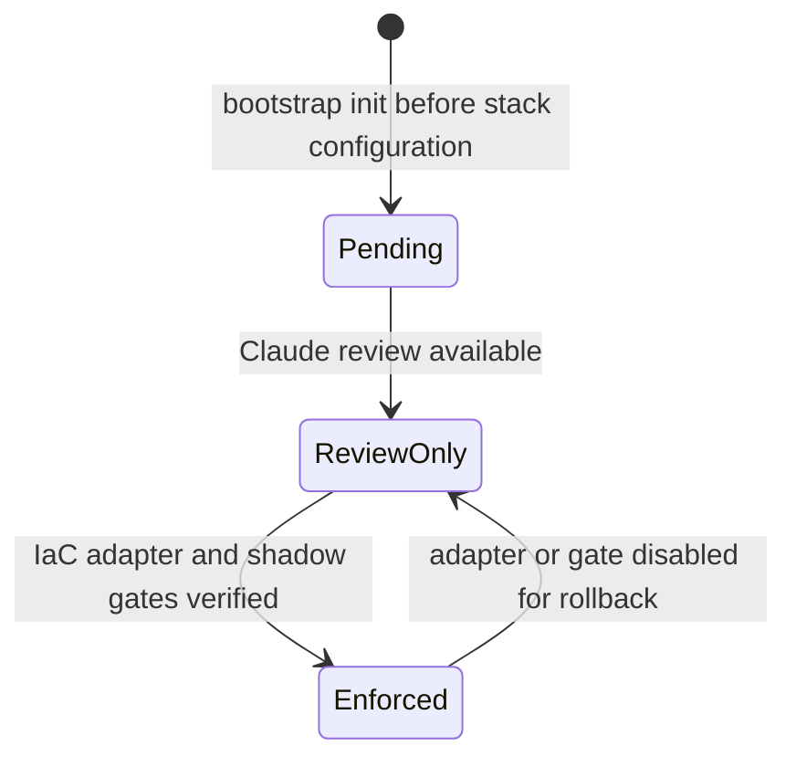
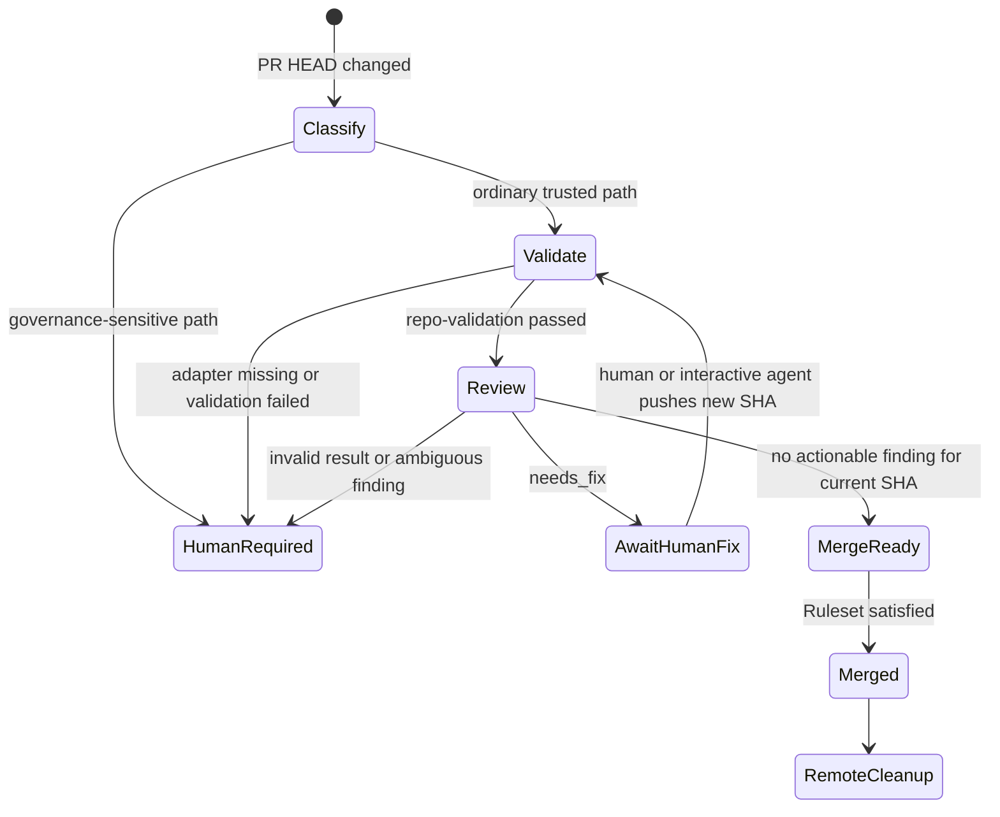
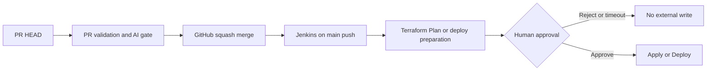

# State Machines / 状态机

## IaC adoption lifecycle



`Pending` 和 `ReviewOnly` 均不得 auto-merge。只有 IaC adapter、gate provenance、Ruleset 与 secret 边界通过验证后才能进入 `Enforced`。

## PR convergence



## Structured review result

```json
{
  "reviewed_sha": "full commit SHA",
  "status": "pass | needs_fix | human_required",
  "findings": [
    {
      "fingerprint": "stable identifier",
      "severity": "blocking | non_blocking",
      "actionable": true,
      "path": "repository-relative path",
      "summary": "short explanation"
    }
  ]
}
```

- 自然语言评论不是 gate 输入；schema 校验后的结构化结果才是。
- 每个新 SHA 使旧验证、旧审查和旧 merge readiness 失效。
- `concurrency` 以 PR number 为键，取消已过时的 run，但不能中断正在进行的原子 push。
- Dedicated Fixer App 延后；当前阻断 finding 由人工或交互式 agent 修复，human thread 永不自动解决。

## Jenkins boundary



门槛 2 证明代码在合并前满足仓库验证；Jenkins 人工输入控制合并后的外部副作用。任何一层都不能替代另一层。
