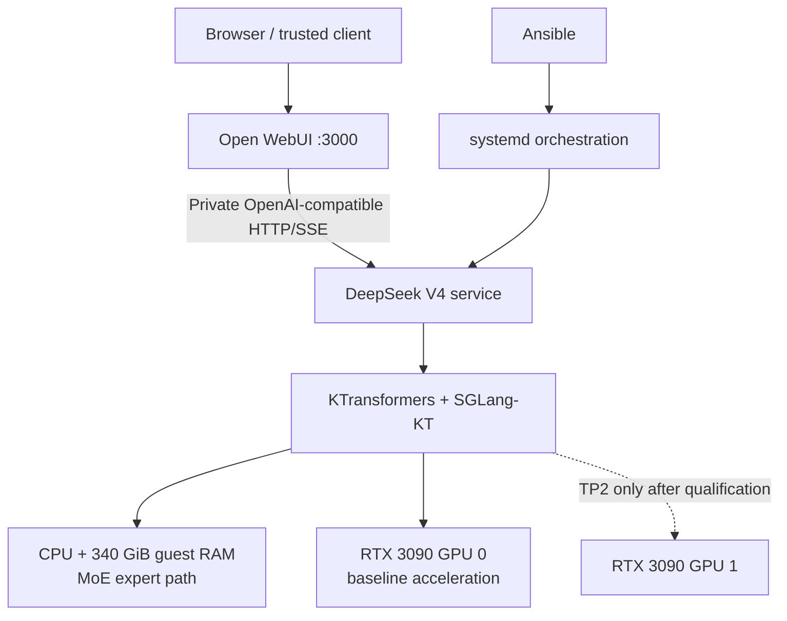
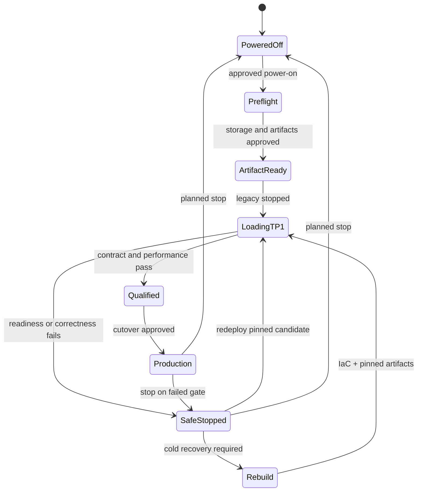

# Architecture

## Decision summary

| Concern | Contract |
|---|---|
| Compute boundary | 复用现有 ESXi `llm-server` VM，形成单节点异构推理 appliance |
| Primary runtime | KTransformers + SGLang-KT，服务官方 `DeepSeek-V4-Flash-0731` checkpoint |
| Baseline | TP1、1× RTX 3090、16K context、并发 1、MTP off |
| Service topology | 单一活动大模型后端；DeepSeek 与 legacy backend 互斥 |
| Packaging | 专用 Docker Compose project，由专用 Ansible role/playbook 管理 |
| Lifecycle | Docker 管容器退出重启；systemd 管开机编排、显式启停与互斥 |
| Client boundary | Open WebUI 通过私有 Compose 网络访问 OpenAI-compatible HTTP/SSE API |
| Failure recovery | 安全停止；保留 Open WebUI 状态与 manifest，通过 IaC 和固定 artifact 冷重建或重部署已通过候选 |
| Scaling | TP1 黄金基线后，按单变量、证据门控方式尝试 TP2 等优化 |

## System diagram

## Invariants

1. 两张 24 GB GPU 不组成透明统一的 48 GB 地址空间。
2. MoE 专家主体驻留 CPU/RAM；GPU expert offload 必须单独证明输出正确。
3. DeepSeek 是唯一目标大模型后端；任何 legacy unit 都不得被生产路径重新激活。
4. TP1 是正确性黄金基线；TP2、并发、context、cache 和推测解码都是实验分支。
5. Open WebUI 可在模型加载期间保持可用，不以 backend readiness 作为 UI 启动依赖。
6. 端口可以并存，但大模型资源不能同时驻留。
7. DirectPath 下的可用性来自可重建配置、固定 artifact 与冷恢复，不来自 vMotion/HA。

## Ownership boundaries

| Owner | Owns | Must not own |
|---|---|---|
| Terraform | VM CPU、内存、磁盘、EFI/MMIO、网络等虚拟硬件声明 | guest 包、容器或服务状态 |
| ESXi operator | 当前 provider 无法安全声明的 GPU DirectPath 绑定 | guest runtime 配置 |
| Ansible | guest 目录、配置、期望服务状态、验证入口 | 临时手工部署状态 |
| Docker Compose | DeepSeek 容器、网络、volume 与容器级健康/重启 | system boot orchestration |
| systemd | 开机编排、显式 start/stop、后端互斥 | 与 Docker 竞争的持续 restart loop |

## Runtime boundary

- 新运行时必须位于独立路径、Compose project、unit 和端口，不能覆盖 `/opt/llm-server/ik_llama.cpp`。
- DeepSeek role 在 PoC 中只验证现有 NVIDIA driver/Toolkit，不得静默安装、升级或触发重启；任何 driver 变更是独立获批动作。
- 生产定义必须显式设置 DeepSeek V4 reasoning parser 与 tool-call parser，除非镜像的有效 entrypoint 已被检查并证明等价。
- 模型 checkpoint 以只读方式挂载；cache、日志和临时文件使用明确的可写 volume。
- checkpoint 与 container layer 是可按 manifest 重建的缓存，不做大体量常规备份；Open WebUI 数据、配置、凭据和晋级证据必须保护。
- 若 native endpoint 不能满足合同，先显式配置底层 SGLang parser；薄适配层只能在有失败证据时引入。
- `ik_llama.cpp` 比较路线必须使用独立 checkout、binary、unit、port 和 matched GGUF，且按顺序而非同时与 KTransformers 测试。

## Network and security boundary

- PoC host 测试端口只绑定 `127.0.0.1`；生产默认不向 LAN 发布 inference port。
- Open WebUI 与 DeepSeek 使用显式私有 Compose 网络和稳定 service name。
- 首次部署仅在 Open WebUI 持久化数据库尚未初始化时由 Ansible seed DeepSeek connection；初始化完成后数据库是唯一连接配置权威。
- 后续 Ansible run 必须保留数据库中的管理员修改，只执行备份和连接验证；不得靠环境变量或容器重建持续覆盖连接。
- 只有出现经批准的直接 LAN 客户端需求时，才引入 Vault-backed API key、来源网络限制与 TLS。
- 容器不得使用 `--privileged`；仅允许已验证所需的 GPU、host IPC 和 `SYS_NICE`。
- runtime secret 只能由 Vault 渲染到 root-owned `0600` 文件，不能进入 Compose 源码、普通 inventory、日志或 legacy `0644` model env。
- Open WebUI catch-all passthrough 默认关闭，避免上游管理能力被转发。
- 日志必须有有界保留策略；PoC 保存晋级/恢复摘要和失败诊断，不要求完整监控平台。

## Lifecycle state machine

Readiness 必须依次证明容器/进程存活、`/health`、`/v1/models`、确定性生成和 parser fixture；TCP 端口开放不代表 ready。初始加载预算为 15–20 分钟，之后才能依据实测收紧。

启用 guest unit 不改变 ESXi VM 的按需开机策略。DirectPath 限制 snapshot/suspend、vMotion、DRS/HA 等常规能力，恢复材料必须以冷启动和重建路径为准。

## Scaling order

1. TP1、单卡、16K、并发 1、标准 decode。
2. 保持其他变量不变，评估 TP2。
3. 资源与尾延迟允许时评估并发 2。
4. 按增量评估更长 context。
5. 依次评估量化 cache、GPU expert 调整和 MTP/DSpark。

每次候选必须重新执行固定 corpus、API 合同、资源和稳定性检查；上游新版本一律视为新的候选发布。
