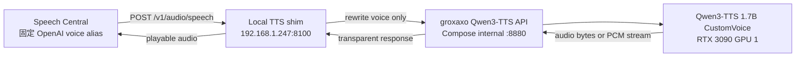
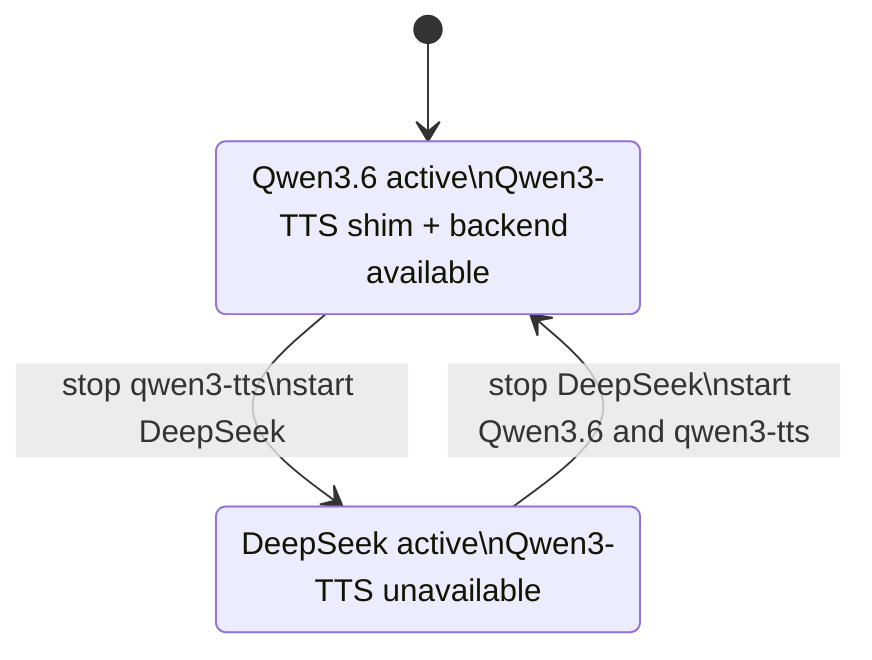

# 架构图

## PoC 运行链路

Cloudflare Worker不在此链路中。shim 和 API 由同一个 Compose project 与 `qwen3-tts.service` 管理；只有 shim 端口发布到可信家庭局域网。

## LLM 运行时边界

部署和启动检查必须拒绝 `Qwen3.6 inactive` 或 `DeepSeek active` 的状态，避免争抢 GPU 资源。
