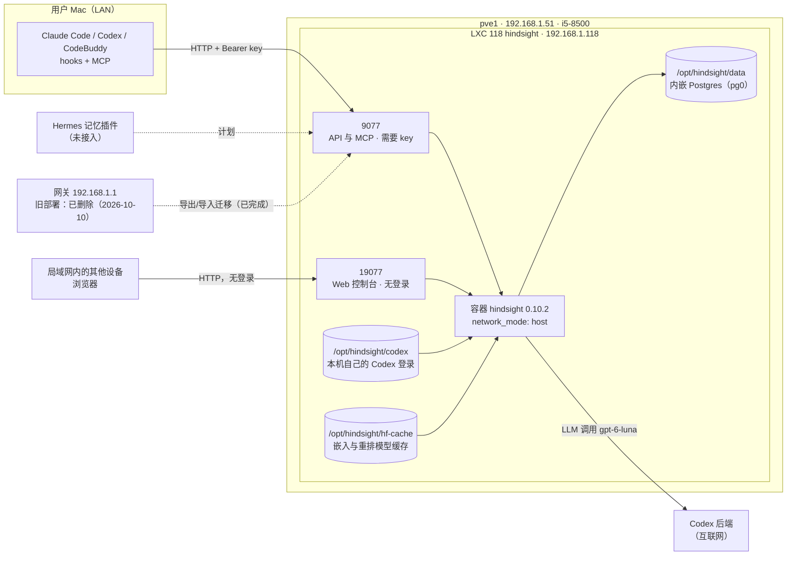

# Hindsight 共享记忆服务架构（pve1 LXC 118）

**更新日期**：2026-10-10；**状态**：已搬迁并验证。2026-10-10 用户决定把 Hindsight 整体搬离网关，现在运行在 pve1 的 LXC 118（`192.168.1.118`）；Claude Code、Codex、CodeBuddy 已切换到新地址（Multica 任务自动跟随）。网关上的旧部署已由用户在当天删除，没有回滚副本。Hermes 记忆插件接入**尚未完成**。网页控制台**没有登录**，后端地址已于当天修好，见[网页控制台](#网页控制台)。当天下午万兆交换机故障造成过一次网络中断，Hindsight 因此崩溃重启 4 次，现已加上离线模式和持久模型缓存，见[网络依赖与已知事故](#网络依赖与已知事故)。备份由运维方另行规划，本文只记录逻辑导出的方法。本文保留了“为什么离开网关”的经验教训，见[网关旧部署与经验教训](#网关旧部署与经验教训)；操作步骤见 [Hindsight 运维指南](../guides/hindsight-operations.md)。

**证据口径**：标“核对”的内容来自 2026-10-10 对 pve1、LXC 118 和网关的只读检查（`pct config`/`pct status`/`pct list`/`qm list`、`pvesm status`、`pve-firewall status`、`/etc/pve/jobs.cfg`、`docker ps` 与 `docker inspect --format` 的非敏感字段、`ls`/`stat`、`ss`/`netstat`、`/health` 与 `/version`、`compose.yaml` 的非密钥行、控制台只看 HTTP 状态码和页面标题、容器日志里的单行验证信息和错误行计数），以及对 Mac 上导出文件名称、`~/.hindsight/` 文件权限与修改时间的查看；没有读取 `.env`、`codex/auth.json`、容器环境变量、`coding-agent.json`、导出 ZIP 的内容或任何密钥文件。标“部署记录”“迁移记录”“切换记录”“调优记录”“实测记录”的内容来自部署者的验证和操作结果，本次整理没有重新执行（例如带 key 的请求、记忆库导出导入、客户端读写验证、召回和重排耗时的测量）。标“历史”的内容是网关上旧部署的事实，已不是现状。本文不记录任何 key、token 或 `auth.json` 的内容，只记录它们的存放位置和变量名。标“事故记录”的内容来自 2026-10-10 下午的现场检查和操作（对网关、pve1、LXC 118 的只读检查，以及修复 `compose.yaml` 的改动）。

## 用途与范围

Hindsight 是 Vectorize 的开源长期记忆服务（上游：[vectorize-io/hindsight](https://github.com/vectorize-io/hindsight)）。本部署让所有 AI Agent 共用同一份长期记忆：

- **客户端**：用户 Mac 上的 Claude Code、Codex、CodeBuddy（通过 hooks 和 MCP 接入）；Multica 的任务读取同一份 HOME 下的配置，自动跟随。Hermes 的 Hindsight 记忆插件**尚未接入**。
- **记忆库（bank）** 按项目命名，形如 `coding-agent::<项目名>`。目前已知的两个库是 `coding-agent::hermes` 与 `coding-agent::IaC`（迁移记录），本文不断言它们就是全部的库。
- **位置**：pve1 上的 LXC 118。2026-10-09 至 2026-10-10 这个服务曾经部署在网关上，见[历史](#网关旧部署与经验教训)。

## 拓扑

实线是已经存在的路径，虚线是计划中或一次性的路径。控制台端口 19077 没有登录。

## 已核实的部署事实（核对）

| 项目 | 内容 |
|---|---|
| 宿主 | pve1（`192.168.1.51`，PVE 9.0.3，内核 6.14.8-2-pve）：Intel Core i5-8500（6 核 6 线程，标称 3.00 GHz，`lscpu` 的 CPU max 为 4100 MHz），内存 31935 MiB（可用 7967 MiB），swap 8191 MiB；存储 `local-lvm` 为 LVM-thin |
| LXC | VMID 118，hostname `hindsight`，Ubuntu 24.04 LTS，`unprivileged: 1`（uid 映射 0→100000），`cores: 4`（`cpuunits: 1024`），`memory: 4096`、`swap: 512`，rootfs `local-lvm:vm-118-disk-0` 24G（已用约 5 GB），`features: nesting=1,keyctl=1`，`onboot: 1`，tags `hindsight` |
| 网络 | `net0`：`eth0`，桥 `vmbr1`，`192.168.1.118/24`，网关 `192.168.1.1`，DNS `192.168.1.1`，`firewall=1`。`pve-firewall status` 为 `disabled/running`，不存在 `cluster.fw` 和 `118.fw`，没有生效的防火墙规则 |
| Docker | Ubuntu 仓库的 `docker.io` 29.1.3-0ubuntu3~24.04.2 与 `docker-compose-v2` 2.40.3；runc、overlayfs、cgroup v2；`docker` 服务 enabled |
| 容器 | `hindsight`；Compose 项目目录 `/opt/hindsight/`；镜像 `ghcr.io/vectorize-io/hindsight:0.10.2`（固定 tag；RepoDigest `ghcr.io/vectorize-io/hindsight@sha256:d1840062a5b79940ab7a9f4809ceb90fc776d4ad737cd9329e9b5836cc64ab70`，与网关旧部署相同）；`restart: unless-stopped`；`network_mode: host`；`shm_size: 1g`；`mem_limit: 3g`（3221225472 字节，LXC 本身 4 GiB）；非特权，容器内用户 `hindsight`；没有 Docker HEALTHCHECK |
| 端口 | host 网络，`compose.yaml` 里没有 `ports`；端口由环境变量决定：`HINDSIGHT_API_PORT=9077`（API 与 MCP，需要 key）、`HINDSIGHT_CP_PORT=19077`（网页控制台，**没有登录**）；LXC 内 `ss -ltn` 显示两个端口都监听在 `0.0.0.0` |
| 目录 | `/opt/hindsight/`：`compose.yaml`（644 root）、`.env`（600 root）、`data/`（755，属主 UID/GID 1000，挂载到容器 `/home/hindsight/.pg0`）、`codex/`（700，属主 1000:1000，挂载到容器 `/home/hindsight/.codex`）及其中的 `auth.json`（600，属主 1000:1000）、`hf-cache/`（755，属主 1000:1000，约 217 MB，挂载到容器 `/home/hindsight/.cache/huggingface`，2026-10-10 新增）；另有改配置前留下的 `compose.yaml.bak-20261010-055019` 和 `compose.yaml.bak-20261010-055038`（644 root，内容相同）；没有 `models/` 和 `backup/` 目录 |
| 认证 | `compose.yaml` 设置 `HINDSIGHT_API_TENANT_EXTENSION=hindsight_api.extensions.builtin.tenant:ApiKeyTenantExtension`；不带 key 请求 `/v1/default/banks`（9077）返回 HTTP 401；`/health` 与 `/version` 无需认证 |
| LLM | `HINDSIGHT_API_LLM_PROVIDER=openai-codex`、`HINDSIGHT_API_LLM_MODEL=gpt-6-luna`；凭据是 `codex/auth.json`（这台机器自己的 Codex 登录）；容器日志里有 `Codex LLM verified: gpt-6-luna`（2026-10-10 04:03:07 UTC） |
| 重排与线程 | `compose.yaml` 没有设置 `HINDSIGHT_API_RERANKER_LOCAL_MODEL`，用镜像默认的 `cross-encoder/ms-marco-MiniLM-L-6-v2`（`compose.yaml` 注释；没有 `models/` 目录）；设置了 `OMP_NUM_THREADS=4`、`MKL_NUM_THREADS=4`、`HINDSIGHT_API_RERANKER_LOCAL_BUCKET_BATCHING=true`、`HINDSIGHT_API_RERANKER_LOCAL_MAX_CONCURRENT=1` |
| 模型缓存 | 嵌入模型 `BAAI/bge-small-en-v1.5` 与重排模型 `cross-encoder/ms-marco-MiniLM-L-6-v2` 的文件在 `/opt/hindsight/hf-cache/`；`compose.yaml` 设置 `HF_HUB_OFFLINE=1` 和 `TRANSFORMERS_OFFLINE=1`，启动时不访问 HuggingFace（2026-10-10 05:50 UTC 起，见[模型缓存与离线模式](#模型缓存与离线模式)） |
| Worker | `HINDSIGHT_API_WORKER_ID=hindsight-pve1` |
| 健康与版本 | `GET /health` 返回 200，内容含 `"status":"healthy"` 与 `"database":"connected"`；`GET /version` 返回 `api_version` 0.10.2，功能标志含 `mcp: true`、`worker: true` |
| 控制台 | `GET http://192.168.1.118:19077/` 返回 307，页面标题 `Hindsight Control Plane`；不带 key 请求 `/api/banks` 返回 **200** 并列出 `coding-agent::hermes` 与 `coding-agent::IaC`（2026-10-10 修复后核对）。修复前它因 `HINDSIGHT_CP_DATAPLANE_API_URL` 缺省指向 `localhost:8888` 而返回 502，现在 `compose.yaml` 里设为 `http://127.0.0.1:9077`。详见[网页控制台](#网页控制台) |
| 日志 | `json-file`，`max-size: 20m`、`max-file: 5`（`docker inspect` 的 `LogConfig` 核对；每个容器最多约 100 MB），2026-10-10 加入 |
| 运行记录 | 容器启动于 2026-10-10 04:02:55 UTC，RestartCount 0、OOMKilled false；04:19 UTC：`docker stats` 内存 1.43 GiB / 3 GiB、CPU 约 1.3%；LXC 内可用内存约 2643 MiB、loadavg 约 0.5；之后 04:54–05:50 UTC 因网络故障崩溃重启 4 次（见[网络依赖与已知事故](#网络依赖与已知事故)），05:50 UTC 重建容器后 RestartCount 0，`/health` 返回 200，一次 IaC 库召回 7.2 秒（事故记录） |
| Mac 客户端文件 | `~/.hindsight/coding-agent.json` 权限 600，修改时间 2026-10-10 15:05（Mac 本地时间）；`~/.hindsight/gateway-api-key` 权限 600，修改时间仍是 2026-10-09 15:51（文件名里的 gateway 是历史遗留）；均未读取内容 |
| 迁移导出文件 | Mac 上 `~/.hindsight-backup-20261007-130513/bank-exports/`（目录 700、文件 600）里有本次迁移的 `gateway-hermes-to-pve1.zip`（3684344 字节）和 `gateway-IaC-to-pve1.zip`（1889929 字节），以及更早一轮迁移留下的导出 |
| 旧部署（网关） | 已于 2026-10-10 由用户删除：`/mnt/data/hindsight/` 目录、`hindsight` 容器和 Hindsight 镜像都不存在（删除后只读核对）；`codex-proxy` 等其他服务仍在网关上运行，Hindsight 不再使用 `codex-proxy` |
| PVE 备份任务 | `/etc/pve/jobs.cfg` 里只有一个 vzdump 任务：节点 pve0、每日 00:00、存储 `pbs`、快照模式，VMID 列表为 100–109，不含 118 |
| pve1 上的其他来宾 | LXC 111 `fileserver`；VM 112、113 `openbao-testbed-*`（各 4096 MiB）、114 `home-assistant`（4096 MiB）、115 `funasr`（12288 MiB）、117 `proxmox-datacenter-manager`（4096 MiB），116 `Windows11`（16384 MiB）已停止 |

## 部署与迁移记录

以下内容由部署者验证，本次整理没有重新执行。

- **LXC 与 Docker**：LXC 118 为非特权、Ubuntu 24.04，沿用“IP 末段 = VMID”的惯例；SSH 用用户已有的公钥免密登录 `root@192.168.1.118`。LXC 里用 Ubuntu 仓库的 `docker.io` 29.1.3 和 `docker-compose-v2` 2.40.3。pve1 的 CPU 是 i5-8500（用户确认不是 T 系列），实测满载全核约 3.9 GHz，没有降频；pve1 内存 32 GB，可用约 8~9.5 GB。
- **必须用 `network_mode: host`**：在非特权 LXC 里，runc 1.3.4 创建默认桥接网络的容器会失败，报 `open sysctl net.ipv4.ip_unprivileged_port_start file: reopen fd 8: permission denied`；带 `--network host` 的容器可以启动。所以 `compose.yaml` 没有 `ports`，端口由 `HINDSIGHT_API_PORT` 和 `HINDSIGHT_CP_PORT` 决定。
- **LLM 登录**：不再用 codex-proxy，改用 Hindsight 内置的 `openai-codex` 提供方。凭据是这台机器自己的、全新的 Codex 登录：在 Mac 上用临时 `CODEX_HOME` 执行 `codex login --device-auth`（设备码，用户在浏览器批准一次）生成 `auth.json`，放到 LXC 的 `/opt/hindsight/codex/auth.json`，Mac 上的临时副本已删除；令牌刷新由 Hindsight 自己负责。没有拷贝别处正在使用的 `auth.json`。
- **重排**：恢复为默认的 `cross-encoder/ms-marco-MiniLM-L-6-v2`、300 个候选。在 LXC 里对 300 个合成候选做 fp32 打分约 4.0 秒，开分桶批处理约 3.2 秒，3 线程 3.8~4.8 秒；真实召回约 7~8.4 秒（真实候选文本比基准更长）；reflect 约 5 秒；容器内存约 1.1~1.4 GiB。作为对比，N100 网关上同一模型要 66~68 秒，换成 TinyBERT 约 3.7 秒但质量折中。
- **数据迁移**：从网关用官方导出导入。导出 hermes 库 3.7 MB、IaC 库 1.9 MB 的 ZIP，经临时引导库用 `mode=restore&target_bank_id=...` 导入，分别约 30 秒和 25 秒（N100 上要 2~3 分钟）。核对：hermes 422 条/18 个文档，IaC 420 条/7 个文档，文档和知识页都完全一致；后台整理收敛后 hermes 433 条/19 个文档，IaC 420 条/7 个文档。
- **客户端切换**：Mac 的 `~/.hindsight/coding-agent.json` 的 `apiUrl` 改为 `http://192.168.1.118:9077`；CodeBuddy 3 个项目的 MCP 改指 `192.168.1.118:9077` 并带认证头。Claude Code、Codex、CodeBuddy 各做了一次读写验证，hooks 的召回和写回事件正常，新写入只进新机器，旧网关没有收到任何新文档。API key 与之前网关用的是同一个，所以客户端只改了地址。
- **旧部署停止**：网关上执行了 `docker compose stop`（容器和数据保留在 `/mnt/data/hindsight`，作为回退），网关可用内存随之恢复；用户随后自己执行了清理（删除容器、镜像和 `/mnt/data/hindsight`），文档没有代他删除任何数据；网关上不再有回滚副本。

## LLM 与 Codex 登录

Hindsight 用 LLM 提取事实、归纳和反思。现在它通过内置的 `openai-codex` 提供方直接访问 Codex 服务，模型 `gpt-6-luna`，需要这台机器能访问互联网。凭据是 `/opt/hindsight/codex/auth.json`，挂载为容器内的 `/home/hindsight/.codex`（读写，因为令牌由 Hindsight 自己刷新）；属主必须是容器用户的 UID 1000。

**每台机器要有自己的 Codex 登录，不要拷贝别处正在使用的 `auth.json`。** 这是此前已经踩过的坑（部署者记录）：拷贝出来的登录在刷新令牌轮换后会失效，只有真正在用的那一份会被更新。新机器的登录是在 Mac 上用临时 `CODEX_HOME` 通过设备码流程新建的；令牌失效时的重做步骤见运维指南的[Codex 登录](../guides/hindsight-operations.md#7-codex-登录的建立与续期)。

和网关上的旧部署相比，这条路径少了 `codex-proxy` 这一层，也不再依赖 `xiaozhi_xiaozhi-net`；多出来的依赖是这个登录本身和 LXC 到互联网的出口。Codex 服务不可达、登录失效或模型名不被接受时，依赖 LLM 的操作（提取事实、归纳、反思）会失败；不依赖 LLM 的操作是否受影响，没有做过实验（库的导入不调用 LLM，不耗额度）。

## 网络、端口与认证

**host 网络的含义**：容器与 LXC 共用网络命名空间，Hindsight 直接在 LXC 的所有接口上监听。这个 LXC 是专用的，所以可以接受；但意味着没有容器层的端口映射，也无法像在网关上那样只绑某个 IP。

| 项目 | 当前做法 | 说明 |
|---|---|---|
| 地址 | API 与 MCP：`http://192.168.1.118:9077`；控制台：`http://192.168.1.118:19077/` | 都监听在 LXC 的 `0.0.0.0`，局域网内可达 |
| 认证（9077） | 内置 `ApiKeyTenantExtension` | 除 `/health`、`/version` 外，所有 API 和 MCP 请求都要 `Authorization: Bearer <key>`；无 key 或错误 key 返回 401 |
| 认证（19077） | **没有登录** | 控制台自己不做认证，设计上它在服务端用 `HINDSIGHT_CP_DATAPLANE_API_KEY` 调用 API；详见下一小节 |
| 防火墙 | 没有生效的规则 | `net0` 带 `firewall=1`，但数据中心防火墙未启用（`pve-firewall status` 为 disabled），没有 `cluster.fw` 和 `118.fw` |
| 密钥存放 | LXC `/opt/hindsight/.env`（600 root）；Mac `~/.hindsight/coding-agent.json`（600）、`~/.hindsight/gateway-api-key`（600）；CodeBuddy 3 个项目的 MCP 认证头 | `.env` 中有两个变量：`HINDSIGHT_API_TENANT_API_KEY` 和 `HINDSIGHT_CP_DATAPLANE_API_KEY`（须与前者保持一致）；值与之前网关用的是同一个 key。Codex 登录不在 `.env`，在 `codex/auth.json`。key 只放这些位置，不写进 `compose.yaml` |
| 传输 | 明文 HTTP | 没有 TLS，key 和记忆内容在 LAN 内不加密传输，只适合可信的家庭 LAN |

### 网页控制台

- **地址与功能**：`http://192.168.1.118:19077/`，用来查看库、事实、知识页等（部署记录）。Docker 镜像里的控制台只用于查看和操作记忆数据，没有 Mac 上 hindsight-embed 那种带配置向导的“控制中心”；容器配置只能改 `compose.yaml`。
- **没有登录，这是已知风险**：控制台自己不做认证，它在服务端用 `HINDSIGHT_CP_DATAPLANE_API_KEY`（与 API key 同值，在 `.env`）调用 API，所以 9077 上的 key 认证对经由 19077 的访问不起作用。2026-10-10 在新位置上核对过：不带任何 key 请求控制台的 `/api/banks` 返回 HTTP 200 并列出库。它监听 `0.0.0.0` 且没有防火墙规则，局域网内任何设备都能打开这个页面。
- **后端地址（2026-10-10 已修复）**：此前在新位置上不带 key 请求 `/api/banks` 返回 **502**，容器日志是 `[Control Plane] Connecting to dataplane at: http://localhost:8888` 加 `ECONNREFUSED`——控制台的数据面地址缺省是 8888，而 API 在 9077。现在 `compose.yaml` 设了 `HINDSIGHT_CP_DATAPLANE_API_URL: http://127.0.0.1:9077`（变量名经生效验证），重建容器后 `/api/banks` 返回 200 并列出两个库，数据没有受损。修好之后控制台恢复了“无登录即可读写记忆”的性质，是否收紧见下。
- **收紧办法（由用户决定，未实施）**：host 网络下不能再用 `ports: 127.0.0.1:19077:9999` 这种写法。可选的办法有两种：让控制台只监听 `127.0.0.1`，再用 `ssh -L 19077:127.0.0.1:19077 root@192.168.1.118` 隧道访问（需要先查清本版本控制台的监听地址设置，本文没有核实具体变量名）；或者用 PVE 防火墙限制能访问 19077 的来源（LXC 的 `net0` 已有 `firewall=1`，但需要先启用数据中心防火墙并给 LXC 写规则，这是整个集群范围的改动，要先确认不会切断管理访问；未实测）。步骤见运维指南的[网页控制台](../guides/hindsight-operations.md#10-网页控制台)。

## 网络依赖与已知事故

### 网络路径（核对）

- 网关的 `br-lan` 桥接 `eth1`（2.5G，Mac 和 Wi-Fi 一侧）、`eth2`（10G，Intel ixgbe）和 `eth3`（无链路）。`brctl showmacs` 显示 PVE 主机和来宾（`.50`、`.51`、`.52`、`.100`–`.120` 等）的 MAC 都学在 `eth2` 上。`eth2` 插的是 SFP+ 的 10GBASE-T 铜口模块（模块 EEPROM 型号 `SFP-10G-T-X`），链路 10 Gbps，接万兆交换机。
- 所以 Mac 访问 LXC 118 的路径是：Mac → 网关 `eth1` → `br-lan` → 网关 `eth2` → 万兆交换机 → pve1 → LXC 118；LXC 访问互联网（Codex、HuggingFace）也经网关出去。这条路径上任何一处故障，会同时影响客户端访问和 LXC 的外网访问。

### 2026-10-10 事故记录

- **现象**：下午起，Mac 到 `.50`、`.51`、`.118` 等 PVE 一侧所有地址时通时断：ping 延迟 0.4–2.7 秒、丢包 10–60%，Mac 上 ARP 解析失败（`No route to host`），控制台打不开；同一时间 Mac 到网关 `.1`（约 2.5 ms，无丢包）和网关另一侧的有线设备（`.2`、`.186`、`.215`，0.3–3 ms）正常。
- **定位**：从网关并发 ping 所有邻居，`eth2` 一侧 20–100% 丢包、370–960 ms，`eth1` 一侧有线设备正常。在 pve1 上 ping pve0、pve2 是 0% 丢包、0.13–0.25 ms，ping LXC 118 是 0.04 ms，ping 网关却 33% 丢包、289–999 ms。pve1 本身空闲（load 0.13，mlx5 网卡 10 Gbps，自 9 月 21 日启动以来 carrier 只变化 3 次）。网关侧 `ethtool -S eth2` 没有 CRC 或 FIFO 错误，PCIe 没有 AER 错误。结论：故障在“网关 `eth2` ↔ 万兆交换机”这一段，而不是 PVE 主机或 LXC。延迟呈锯齿状（堵 1–2.7 秒后一起放出），到 `.51` 和 `.118` 的序列几乎一致，说明堵点在共同的链路上。网关 `eth2` 自开机约 55 天累计 `carrier_changes` 1160 次，当天 14:00 前后（网关本地时间）40 秒内连续 down/up 6 次。
- **处置**：用户重启了这台交换机。之后 Mac 到 `.50`、`.51`、`.118` 的 ping 为 0% 丢包、2–3 ms，API 与控制台恢复；网关 `eth2` 的 `carrier_changes` 因重启增加到 1162。
- **根因**：交换机故障的具体原因没有确认（固件、过热、10G-T 模块或线缆都有可能）。以后再出现“网关 `.1` 正常、PVE 一侧延迟高”时，先看交换机和网关 `eth2` 的链路状态（`dmesg | grep 'eth2: NIC Link'`、`cat /sys/class/net/eth2/carrier_changes`），不要先怀疑 LXC。
- **对 Hindsight 的影响**：事故期间 LXC 访问外网同样失败，Codex 校验连接超时（只是警告）；更严重的是启动时 sentence-transformers 向 HuggingFace 做元数据检查失败，报 `RuntimeError: Cannot send a request, as the client has been closed`，应用启动失败，容器被 `restart: unless-stopped` 反复拉起，04:54–05:50 UTC 崩溃重启 4 次。数据没有受损。加固见[模型缓存与离线模式](#模型缓存与离线模式)。
- **其他影响（推论，未核实）**：Proxmox 双节点的 QDevice 见证（qnetd）在网关上，PVE 节点经同一条链路连它，这段链路不稳时见证投票可能受影响，见 [Proxmox 双节点与 N100 QDevice 架构](./proxmox-qdevice-architecture.md)。

## 资源与性能

### 资源

| 层 | 配置 | 说明 |
|---|---|---|
| pve1 | 6 核 6 线程，内存 32 GB，可用约 8 GB，swap 8 GiB | 同机还有 VM 112/113（各 4 GiB）、114（4 GiB）、115 `funasr`（12 GiB）、117（4 GiB）和 LXC 111；VM 116 `Windows11`（配置 16 GiB）已停止，它的配置内存大于当前可用内存，能否与现有来宾同时运行没有验证 |
| LXC 118 | `cores: 4`、`memory: 4096`、`swap: 512`，rootfs 24G | 容器看到的 CPU 是 4 个（`nproc` 为 4，LXC 的 cpuset 固定在宿主的 4 个核上）；LXC 内可用内存约 2.6 GiB |
| 容器 | `mem_limit: 3g`、`shm_size: 1g` | 没有 `cpus`、`cpu_shares`、`oom_score_adj`（这三项是网关上为保护其他服务设置的，见历史） |

### 召回与重排性能（调优记录、实测记录）

- 重排用默认的 `cross-encoder/ms-marco-MiniLM-L-6-v2`，300 个候选，和 Mac 上的基准一致，因此不再有网关上 TinyBERT 带来的排序质量折中。
- LXC 里 300 个合成候选 fp32 打分约 4.0 秒，开分桶批处理约 3.2 秒，3 线程 3.8~4.8 秒；真实召回约 7~8.4 秒（客户端 hooks 的超时是 30 秒）；reflect 约 5 秒；容器内存约 1.1~1.4 GiB（核对 1.43 GiB）。
- `OMP_NUM_THREADS` 和 `MKL_NUM_THREADS` 设为 4，与 LXC 的核数一致；`HINDSIGHT_API_RERANKER_LOCAL_BUCKET_BATCHING=true` 开启分桶批处理；`..._MAX_CONCURRENT=1`（变量名含义是本地重排的最大并发，没有单独说明收益）。
- 嵌入模型仍是镜像内置的 BAAI/bge-small-en-v1.5，在 CPU 本地运行。
- 想再快一点：把 LXC 的核数调高是最直接的办法（`pct set 118 --cores N`，同步调整线程数），收益没有测，pve1 上其他来宾也在用 CPU。

### 模型缓存与离线模式

- 嵌入模型 `BAAI/bge-small-en-v1.5` 和重排模型 `cross-encoder/ms-marco-MiniLM-L-6-v2` 是 HuggingFace 上的开源模型，共约 217 MB，在 CPU 本地运行。它们原先只存在于容器可写层的 `/home/hindsight/.cache/huggingface`，容器一重建就丢，而且每次启动都会联网检查更新。
- 2026-10-10 05:50 UTC：用 `docker cp` 把缓存复制到 `/opt/hindsight/hf-cache/` 并挂载进容器，同时设置 `HF_HUB_OFFLINE=1` 和 `TRANSFORMERS_OFFLINE=1`，启动不再访问 HuggingFace。验证：容器约 20 秒内健康，RestartCount 0，召回正常（事故记录）。
- 代价：以后要换别的本地模型，必须先临时去掉这两个变量，让容器联网下载一次，步骤见运维指南的[重排与缓存](../guides/hindsight-operations.md#82-召回与重排)。

## 备份与逻辑导出

**备份由运维方另行规划，本文只记录逻辑导出的方法。**

- **技术事实**：`/opt/hindsight/data` 是运行中的 Postgres 数据目录，对它做文件级拷贝不保证崩溃一致性，不能当作备份手段。PVE 快照（`pct snapshot`）是存储层的快照，不是文件级拷贝；它给出的是崩溃一致的状态，恢复没有演练过，可恢复性仍以逻辑导出为准。
- **逻辑导出与导入**（Hindsight 0.10.1 起提供，按 bank 操作，用法来自迁移记录）：导出是异步操作，产出 ZIP；导入用 multipart 上传 ZIP，`restore` 模式要求 `target_bank_id` 指定的目标库不存在，路径里则要放一个已存在的库来承载操作；导入时在目标端重新向量化，不调用 LLM、不消耗额度。本次从网关迁到 LXC 就是这样做的。请求格式、引导库、核对方法见运维指南的[逻辑导出与恢复](../guides/hindsight-operations.md#9-逻辑导出与跨主机迁移)。跨版本的归档要求版本兼容，升级前先看[上游 0.10.1 说明](https://hindsight.vectorize.io/blog/2026/09/22/move-a-memory-bank)和后续发布说明。
- LXC 上没有 `backup/` 目录。任何覆盖整个 LXC 或 `/opt/hindsight` 的备份都会带上 `.env`（里面是 key）和 `codex/auth.json`（Codex 登录）。
- 现有的 PVE 备份任务（每日 00:00 到 `pbs`，VMID 列表 100–109）不含 118；这只是一条事实，备份的安排由运维方决定。
- 本文记录的导出/导入方法已在 Mac 到网关、网关到 LXC 两次迁移中用过并核对；对新机器自己导出文件的恢复演练没有记录。

## 实施状态与待办

| 事项 | 状态 | 说明 |
|---|---|---|
| 把 Hindsight 搬到 pve1 的 LXC 118 | 已完成并验证（2026-10-10） | 见上文核对与记录 |
| 数据迁移（从网关导出、在 LXC 导入） | 已完成（2026-10-10） | hermes 422 条/18 个文档、IaC 420 条/7 个文档，文档和知识页完全一致（迁移记录）；后台整理收敛后 hermes 433 条/19 个文档 |
| 切换 Claude Code / Codex / CodeBuddy 到新地址 | 已完成（2026-10-10） | 切换记录：三者各做过一次读写验证，新写入只进新机器；Multica 任务自动跟随 |
| 网关上的旧部署 | 已删除（用户，2026-10-10） | 没有回滚副本；恢复数据靠 Mac 上的导出文件，见[旧部署现状](#旧部署现状) |
| Hermes 记忆插件接入 | **未完成** | 接入时的网络路径和 key 配置待定；2026-10-10 04:19 UTC 核对时，网关上的 `hermes` 与 `hermes-webui` 容器刚被停止，原因和后续安排没有核实 |
| 网页控制台 | 后端已修复，仍无登录 | 2026-10-10 把数据面地址指向 `http://127.0.0.1:9077`，`/api/banks` 返回 200；是否收紧由用户决定，见[网页控制台](#网页控制台) |
| 容器日志轮转 | 已配置（2026-10-10） | `json-file`，`max-size: 20m`、`max-file: 5` |
| 模型缓存与离线模式 | 已完成（2026-10-10） | `hf-cache/` 持久缓存加 `HF_HUB_OFFLINE=1`，见[模型缓存与离线模式](#模型缓存与离线模式) |
| 万兆交换机与网关 `eth2` 链路 | 重启后恢复，根因未确认 | 见[网络依赖与已知事故](#网络依赖与已知事故) |
| 备份 | 由运维方另行规划 | 本文只记录逻辑导出的方法，见上一节 |
| pve1 或 LXC 重启后的自动恢复 | 未验证 | 依赖 `onboot: 1`、`docker` 服务 enabled 和 `restart: unless-stopped` |
| 升级与回滚演练 | 未演练 | 见运维指南 |

## 风险与未验证项

| 项目 | 说明 |
|---|---|
| 控制台没有登录 | 19077 监听 `0.0.0.0` 且没有防火墙规则；设计上控制台用服务端持有的 key 调用 API，绕过 9077 上的 key 认证（2026-10-10 在新位置上核对：不带 key 即可取得库列表）。 |
| Codex 登录依赖 | LLM 操作依赖这台机器自己的 `codex/auth.json` 和到互联网的出口；登录失效或被撤销时，提取、归纳、反思会失败。续期步骤见运维指南。不要从别处拷贝 `auth.json`。 |
| host 网络与非特权 LXC | `network_mode: host` 是在 runc 1.3.4 下的变通办法；Docker 来自 Ubuntu 仓库，随 apt 更新，runc 行为变化可能让容器起不来。系统更新前建议先 `pct snapshot`。 |
| key 分散在多处 | LXC 的 `.env`、Mac 的 `coding-agent.json` 和 `gateway-api-key`、CodeBuddy 3 个项目的 MCP 认证头，轮换时都要同步。 |
| 明文 HTTP | key 与记忆内容在 LAN 内不加密；没有 TLS，也没有局域网外的访问路径，Mac 离开局域网就没有记忆。 |
| 日志含记忆内容 | 容器日志已限制为 20 MB × 5 个文件；日志里仍有 bank 名和召回查询文本，对外粘贴前要脱敏。 |
| 网关 `eth2` 与万兆交换机链路 | 所有 PVE 一侧的流量（含 Mac 到 LXC、LXC 到外网）都走这条链路；2026-10-10 下午它出过故障，根因没有确认，可能再发生。发生时 API 和控制台时通时断，LXC 的 LLM 调用也会失败，见[网络依赖与已知事故](#网络依赖与已知事故)。 |
| 离线模式 | `HF_HUB_OFFLINE=1` 下缓存缺失会让容器起不来；`hf-cache/` 不要删除或移动，换本地模型要先临时关闭离线开关。 |
| pve1 资源共享 | LXC 的 4 个核与 VM、LXC 共用；`funasr` 占 12 GiB；`Windows11`（16 GiB）若启动，pve1 的内存余量会明显下降（按配置值估算，未验证）。 |
| 升级与回滚 | 新版本迁移数据库后，旧版本能否读取旧数据目录未核实；归档跨版本兼容要看上游说明；均未演练。 |
| 手工部署 | LXC 118 由操作者用 `pct` 手工创建，不在 Terraform、Ansible 管理内，NetBox 实例未核对，没有自动漂移检测。 |

## 网关旧部署与经验教训

2026-10-09 至 2026-10-10，这个服务部署在网关（N100，`192.168.1.1`）上。以下是当时的事实和经验教训，**不是现状**。

### 当时的部署

- 容器 `hindsight`（同一个镜像 digest），Compose 项目 `/mnt/data/hindsight/`，发布 `192.168.1.1:9077`（API 与 MCP）和 `192.168.1.1:19077`（控制台，无登录），加入 `xiaozhi_xiaozhi-net`；LLM 经 `codex-proxy`（`http://codex-proxy:8080/v1`，模型 `gpt-6-luna`），重排换成本地 `cross-encoder/ms-marco-TinyBERT-L-2-v2`（`models/`，只读挂载到 `/models`），`mem_limit: 2g`、`oom_score_adj: 500`、`cpus: 2.0`、`cpu_shares: 512`，worker id `hindsight-gateway`。
- 当时的路径依赖 `codex-proxy` 保管唯一的 Codex 登录；Hindsight 只是它的 HTTP 客户端。教训是不要把 Codex 的 `auth.json` 拷给别的程序：拷贝出来的登录在刷新令牌轮换后会失效。

### 离开网关的背景（部署期间在 N100 上观察到的问题）

- **重排算力不够**：默认的 MiniLM-L6 对 300 个候选打分，网关上一次 recall 约 66~68 秒（Mac 上约 4~9 秒），几乎全部时间在重排。调好线程数和分桶批处理后 300 对仍要约 24~30 秒。换成 TinyBERT-L-2 后 recall 约 3.7 秒，但排序质量有折中：以 Mac 上完整 MiniLM-L6 + 300 个候选的结果为基准，6 条查询的前 5 名重合约 57%、前 10 名约 58%；“重合”只是与较大模型的一致程度，不是人工标注的相关性。
- **整机内存紧张，发生过 global OOM**：网关约 7.9 GB 内存且没有 swap，`hermes` 容器自己有时会涨到约 3 GB，整机可用内存只剩约 0.9~1.9 GB。2026-10-09 约 09:41 UTC，一次基准测试（在容器里一次性处理 300 条重排，瞬间约 1.4 GB）触发了整机内存耗尽：内核日志显示约 5 秒内共杀了 6 个进程，5 个 chromium（每个约 16 MB，按 cgroup 路径对应到 `hermes` 容器）和 1 个测试用的 python（约 1.4 GB）；OOM killer 是在 AdGuardHome、unetd、adb 等宿主进程申请内存时被调用的；13 个容器都没有重启。此后把 `mem_limit` 从 3g 降到 2g，并设 `oom_score_adj: 500`，让整机缺内存时内核优先杀 Hindsight。2 GiB 上限下最重的已知负载（克隆 hermes 库加 2 个并发 `budget=high` 召回）实测峰值 1721 MiB（约 84%），`memory.events` 的 `max`、`oom`、`oom_kill` 全是 0。曾记录一个选项：给网关加 2~4 GB 的 swap 文件，未执行。（dmesg 是环形缓冲，2026-10-10 04:19 UTC 核对时只剩 5 条相关记录，没有新增事件。）
- **控制台暴露**：旧部署同样把无登录的控制台发布到了局域网地址，并核对过不带 key 能取得库列表。

### 重排方案对比（N100 网关，历史实测）

下面的耗时口径不完全相同（recall 总耗时或仅重排），各行来自不同轮次的测试，只作量级比较。

| 方案 | 耗时 | 前 5 名重合 | 前 10 名重合 |
|---|---|---|---|
| PyTorch fp32，MiniLM-L6，300 候选，默认配置 | recall 约 66~68 秒 | 基准 | 基准 |
| 同上，线程数和分桶批处理调好后 | 仅重排约 24~30 秒 | — | — |
| MiniLM-L6，只限制为 40 个候选 | 约 9 秒 | 47% | 37% |
| MiniLM-L6，只限制为 80 个候选 | 约 18 秒 | 53% | 52% |
| MiniLM-L-4，100 个候选 | 约 13.5 秒 | 43% | 47% |
| PyTorch fp32，TinyBERT-L-2，300 候选（当时采用） | recall 约 3.6~3.8 秒（仅重排约 1.4 秒） | 约 57% | 约 58% |
| FlashRank int8 ONNX，`ms-marco-TinyBERT-L-2-v2` | 仅重排 2.6 秒 | — | — |
| FlashRank int8 ONNX，`ms-marco-MiniLM-L-12-v2` | 仅重排 63.4 秒 | — | — |
| **pve1 LXC，MiniLM-L6，300 候选（现状）** | 合成候选约 4.0 秒（分桶批处理约 3.2 秒）；真实召回约 7~8.4 秒 | 未单独比对（同一模型与候选数） | 未单独比对 |

- **FlashRank 实测（在受限一次性容器里，`--memory 512m --memory-swap 512m --oom-score-adj 1000 --cpus 2`，峰值 RSS 约 330 MiB，没有影响整机）**：300 个候选分批（每批 32）打分，int8 ONNX 在这颗 N100 上并不比 PyTorch fp32 快，同一个 TinyBERT-L-2 反而更慢（2.6 秒对约 1.4 秒），所以不是出路。
- **未实测的加速想法**：宿主的 Intel 核显（i915 驱动，`/dev/dri/renderD128`）没有映射进容器，镜像里的 PyTorch 是纯 CPU 版（2.13.0+cpu），onnxruntime 只有 CPU 后端，没有 OpenVINO 或 Intel 扩展（这几项是部署者在镜像内查到的），要用需要自建镜像并映射设备，收益未测，且核显与 CPU 共用同一块内存；把 CPU 配额从 2 核放开到 4 核理论上可以提速，也没有测。
- **托管重排服务与 OpenAI**：这版 Hindsight 支持的重排提供方有 `local`（默认）、`flashrank`、`tei`、`cohere`、`openrouter`、`siliconflow`、`alibaba`、`google`、`zeroentropy`、`typesafe`、`litellm`、`litellm-sdk`、`jina-mlx`，以及 `rrf`（不做重排，只用融合排序），选择变量是 `HINDSIGHT_API_RERANKER_PROVIDER`（清单来自部署者，没有独立核对）。托管服务一般能让召回更快，质量通常也更好，但候选记忆的文本会发给第三方、按调用计费、要保管额外的 key、依赖外网；没有采用，也没有实测。OpenAI 没有重排接口，提供方里也没有它；它能替代的是嵌入模型，会改变向量、需要重新向量化。
- **做实验的约束**：不要在共用主机上做会瞬间占用大量内存的实验；确实要做，用带 `--memory` 和 `--oom-score-adj` 限制的一次性容器，让实验进程自己先死。

### 旧部署现状

- **现状（核对）**：用户已在 2026-10-10 删除网关上的旧部署：`/mnt/data/hindsight/` 目录、容器 `hindsight` 和镜像 `ghcr.io/vectorize-io/hindsight:0.10.2` 都已不存在；`codex-proxy` 等网关上的其他服务不受影响。
- **没有回滚副本**：要恢复数据只能从 Mac 上受保护的导出文件导入（`~/.hindsight-backup-20261007-130513/bank-exports/`，其中有 2026-10-10 15:27 从 LXC 导出的 hermes 和 IaC 两个库），步骤见运维指南的[逻辑导出与跨主机迁移](../guides/hindsight-operations.md#9-逻辑导出与跨主机迁移)。网关是 BusyBox 环境，常用命令的差异见运维指南的[旧部署与网关环境](../guides/hindsight-operations.md#12-旧部署与网关环境)。

## 当前管理边界

LXC 118 由操作者在 2026-10-10 通过 `pct` 和 SSH 手工创建并部署，`compose.yaml` 头部注释也写明了这一点；仓库的 `terraform/`、`ansible/` 中没有 Hindsight 或 VMID 118 的声明，NetBox 实例未核对。pve1 是 Proxmox 集群成员，其上的来宾有的由 Terraform 管理，LXC 118 不在其中；本文只记录实际状态，没有为此新增 Terraform 资源、Ansible role 或自动部署入口。网关在 Ansible inventory 中属于 `network_appliance` 组，被 `site.yml` 按名排除，网关上的任何改动都须事先获得明确授权。

现场与本文不一致时以现场为准，并回写本文；容器、端口、镜像 tag、目录、权限和调优参数这类事实应随变更同步更新。接入 Hermes、收紧控制台等状态变化完成后，也要回写“实施状态与待办”。

## 相关文档

- [Hindsight 运维指南](../guides/hindsight-operations.md)：LXC 管理、升级回滚、轮换 key、Codex 登录续期、召回性能、迁移与导出、控制台、排障。
- [Proxmox 双节点与 N100 QDevice 架构](./proxmox-qdevice-architecture.md)：Hindsight 曾经与见证共用的 N100，及其维护约束。
- [CN 出口代理指南](../guides/cn-exit-singbox-proxy.md)：网关上另一个 Docker 工作负载及其运维写法。
- 上游：[vectorize-io/hindsight](https://github.com/vectorize-io/hindsight)，[bank 迁移（导出/导入）说明](https://hindsight.vectorize.io/blog/2026/09/22/move-a-memory-bank)。
