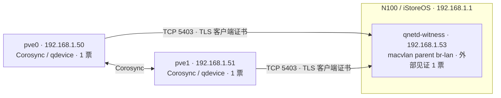

# Proxmox 双节点集群与 N100 QDevice 架构

**更新日期**：2026-10-02（2026-10-10 补充一条 N100 上 Hindsight 的历史说明，见“当前管理边界”）；**状态**：已实施。本文记录本次现场配置和验收边界。

## 选择与拓扑

`HomePVECluster` 保留 pve0、pve1 两个成员，以 N100/iStoreOS 网关上的独立 Debian Docker 容器提供外部见证票。见证不依赖任何 PVE 客机，也不把 N100 加入 PVE 集群；它与网关、Hermes/语音服务共享物理设备，并非另一台独立供电的服务器。

2026-08-07 的 pve0 3 票 / pve1 1 票方案由本次 **1 / 1 + QDevice 1** 取代。规范化票数时 `config_version` 从 9 增至 10，随后唯一一次 `pvecm qdevice setup 192.168.1.53` 将版本增至 11，没有使用 `force` 或临时 `pvecm expected`。



| 项目 | 已实施配置 |
|---|---|
| PVE 成员 | pve0 nodeid 1；pve1 nodeid 2；各 `quorum_votes: 1` |
| Corosync 地址 | ring0 `.50/.51`，ring1 `.20/.21`；本次未改链路或桥接 |
| 见证 | `192.168.1.53/24`；MAC `02:00:01:00:00:53`；Docker 网络 `qnetd-lan` |
| 网关 / macvlan parent | N100 `.1`；`br-lan`，成员 eth1/eth2/eth3，无新增 VLAN |
| qnetd | Debian `corosync-qnetd 3.0.3-2`；镜像 `homelab-qnetd:3.0.3-2` |
| PVE 客户端 | 两节点 `corosync-qdevice 3.0.3-2`，服务 active/enabled |
| 仲裁 | `ffsplit`；最低 nodeid 为 tie-breaker；总票数 3，quorum 2 |

`.53` 分配前核对了 OpenWrt DHCP 动态池、静态配置与租约、NetBox 和仓库清单，并辅以定向 ARP 检查；没有仅凭 ping 不应答认定空闲。分配后已持久化 OpenWrt `dhcp.qnetd_witness` 静态记录；没有 reload/restart dnsmasq，该记录尚待后续服务加载，不能作为当前 DHCP/DNS 已生效的证据。容器直接使用静态地址，不依赖该记录取址；本次也未同步 NetBox。

## 仲裁、VM HA 与存储的边界

QDevice 为双节点集群提供外部投票，机制上允许一台 PVE 与见证合计提供 2 票；两台 PVE 都在线时，即使见证不可用，两台也合计 2 票。单节点存活和网络分区仍受见证可达性及仲裁算法约束。此次实际只验收了两节点在线的正常状态，未验证任何故障切换场景。[Proxmox 外部投票说明](https://github.com/proxmox/pve-docs/blob/master/pvecm.adoc#corosync-external-vote-support)

| 可通信的成员 / 见证 | 当前配置的机制预期（未做故障实验） |
|---|---|
| pve0 与 pve1 互通，见证可达 | 3 票，quorate |
| pve0 与 pve1 互通，见证不可达 | 2 票，仍 quorate |
| 仅 pve0 或仅 pve1 存活，且获见证票 | 2 票，quorate |
| 仅一台 PVE 存活，见证不可达 | 1/3 票，不 quorate；pve0 也不例外 |
| 两 PVE 互不通信，但双方均可达同一见证 | 按当前 ffsplit / 最低 nodeid 规则，预期 pve0 获票；pve1 不 quorate |

相对旧 3/1 权重，本次明确放弃了“pve0 独自存活、无外部见证也可 quorate”的性质。**任一 PVE 停机期间，不要同时维护 N100 或见证路径。**失去 quorum 时，先恢复对端或见证；本文的正常回滚流程不使用 `pvecm expected`。若两者均无法恢复，紧急降级须另行确认对端已隔离及共享资源安全，按获准的应急方案处理；不能把临时降票当作常规恢复手段。

得到 quorum 不等于启用了 VM HA、自动迁移或可跨节点访问的磁盘。本次没有配置客机 HA 资源、复制或共享存储；HAOS VM114 的 `local-lvm` 磁盘仍属于 pve1。本次调整也未修复 pve0 的 SATA/WRITE 错误或 PBS 不可达与备份作业失败；[历史 NVMe 事故记录](../troubleshooting/2026-04-12-pve0-nvme-controller-hang.md) 和 [备份规范](./backup-architecture-consolidation-spec.md) 的备份管理边界继续有效。

## 网络与权限

qnetd 仅绑定 IPv4 `192.168.1.53:5403`，实际启动参数为 `-f -4 -l 192.168.1.53 -p 5403 -s req -c on`：要求 TLS 和客户端证书。容器用户为 `995:995`，根文件系统只读，`cap_drop: ALL`、无额外 capability、无 privileged；仅挂载专用 NSS 状态目录，没有挂载 Docker socket 或 OpenWrt 根目录。

保护位于网关原生 nftables 的独立 `netdev qnetd_guard` 表，不能以宿主 INPUT 规则替代。ingress hook 覆盖物理 LAN eth1/eth2/eth3 和 `br-lan`，只允许实际 PVE 源 `.50/.51` 到 `.53` 的 TCP 5403；经这些 hook 的其余目标 IPv4 和目标 MAC 非 ARP 流量被拒绝，WAN eth0 对 `.53` 拒绝。规则只匹配该 IP/MAC，不改其他 LAN 转发规则。ACL 过滤源地址和端口，客户端身份由 qnetd 强制的 TLS 客户端证书认证。

2026-10-02 只读清单仅发现 `qnetd-lan` 一个 macvlan 网络，未发现 ipvlan 网络。以后若增加同 parent 的 macvlan 端点，不能假定其内部流量经过现有 host ingress hook，应重新评估路径。pve0/pve1 的 `vmbr0` 地址分别为 `.20/.21/24`，`vmbr1` 为 `.50/.51/24`；当前到 `.53` 的路由均经 `vmbr1`，源分别为 `.50/.51`。`.20/.21` 未在 ACL 中放行，ring0 故障后见证可达性没有实测，不能由 Corosync ring1 的存在推定。

临时 root SSH 曾仅绑定 `.53:22`，ACL 和公钥都限制源 `.50`；host 公钥通过既有严格 hostkey 校验的网关 SSH 获取并固定到 pve0，随后运行 PVE 官方 PKI 初始化。最终镜像不运行 SSH，临时 `authorized_keys` 已清空，ACL 已移除 TCP 22。

bootstrap 镜像、`/mnt/data/qnetd/bootstrap/` 中的配置及 SSH host 私钥仍作为私有现场材料保留（目录 0700、私钥 0600）；没有以 bootstrap 镜像运行的 witness。它们不是正常启动入口，不能直接复用来初始化空 state；重新启用 SSH 或生成新 CA 必须按单独的 PKI 重建方案执行。

macvlan 容器默认不能直接访问其宿主；本方案没有增加 host shim，也不依赖 qnetd 对网关 DNS/Internet 的运行时访问。[Docker macvlan 文档](https://docs.docker.com/engine/network/drivers/macvlan/)

## 数据位置与自动启动

| 位置 | 用途 |
|---|---|
| N100 `/mnt/data/qnetd/compose.yaml` | 最终容器定义；`qnetd-lan` 为外部 macvlan 网络 |
| N100 `/mnt/data/qnetd/build/` | 固定官方 Debian 基础摘要的 Dockerfile 与构建记录 |
| N100 `/mnt/data/qnetd/state/nssdb/` | 持久 CA、证书和 NSS 私钥状态；映射至容器 `/etc/corosync/qnetd/nssdb` |
| N100 `/etc/qnetd-guard.nft`、`/etc/init.d/qnetd-guard` | 持久入口规则与 S98 启动门控 |
| N100 `/etc/init.d/qnetd` | S99 witness 启动；排序在原 S99dockerd 之后 |
| N100 `/mnt/data/qnetd/OPERATIONS.txt` | 现场操作和回滚说明 |
| 两 PVE `/etc/pve/corosync.conf` | 共享 Corosync 配置；此次完成版本 11 |
| 两 PVE `/etc/corosync/qdevice/net/nssdb/` | PVE 管理的 qdevice 客户端证书和密钥 |

启动顺序为既有 S11blockmount 挂载 `/mnt/data`，**S98qnetd-guard → 原 S99dockerd → S99qnetd**。qnetd 启动函数调用 guard start、确认表存在、等待 Docker ready、确认 CA 证书文件存在且非空，才启动最终容器；它不校验 NSS DB/私钥完整性，正常启动不会重新生成 CA。Docker 最多检查 30 次、间隔约 1 秒，超时即返回失败；没有后续自动重试或专用告警。guard 已有同名表时直接返回成功，不校验内容和全部 hook 的有效绑定，因此表存在不能替代验收。

Docker 使用 `restart: on-failure` 恢复进程异常退出。按 [Docker restart 策略](https://docs.docker.com/engine/containers/start-containers-automatically/) 的说明，不预期在 daemon 重启时自动启动；但这不能作为所有异常重启路径均受 init 门控的保证。Docker 27.3.1 对应的 Moby 恢复逻辑会调用 `ShouldRestart`，`on-failure` 判定依赖记录的退出码，因此存在异常退出后被恢复的代码路径；本机未做重启实验。[daemon 恢复逻辑](https://github.com/moby/moby/blob/v27.3.1/daemon/daemon.go#L508)、[容器判定](https://github.com/moby/moby/blob/v27.3.1/container/container.go#L480)、[策略判定](https://github.com/moby/moby/blob/v27.3.1/restartmanager/restartmanager.go#L81)

任何网关/Docker 重启、掉电或崩溃恢复后（含非计划），以及任一 PVE 计划停机前，须核对 guard 的规则和全部 hook、容器及 TLS 状态；缺失容器时，经确认 guard 后用 `/etc/init.d/qnetd start` 恢复。通过标准为 qnetd 有两个已验证客户端、两 PVE 均为 `Quorate Qdevice`。两 PVE 在线时若 `Total votes` 只有 2，说明当前未获见证票；须结合 `corosync-qdevice-tool -s -v` 的连接/TLS 状态及 qnetd 客户端清单诊断，不能仅凭 votes 或 Flags 判断断线原因。该命令只操作 witness，不重启网关、Docker 或其他服务。

不要执行 `fw4 flush` 或 `nft flush ruleset` 清除独立 guard 表；若表被清除，先停止正在运行的 witness，再恢复 guard 并通过 qnetd init 启动。正常 fw4 reload 的实现仅管理自己的表，本次没有执行 firewall reload、网关/Docker/PVE 重启来验证启动行为。

network restart、LAN 桥/成员变更及固件升级可能改变 macvlan parent 或 ingress 绑定，均未在本机验证。此类维护应保留两 PVE 在线且互通，先停 witness；完成后重新核对或修复 parent、macvlan 端点、静态地址及全部 guard hook，再经 init 启动并验收 TLS/票数。已有同名表时再次运行 guard start 不会重建规则，不能当作完整修复步骤。

## 验收证据与只读检查

2026-10-02 收尾时已核实：

- 两节点 `pvecm status`：`Expected votes: 3`、`Total votes: 3`、`Quorum: 2`、`Quorate Qdevice`，各节点 1 票；配置版本 11。
- 两节点 `corosync-qdevice-tool -s -v`：`Connected`、`TLS active: Yes (client certificate sent)`。
- qnetd：`Required (client certificate required)`、2 个客户端；`.50/.51` 均为 `TLS active: Yes (client certificate verified)`。
- 最终 qnetd 监听仅 `.53:5403`；pve0 可连 5403，原临时 22 被拒绝；Mac 对 5403/22 均拒绝。允许与拒绝流量均命中实际 ingress 计数。
- 持久 `/etc/qnetd-guard.nft` 与最终 `guard-steady.nft` SHA-256 相同：`9ae5a71050fe3fce552e18351d219657379c69a6b8d46d9747a65a59651f8985`；最终运行规则不放行 TCP 22。
- 既有业务容器 ID 和运行时长保持，Docker 配置与部署前相同；网关到 `.50/.51` 定向 ping 均成功。

开机顺序只核对持久配置和服务启用状态；未做节点故障、网关冷启动（包括 br-lan 晚于 S98 就绪）、Docker 重启/崩溃、network restart/桥重建、ring0 失效、断网或失去 quorum 的实验，也未做 NSS 恢复演练。

在对应主机上执行以下只读检查：

```bash
# On either PVE node
pvecm status
corosync-qdevice-tool -s -v
systemctl is-active corosync corosync-qdevice pve-cluster
systemctl is-enabled corosync-qdevice

# On N100
docker exec qnetd-witness corosync-qnetd-tool -s
docker exec qnetd-witness corosync-qnetd-tool -l -v
nft list table netdev qnetd_guard
ip -d link show br-lan
docker network inspect qnetd-lan --format '{{.Driver}} {{index .Options "parent"}}'
```

## 备份与回滚

NSS 中含 CA/客户端私钥，配置和备份应在私有服务器目录保留；仓库只记录路径与操作说明，不提交 NSS、PKCS12、SSH 私钥或凭据。

| 私有位置 | 已保存内容 |
|---|---|
| N100 `/mnt/data/qnetd/rollback/` | 原 DHCP/Docker/规则快照、最终 ACL 计数和业务容器身份、`qnetd-nss-state.tgz`、校验和；目录 0700、备份 0600，gzip/tar 完整性检查通过 |
| 两 PVE `/root/qdevice-20261002/` | 原 version 9 与最终 version 11 配置、状态/安装/setup 日志、`qdevice-nssdb.tgz` 和校验和、`OPERATIONS.txt` 与 `restore-original-votes.pl`；目录 0700、文件 0600 |

这些是此次变更的配置/PKI 快照，不是周期备份作业或业务恢复测试。本次没有改 PVE/PBS 作业、保留、GC/verify 计划，HAOS VM114 也未自动加入仍显式列出 100–109 的作业。

qnetd CA 私钥运行副本与快照都在 N100 的同一 `/mnt/data` 故障域；没有已核实的离机副本。PVE 客户端 NSS 不能替代服务器 CA 私钥备份，pve0 私有快照还处于已报告错误的 rpool 上。恢复原身份以私有原状态仍可读取为前提；单靠这些现场快照不能证明能应对 N100 数据盘丢失。离机加密备份与恢复演练尚未安排，本次不新增备份作业。

2026-10-02 通过 `certutil -L` 只读查询：qnetd `QNet CA`、`QNetd Cert` 以及 pve0 `Cluster Cert` 的 Not After 均为 **2126-10-02**；pve1 证书有效期未单独查询。这里记录有效期，不代表已配置证书到期监控或验证了恢复能力。

后续授权回滚时，按以下顺序操作：

1. 先保存两侧私有状态；在两 PVE 节点均在线且 quorate 时，执行支持命令 `pvecm qdevice remove`，只执行一次、不使用 `force`。已安装 `pve-cluster 9.0.6` 的实现会移除配置、递增版本，通过节点 SSH 删除各节点 `/etc/corosync/qdevice`，再停止/禁用客户端服务；重新接入需要受控 setup，不能只 enable 服务。
2. 核实两节点各 1 票、总 2 票、quorum 2，双方仍 quorate。若需要恢复原 3/1 权重，再使用私有目录的 `restore-original-votes.pl` 和 `corosync-cfgtool -R`；脚本通过 PVE cfs 锁与 `atomic_write_conf` 递增当前版本。**不能直接覆盖旧 version 9 配置；该正常回滚流程不使用 `pvecm expected` 绕过 quorum。**
3. 确认集群已移除 QDevice 后，再停止/禁用 N100 的 qnetd；容器停止后才能停用 guard。若撤回网络/IP，只针对 `qnetd-witness`、`qnetd-lan`、`dhcp.qnetd_witness`，保留私有 NSS 备份，不覆盖整份旧 DHCP 配置。

恢复 NSS 应保留原身份：仅在 witness 停止时恢复私有状态、保持 `995:995` 所有权，再经 guard 启动，复查两侧 TLS 与票数；发现身份不匹配时另行规划 PKI 重建，不能直接重跑 setup、强制初始化或生成新 CA。上述回滚与恢复本次均未执行。

若 N100 原 CA 状态及可用备份均已丢失，则无法恢复原身份。另行授权的重建顺序为：两 PVE 在线且 quorate → 保存尚存证据并 `pvecm qdevice remove` → 重建 witness/新 PKI → 固定新 host 公钥并受限开放 bootstrap SSH → 唯一一次受控 setup → 撤销 SSH → 复查 TLS/票数。恢复期间不能在现有集群 QDevice 配置上直接重跑 setup；本文不自动执行重建。

将来增删 PVE 集群成员前，先按支持流程移除 QDevice，完成成员变更后重新评估节点数、算法与票数；不得直接把当前双节点 ffsplit 配置套用于奇数节点集群。[Proxmox 成员变更前置条件](https://github.com/proxmox/pve-docs/blob/master/pvecm.adoc#addingdeleting-nodes-after-qdevice-setup)

## 当前管理边界

本次 QDevice 和 HAOS 由用户批准的原生维护操作落地，尚未纳入仓库 Terraform/Ansible ownership；本文及总体架构记录实际状态，没有为此新增 Terraform 资源或自动部署入口。

同日 pve1 的停用 PaddleSpeech CT114 在完整离线归档后退役，VMID 114 已用于 HAOS VM：2 vCPU、4 GiB、64 GiB 系统盘及 EFI 盘、Q35/OVMF、`local-lvm`、`vmbr1`、autostart，静态 `.114/24`、网关/DNS `.1`。本次创建操作止于 onboarding，未创建账户或 token；后续 2026-10-02 只读 GET `/api/onboarding` 已显示全部四步完成，不再是未初始化状态。同日 Core 报告端口 80，`http://192.168.1.114/` 返回 200；这是日期观测，端口后续可变。CT 原配置、归档及校验记录保留于 pve1 `/var/lib/vz/dump/retired-paddlespeech-114-20261002T093248/`；未做实际恢复测试。

对当前仓库 `terraform/proxmox` 的 `.tf` 和 `ansible/inventory` 的 YAML 做定向只读搜索，未发现 PaddleSpeech / Home Assistant / VMID 114 / `.114` 声明；这不能证明远端 HCP state 和 NetBox 没有旧记录，二者未在本轮复核。未来对 114 进行任何 plan/apply 或接管前，须核对 state、IPAM 与实际资源身份；发现残留则另行授权处理。本次只记录当前用途，不改变 Terraform/state 或备份所有权。

2026-10-09 至 2026-10-10，同一台 N100 上还运行过 Hindsight 共享记忆服务。其间一次实验曾触发整机内存耗尽（设备约 7.9 GB 内存、无 swap，`hermes` 容器有时占约 3 GB）：内核日志显示被杀的是 `hermes` 容器里的 chromium 进程和一个测试进程，13 个容器都没有重启（部署记录）。该服务已于 2026-10-10 搬到 pve1 的 LXC 118，网关上的旧部署已由用户删除；经过和经验教训见 [Hindsight 架构](./hindsight-memory-architecture.md)。N100 没有 swap，内存余量取决于 `hermes` 等容器的占用；本文的维护约束不变。 PVE 节点到 qnetd 的路径要经过网关的 `eth2` 和万兆交换机；2026-10-10 下午这段链路因交换机故障出现过高延迟和丢包（用户重启交换机后恢复），对见证投票的实际影响没有核实，详见 [Hindsight 架构](./hindsight-memory-architecture.md#网络依赖与已知事故)。
