# Architecture Spine — IaC CI-Only Execution

## Design Paradigm

**Policy-gated pipeline control plane with CI-exclusive mutation.** Pull request and `main` are the two code-change lanes. Maintenance and NetBox events are restricted auxiliary lanes. Jenkins is the only normal execution plane, and HCP Terraform stores state while Terraform continues to execute on isolated Jenkins agents.

```mermaid
flowchart LR
    Dev[Developer] -->|branch and pull request| Gitea[Gitea authoritative repository]
    Gitea -->|signed internal webhook| PR[Trusted PR orchestrator on isolated plan agent]
    PR -->|static validation and reviewable plans| Checks[Gitea required checks]
    Checks -->|merge immutable SHA to main| Main[Main lane on deploy agent]
    Main --> Lock[Acquire deployment transaction locks]
    Lock --> Plan[Plan, manifest, and preview]
    Plan --> Approval{Explicit approval}
    Approval --> Apply[Terraform apply]
    Apply --> Inventory[Refresh and resolve inventory]
    Inventory --> Approval2{Approve exact Ansible scope}
    Approval2 --> Deploy[Ansible deploy and verify]
    Deploy --> Unlock[Release transaction locks]
    Apply <--> State[HCP Terraform state]
    Gitea -->|one-way push mirror| GitHub[GitHub mirror and Pages]
    NetBox[NetBox signed event] --> Event[Restricted event lane]
    Event --> Lock
    Operator[Operator] --> Maintenance[Restricted maintenance lane]
    Maintenance --> Lock
```



## Invariants & Rules

### AD-1 — Jenkins owns normal execution [ADOPTED]

- **Binds:** All Terraform roots, Ansible playbooks, helper scripts, documentation, and agent instructions.
- **Prevents:** Unreviewed workstation changes, credential drift, and unaudited state mutation.
- **Rule:** Local machines may edit, inspect, and operate Git but must not run repository Terraform or Ansible commands against managed environments. Jenkins alone performs validation, plan, apply, inventory refresh, deploy, verify, import, state mutation, and destroy, except under AD-9.

### AD-2 — Pull requests validate; immutable `main` commits mutate [ADOPTED]

- **Binds:** Gitea branch protection and all Jenkins jobs.
- **Prevents:** Applying unmerged code, applying a different configuration than the reviewed plan, and exposing mutation credentials to pull-request jobs.
- **Rule:** Only allow-listed Gitea infrastructure-operator accounts may open buildable PRs; fork/untrusted PR builds are disabled. The PR pipeline definition comes from protected Gitea `main`/code-owned Jenkins configuration, never from the PR branch; the PR SHA is checked out only as input data. Each PR runs in a disposable `iac-plan` environment with no controller filesystem, SSH identity, or mutation credential, then destroys its workspace. Separately scoped read-only plan credentials are issued only to this trusted-author lane. The main lane runs on `iac-deploy`, checks out an immutable SHA, creates a saved plan and plan manifest for that SHA, pauses for explicit Terraform approval, and applies only that saved plan. After inventory refresh it pauses for a separate approval of the exact Ansible scope.

### AD-3 — Gitea is authoritative; GitHub is a downstream mirror [ADOPTED]

- **Binds:** Git remotes, Jenkins SCM, webhooks, branch protection, and GitHub Pages.
- **Prevents:** Split-brain merges and public ingress to Jenkins for code changes.
- **Rule:** Gitea `main` is the sole writable code source of truth and sole code-change webhook source. Jenkins clones only Gitea and authenticates internal webhook deliveries before dispatch. Gitea push-mirrors branches and tags to GitHub; the mirror automation is GitHub's sole writer, GitHub never triggers infrastructure jobs, and no reverse synchronization exists. The NetBox event exception is governed only by AD-12.

### AD-4 — One Terraform root owns one remote state and mutation lock

- **Binds:** Terraform root modules and HCP Terraform workspaces.
- **Prevents:** State collisions, cross-platform blast radius, and concurrent writers.
- **Rule:** Jenkins preflight must assert through HCP configuration/API that each workspace exists in `local` execution mode with the expected organization, Terraform version, and state lineage. Before planning, a deployment transaction acquires sorted locks for every selected Terraform root plus stable conflict domains declared by the execution map, such as platform, service, inventory group, or control plane; it holds them through verification. After refresh, every resolved host must fall within those locked domains or the run stops before Ansible. HCP state locking remains an additional safeguard. Ownership is fixed as follows:

| Terraform root | HCP workspace |
| --- | --- |
| `terraform/proxmox` | `iac-proxmox-lab` |
| `terraform/esxi` | `iac-esxi-lab` |
| `terraform/oci` | `iac-oci` |
| `terraform/netbox-integration` | `iac-netbox-integration` |

### AD-5 — Credentials are lane-, scope-, and lifetime-bound

- **Binds:** Jenkins Credentials, Ansible Vault, HCP tokens, provider credentials, SSH identities, plans, and generated files.
- **Prevents:** Pull-request privilege escalation, secret persistence, and cross-platform credential reuse.
- **Rule:** PR jobs receive no apply credential; any live plan credential is short-lived, separately scoped read-only, and available only to the disposable trusted-author lane. Trusted main jobs may receive root-scoped deployment credentials while generating the real plan and retain them through apply, but Terraform mutation remains blocked until approval. Ansible credentials are injected only after its approved host/tag scope is fixed. Credential-version identifiers and keyed non-reversible input digests enter the plan manifest without revealing values. Saved plans and raw plan output are sensitive; only an access-controlled, redacted summary is presented. Vault passwords, generated tfvars, OCI private keys, saved plans, and state backups are build-scoped, mode-restricted, excluded from archived artifacts, and removed in unconditional cleanup.

### AD-6 — Execution scope is repository-owned and fails closed

- **Binds:** Change detection, Terraform root selection, playbook selection, broad-impact paths, and manual jobs.
- **Prevents:** Filename heuristics silently skipping deployments or expanding blast radius.
- **Rule:** A versioned execution map classifies changed paths into Terraform roots and Ansible playbooks and declares their dependency DAG and stable conflict domains. Proxmox, ESXi, and OCI roots are independent unless the map says otherwise; NetBox integration runs after all selected infrastructure roots, and Ansible follows all selected Terraform applies. An unmatched or broad-impact change cannot auto-deploy; it requires an explicit allow-listed operator scope. Maintenance exposes separate allow-listed modes: `import`; reversible state moves/provider replacement; destructive state removal; destroy; and manual playbook. Each mode has typed parameters, before/after state backup where applicable, preview, explicit confirmation text, recovery procedure, audit log, immutable SHA, and the same transaction locks. No arbitrary command parameter is permitted. On partial failure, downstream nodes stop, completed mutations are not auto-rolled back, and retry starts from observed state with a new plan and approval.

### AD-7 — Terraform state precedes Ansible inventory and deployment

- **Binds:** Apply, inventory refresh, Ansible deploy, and verification stages.
- **Prevents:** Configuring nonexistent or stale hosts and reporting deployment success without health verification.
- **Rule:** A selected Terraform apply completes before inventory refresh. Proxmox and ESXi inventory derive from their Terraform roots; OCI remains the repository's static-inventory exception. Jenkins proves the refreshed host set is covered by the pre-acquired conflict-domain locks, then records a digest of the inventory snapshot, resolved host set, playbook, tags, limit, and variables source. An authorized `iac-approvers` member separately approves that exact Ansible digest; any change invalidates approval. Only playbooks with a working Deploy + Verify contract may auto-deploy, and verification must pass before locks release. Other playbooks remain maintenance-only until repaired.

### AD-8 — NetBox requires zero-surprise takeover before apply [ADOPTED]

- **Binds:** `terraform/netbox-integration` and `iac-netbox-integration`.
- **Prevents:** Terraform overwriting newer live NetBox data or duplicating existing objects.
- **Rule:** Jenkins keeps NetBox apply disabled until the live database is backed up and restore-tested, a versioned managed-object manifest declares Terraform ownership, code is reconciled from live data, every owned object ID is imported into remote state, and the reviewed plan contains no unexplained drift. Activation begins with a reversible canary object and verified backup/restore evidence before wider mutation. After activation, the manifest and imported state define the sole Terraform-managed subset; objects outside it remain NetBox-owned.

### AD-9 — Bootstrap and disaster recovery are explicit exceptions

- **Binds:** Jenkins/Gitea installation, controller outage, and lost CI credentials or state access.
- **Prevents:** Pretending CI can repair itself when unavailable and allowing the exception to become routine deployment practice.
- **Rule:** Local Terraform or Ansible execution is allowed only for documented first bootstrap or declared disaster recovery. Record operator, command, target, reason, and result; restore CI promptly; then reconcile with a normal Jenkins plan. No feature or configuration change qualifies.

### AD-10 — Executor capability is provisioned and pinned

- **Binds:** Jenkins controller/agent, Terraform CLI, Ansible, collections, Jenkins plugins, and helper runtimes.
- **Prevents:** Runtime dependency downloads producing non-reproducible or incompatible executions.
- **Rule:** PR jobs run only on isolated `iac-plan` agents and trusted mutation jobs only on `iac-deploy`; neither runs arbitrary shell work on the controller. Required Java, Jenkins LTS, tools, plugins, and collections are version-pinned and provisioned through code; pipelines verify them and fail on mismatch rather than silently upgrading. Pin selection must pass the published Jenkins core/Java/plugin compatibility requirements and an integration test before rollout.

### AD-11 — The CI control plane has a separate lifecycle

- **Binds:** Jenkins controller, Gitea service, their shared LXC, jobs, webhooks, branch rules, plugin configuration, and credential metadata.
- **Prevents:** A routine pipeline restarting its own controller, manual UI drift, and loss of both Git and CI without a recovery path.
- **Rule:** Repository code is the configuration owner: Ansible owns host services, Jenkins Configuration as Code/Job DSL owns Jenkins metadata, and versioned Gitea automation owns repository hooks, branch rules, mirror, and CI identity. Secret values remain only in their credential stores. Planned Jenkins/Gitea changes run from an executor outside the target controller process and require configuration/database backups plus post-restart health checks. If no safe executor exists, the planned change is blocked; AD-9 applies only after a declared bootstrap or disaster condition.

### AD-12 — NetBox events may request execution but never select code

- **Binds:** `Jenkinsfile-webhook-router` and platform provisioning jobs.
- **Prevents:** Treating an external payload as trusted code, bypassing workspace locks, or allowing NetBox to run arbitrary refs and commands.
- **Rule:** The event lane accepts only authenticated, replay-resistant NetBox payloads with allow-listed platform, object, event, and automation policy. It always checks out the current immutable Gitea `main` SHA, cannot supply a Git ref or command, records the payload/delivery ID, and uses the same credentials, transaction locks, preview, policy gates, and audit model as main. Mutation requires either interactive approval or a versioned `fully_automated` policy previously approved through AD-2; the policy identifies exact event and scope combinations. Code changes still enter only through AD-2.

## Consistency Conventions

| Concern | Convention |
| --- | --- |
| Pipeline lanes | `pr`, `main`, `maintenance`, and `event`; `pr` never mutates, while every other mutation requires current explicit approval or a versioned pre-approved event policy. |
| Identity | Every run records Gitea repository, pull request when present, branch, immutable commit SHA, Jenkins build URL, selected scope, and approver. |
| Plans | One saved plan per root and SHA; never reuse a PR plan after merge and never re-plan between approval and apply. |
| Plan manifest | Bind root, Git SHA, lockfile digest, non-secret input digest, HCP organization/workspace, state lineage/serial, plan SHA-256, creator build, and expiry. A mismatch, newer mutation, restart, or expiry invalidates approval. |
| Approval | Two separate records bind authorized approver and time: Terraform plan manifest before apply, then refreshed Ansible inventory/host/playbook/tag/limit digest before deploy. Approval is never transferable to a rerun. |
| Concurrency | Parallel static validation is allowed; sorted root and stable conflict-domain locks span plan through verify for every mutating transaction. |
| Failure behavior | Unknown scope, missing credential, stale plan, failed refresh, or failed verification blocks downstream mutation and reports failure. |
| Git remotes | Developer clones use Gitea as `origin`; GitHub is named `github` when a direct read-only remote is needed. |
| GitHub mirror | A least-privilege mirror identity is the only GitHub writer. GitHub Actions holds no infrastructure secret and may run only mirror-safe documentation checks/Pages. Mirror drift is monitored. |

## Structural Seed

```text
Jenkinsfile                  # Gitea multibranch PR/main orchestration
Jenkinsfile-maintenance      # Explicit import/state/destroy/manual-playbook workflow
Jenkinsfile-webhook-router   # Restricted NetBox event entry
ci/
  execution-map.yml          # Changed path -> Terraform root / Ansible playbook ownership
  managed-netbox.yml         # Terraform-owned NetBox object identities
scripts/jenkins/             # Deterministic scope, plan, cleanup, and audit helpers
terraform/
  proxmox/                   # iac-proxmox-lab
  esxi/                      # iac-esxi-lab
  oci/                       # iac-oci
  netbox-integration/        # iac-netbox-integration; initially apply-disabled
ansible/
  inventory/                 # Terraform-backed Proxmox/ESXi plus static OCI
  playbooks/                 # Deploy + verify contracts
```

## Deferred

- Separating Gitea and Jenkins from their current shared LXC; revisit after CI-only migration, external control-plane execution, and verified independent backups.
- Moving Terraform execution from Jenkins-local to HCP remote/agent execution; revisit only if Jenkins-local networking or executor reproducibility becomes inadequate.
- Exact Jenkins, Gitea plugin, Gitea Checks, Terraform, Ansible, and collection pins; choose them after probing the installed controller and validating supported upgrade paths.
- Removing the Cloudflare GitHub webhook tunnel; perform only after Gitea webhook, PR checks, GitHub mirroring, and rollback have been verified.
- Expanding Terraform ownership of NetBox data beyond the explicitly imported managed subset.
