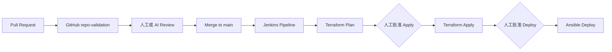
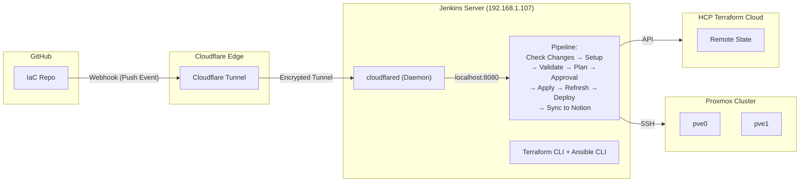
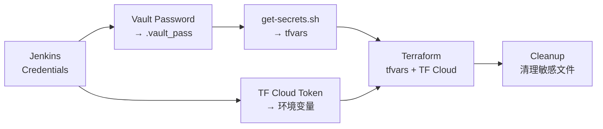
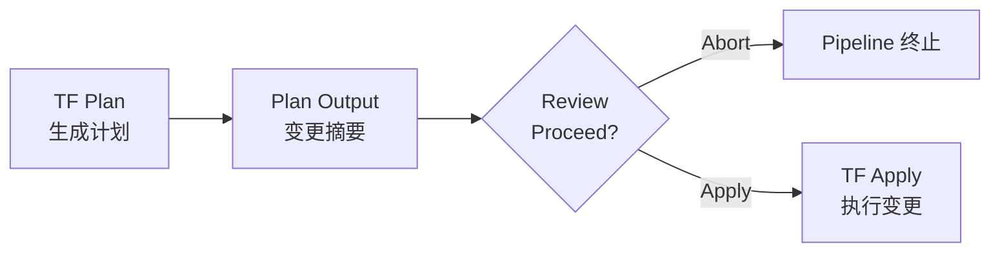
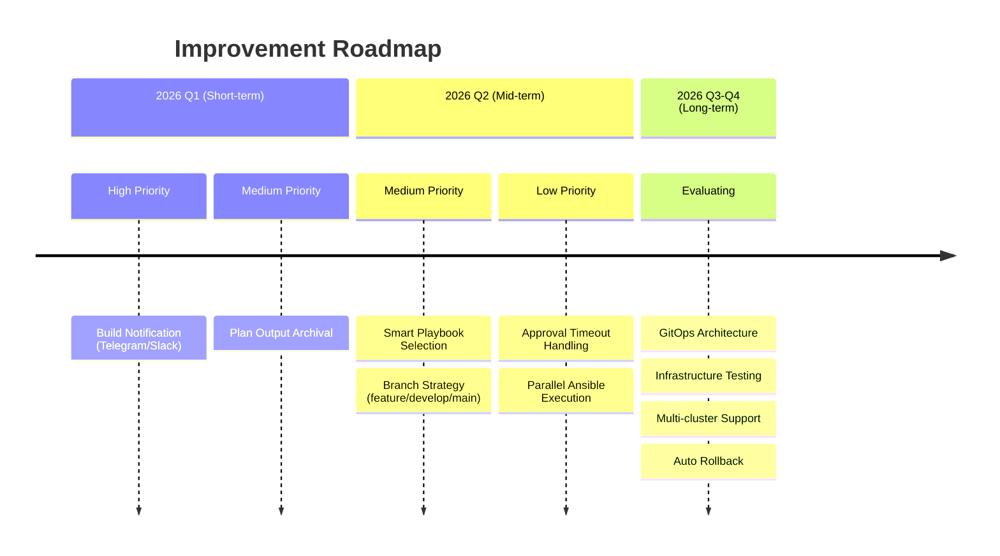

# CI/CD 架构设计文档

> Homelab Infrastructure as Code 项目的持续集成/持续部署架构

## 概述

本项目采用 **Jenkins + Terraform + Ansible** 的 CI/CD 架构，实现从代码提交到基础设施部署的自动化流程。

## 痛点分析

### 引入 CI/CD 之前的问题

在引入 CI/CD 之前，部署流程完全手动，存在以下痛点：

#### 1. 两阶段手动执行

```
# 手动流程 (之前)
cd terraform/proxmox
terraform plan
terraform apply          # 等待完成...

cd ../../ansible
ansible-playbook playbooks/deploy-xxx.yml   # 又要等待...
```

**问题**:
- 需要手动切换目录、执行两次命令
- 容易忘记执行 Ansible 配置
- 基础设施创建了但服务没配置

#### 2. 验证步骤容易遗漏

**问题**:
- 忘记运行 `terraform validate`
- 忘记运行 `ansible-playbook --syntax-check`
- 代码有语法错误但直接 apply 导致失败

#### 3. 敏感信息管理分散

**之前的状态**:
- Terraform 变量手动复制粘贴
- 每次换环境要重新配置
- 敏感信息可能意外提交到 Git

#### 4. 缺乏变更审计

**问题**:
- 不知道谁在什么时候做了什么变更
- 没有变更前的审批机制
- 出问题难以追溯

#### 5. Inventory 同步问题

**问题**:
- Terraform 创建了新 VM，但 Ansible inventory 没更新
- 手动维护静态 inventory 容易出错
- IP 地址变更后 inventory 不同步

### CI/CD 解决方案

| 痛点 | 解决方案 |
|------|----------|
| 两阶段手动执行 | Pipeline 自动串联 Terraform → Ansible |
| 验证步骤遗漏 | Validate 阶段强制执行所有检查 |
| 敏感信息分散 | Ansible Vault 统一管理，动态注入 |
| 缺乏变更审计 | Jenkins 构建历史 + 人工审批节点 |
| Inventory 同步 | 动态 Inventory 从 Terraform State 生成 |

## 设计目标

1. **自动化** - Git push 触发自动验证和部署
2. **安全** - 敏感信息集中管理，构建过程中动态注入
3. **可审计** - 人工审批节点，完整的构建日志
4. **幂等性** - 多次执行结果一致
5. **学习导向** - 适合个人 homelab 学习实践

### 技术栈

| 组件 | 用途 | 版本 |
|------|------|------|
| Jenkins | CI/CD 引擎 | LTS |
| Terraform | 基础设施即代码 | 1.14.x |
| Ansible | 配置管理 | 2.19.x |
| HCP Terraform Cloud | 远程状态存储 | - |
| GitHub | 代码仓库 | - |

## GitHub PR CI 与 Jenkins CD 边界

本仓库把合并前验证与合并后交付明确分离：GitHub Actions 负责无生产凭据、无外部写入的 PR CI；Jenkins 只在代码进入 `main` 后负责需要生产凭据的 plan、apply 与 deploy 流程。两条链路不能互相替代。



### `repo-validation` shadow CI

`.github/workflows/repo-validation.yml` 在 PR 创建、重新打开以及提交新 commit 时运行，包括 Draft PR，以便尽早反馈确定性问题。Draft 转为 ready for review 不会改变 HEAD SHA，因此该事件不重复运行 validation。Phase 1 的结果仅用于观察和校准，尚未加入 Ruleset required checks，因此失败不会改变当前合并权限。

该 workflow：

- 权限仅为 `contents: read`，checkout 不持久化凭据，也不映射 repository secrets。
- 使用事件中显式的 base/head SHA 做三点 diff，不依赖 `HEAD~1`。
- 对 Terraform、Ansible、文档、Hugo 与 Shell 变更运行适用检查；不适用项输出原因明确的 `not_applicable`。
- 只执行 Terraform `fmt`、禁用 backend 的 `init` 和 `validate`，不执行 `plan` 或 `apply`。
- 使用 CI-only Ansible inventory，不读取 Vault、Terraform state 或 SSH 身份，不连接 live hosts。
- 对 workflow、Jenkinsfile、validation scripts、secret bridge 与部署审批相关变更仅报告 `human_required`；Phase 1 不自动修复或合并。
- 不上传 Pages、不部署、不发布 artifact、不刷新生产 state，也不写入任何外部系统。

PR job/check 名固定为 `repo-validation`。同一 PR 出现新 commit 时会取消旧运行，并针对新的 head SHA 重新验证。

### `review-policy-gate` shadow

Phase 2B 将 Phase 2A 的两个自动 AI workflow 收敛为单一 `Claude Review` workflow。`claude-review` 对每个 Ready PR HEAD 只调用一次 SHA-pinned Claude Code Action，并产生一个有界 structured verdict；`review-policy-gate` job 先用公共 governance runtime 校验该 JSON，再由其中的确定性 renderer 生成当前 HEAD 的人类可读评论并执行 policy 判定。评论不是 gate 输入，也不会触发第二次模型调用。

workflow 监听 `opened`、`synchronize`、`ready_for_review` 与 `reopened`，所有 job 仅在 PR 非 Draft 时运行：直接创建 Ready PR 时在 `opened` 首次审查；Draft PR 在 `ready_for_review` 首次审查；Ready 后的新 commit 通过 `synchronize` 复审。同一 PR 的新事件会取消旧 run。Fork PR 在模型步骤前明确失败，不获得模型凭据。

模型只能读取 checkout 和执行受限的本地 Git 命令；Claude Action 显式接收当前 job 的只读 `github.token`，不申请 OIDC、GitHub write tool 或可持久化 checkout 凭据。`review-policy-gate` 不 checkout 或执行 PR head 代码，也不持有 Claude 凭据或 OIDC；它仅为确定性 renderer 获得 `issues: write`，先用固定 runtime 校验上游 job/conclusion、仓库、PR 编号和完整 HEAD SHA，再创建或更新带完整 HEAD marker 的评论并执行 policy 判定。上游失败、空输出、GitHub redaction、畸形 JSON、身份不匹配、陈旧 SHA、`needs_fix` 与 `human_required` 都 fail closed。

公共 runtime 固定到 `blue126/agent-project-bootstrap@3c6e3ada5ebe3790b9bbecf44c594ffa03be716e`，Claude Code Action 和 checkout 也固定到完整 commit SHA。该阶段仍是观察模式：`review-policy-gate` 尚未加入 Ruleset required checks，不配置 Fixer、自动合并或 GitHub 设置，也不改变 Jenkins。

### Phase 2A rollout evidence

- PR #29 首次证明 Claude 能产生符合 schema、绑定当前完整 HEAD SHA 的结构化 verdict，且公共 runtime evaluator 接受 `pass`。
- PR #30 再次证明 structured gate 对新的 HEAD 独立运行并返回无 finding 的 `pass`，同时全部确定性检查通过。
- PR #32 以普通非 workflow 文档变更证明 Draft 生命周期：`opened` 时两个 AI job 均为 `skipped`，`repo-validation` 与适用的确定性检查通过；同一 HEAD 转为 Ready 后只有两个 AI workflow 新建 run，评论 reviewer 实际取得短期 App token 并完成审查，structured gate 对该 SHA 返回无 finding 的 `pass`，且 `repo-validation` 没有重复运行。

这些证据验证了 structured output 与事件触发，但 Phase 2A 每个 HEAD 调用 Claude 两次。Phase 2B 保留其 schema、SHA 绑定和 Draft 生命周期合同，以单次调用加确定性 renderer 取代双调用；新 workflow 的真实 PR 运行仍需作为 rollout evidence 补充。

### Jenkins 保持合并后交付职责

`main` push（包括 PR merge）继续触发 Jenkins。Jenkins 可以读取其受控凭据并生成 Terraform plan，但 Terraform Apply 与 Ansible Deploy 前的两个 `input` 人工审批点必须保留。PR CI 的成功不代表批准部署，GitHub 或 AI 自动化也不得代替 Jenkins 操作者确认任何生产写入。

## 系统架构

### 整体架构图



### 组件说明

#### Jenkins Server

- **部署方式**: Proxmox LXC 容器 (Debian 12)
- **资源配置**: 2 核 CPU, 2GB 内存, 16GB 存储
- **网络**: 192.168.1.107 (静态 IP)
- **VMID**: 107 (与 IP 最后一位对应)

**预装工具**:
- Jenkins LTS
- OpenJDK 17
- Terraform CLI
- Ansible (via pipx)
- Ansible Galaxy Collections
- Python notion-client (Notion 同步脚本依赖)

#### HCP Terraform Cloud

- **用途**: 远程状态存储和锁定
- **组织**: homelab-roseville
- **工作区**: 按环境/用途划分
- **认证**: API Token (存储在 Jenkins Credentials)

## Pipeline 详细设计

### 流程图

> 交互式版本: [cicd-pipeline-flowchart.excalidraw](cicd-pipeline-flowchart.excalidraw) (用 [excalidraw.com](https://excalidraw.com) 打开)

```mermaid
flowchart LR
    Start([Start]) --> CheckChanges["Check Changes<br/>(classify + match playbooks)"]
    CheckChanges --> Decision1{IaC<br/>Changes?}

    Decision1 -- No --> NotBuilt[NOT_BUILT]
    Decision1 -- Yes --> Setup["Setup"]

    Setup --> Validate

    subgraph Validate["Validate (parallel, conditional)"]
        TFValidate["TF Validate<br/>(if terraform/ changed)"]
        AnsibleLint["Ansible Lint<br/>(if ansible/ changed)"]
    end

    Validate --> TFNeeded{terraform/<br/>changed?}
    TFNeeded -- No --> AnsibleNeeded
    TFNeeded -- Yes --> TFPlan[TF Plan]
    TFPlan --> TFChanges{TF Plan<br/>has changes?}
    TFChanges -- No --> AnsibleNeeded
    TFChanges -- Yes --> Approval1{Approve<br/>Apply?}
    Approval1 -- Abort --> Abort1[Abort]
    Approval1 -- Apply --> TFApply[TF Apply]
    TFApply --> AnsibleNeeded

    AnsibleNeeded{Playbooks<br/>matched?}
    AnsibleNeeded -- No --> Cleanup
    AnsibleNeeded -- Yes --> Refresh[Refresh Inventory]
    Refresh --> Approval2{Approve<br/>Deploy?}
    Approval2 -- Abort --> Abort2[Abort]
    Approval2 -- Deploy --> Deploy[Ansible Deploy]

    Deploy --> NotionSync[Sync to Notion]
    NotionSync --> Cleanup[Cleanup]
    Cleanup --> End([End])
```



### 阶段详解

> **Note**: Jenkins 声明式 Pipeline 会在执行 stages 之前自动 checkout SCM，无需显式定义 Checkout stage。

#### 1. Check Changes (智能变更分析)

本阶段执行三层分析：

**第一层：是否需要构建？**

| 路径 | 触发构建 | 原因 |
|------|----------|------|
| `terraform/**` | ✓ | 基础设施变更 |
| `ansible/**` | ✓ | 配置管理变更 |
| `scripts/**` | ✓ | 辅助脚本变更 |
| `Jenkinsfile` | ✓ | Pipeline 本身变更 |
| `docs/**` | ✗ | 文档变更，无需部署 |
| `.github/**` | ✗ | 仓库配置，无需部署 |

**第二层：需要哪些验证？**

| 变更类型 | TF Validate | Ansible Lint | TF Plan/Apply | Ansible Deploy |
|----------|:-----------:|:------------:|:-------------:|:--------------:|
| `terraform/**` | ✓ | ✗ | ✓ | 仅匹配到 playbook 时 |
| `ansible/**` | ✗ | ✓ | ✗ | 仅匹配到 playbook 时 |
| `scripts/` / `Jenkinsfile` | ✗ | ✗ | ✗ | ✗ |

**第三层：自动匹配 Playbook（约定优于配置）**

基于命名约定自动推导，**新增服务无需修改 Jenkinsfile**：

| 变更文件 | 推导规则 | 示例 |
|----------|----------|------|
| `terraform/proxmox/<service>.tf` | → 查找 `deploy-<service>.yml` | `netbox.tf` → `deploy-netbox.yml` |
| `ansible/roles/<role>/**` | → 查找 `deploy-<role>.yml` | `roles/caddy/` → `deploy-caddy.yml` |
| `ansible/playbooks/deploy-*.yml` | → 直接加入部署列表 | `deploy-n8n.yml` → `deploy-n8n.yml` |
| `ansible/inventory/host_vars/<host>*` | → 查找 `deploy-<host>.yml` | `host_vars/pbs.yml` → `deploy-pbs.yml` |

**Terraform 基础设施文件**（不触发 playbook 匹配，仅做 validate/plan）：
- `versions.tf`, `provider.tf`, `variables.tf`, `main.tf`, `provisioning.tf`, `pve-cluster.tf`

**广泛影响路径**（不自动部署，仅做 lint/validate）：
- `ansible/roles/common/`、`ansible/roles/docker/` — 被多个服务共用
- `ansible/inventory/group_vars/` — 影响范围不确定
- `terraform/modules/` — 影响所有使用该 module 的服务

**未匹配文件**：在构建日志中输出 WARNING，写入构建描述（`⚠ N unmatched`），不阻断流程，由人工判断是否需要手动部署。

构建历史描述示例：
```
#15  TF | deploy-netbox.yml | ⚠ 1 unmatched
#14  TF
#13  deploy-caddy.yml
#12  validate only
#11  Skipped: docs/non-IaC changes only
```

#### 2. Setup (条件执行)

```groovy
stage('Setup') {
    steps {
        // 1. 写入 Vault 密码
        withCredentials([string(credentialsId: 'ansible-vault-password', variable: 'VAULT_PASS')]) {
            sh '''
                echo "$VAULT_PASS" > $ANSIBLE_VAULT_PASSWORD_FILE
                chmod 600 $ANSIBLE_VAULT_PASSWORD_FILE
            '''
        }
        // 2. 条件初始化 Terraform (按需)
        script {
            def initProxmox = (env.NEEDS_TF_PROXMOX == 'true' || env.ANSIBLE_PLAYBOOKS?.trim())
            def initEsxi = (env.NEEDS_TF_ESXI == 'true' || env.ANSIBLE_PLAYBOOKS?.trim())
            if (initProxmox) { dir('terraform/proxmox') { sh 'terraform init -input=false' } }
            if (initEsxi) { dir('terraform/esxi') { sh 'terraform init -input=false' } }
        }
        // 3. 生成 Terraform secrets
        sh './scripts/get-secrets.sh'
        // 4. 条件安装 Collections
        dir('ansible') {
            sh '''
                if [ ! -d "collections/ansible_collections/community/docker" ] || \
                   [ ! -d "collections/ansible_collections/cloud/terraform" ]; then
                    echo "Installing Ansible Galaxy collections..."
                    ansible-galaxy collection install -r requirements.yml -p collections
                else
                    echo "Ansible collections already installed, skipping..."
                fi
            '''
        }
    }
}
```

**关键操作**:
1. 从 Jenkins Credentials 获取 Vault 密码，写入临时文件
2. 条件初始化 Terraform providers：
   - `terraform/proxmox/` 变更或有 playbook 需要部署 → init proxmox
   - `terraform/esxi/` 变更或有 playbook 需要部署 → init esxi
   - `terraform/modules/` 变更 → 两个都 init（共享模块）
   - 仅 scripts/Jenkinsfile 变更 → 跳过 init
3. 执行 `get-secrets.sh` 解密 Vault，生成 `secrets.auto.tfvars`（使用 `-i localhost,` 显式指定 inventory，避免加载 terraform 动态 inventory）
4. 检查并安装 Ansible Galaxy Collections (仅首次)

#### 3. Validate (并行)

```groovy
stage('Validate') {
    parallel {
        stage('Terraform Validate') {
            steps {
                dir('terraform/proxmox') {
                    sh 'terraform validate'
                    sh 'terraform fmt -check -recursive || echo "Warning"'
                }
            }
        }
        stage('Ansible Lint') {
            steps {
                dir('ansible') {
                    sh 'ansible-playbook playbooks/*.yml --syntax-check'
                }
            }
        }
    }
}
```

**并行执行**:
- Terraform: 语法验证、格式检查（init 已在 Setup 阶段完成）
- Ansible: 所有 playbook 语法检查（从 `ansible/` 目录执行）

#### 4. Terraform Plan (智能变更检测)

```groovy
stage('Terraform Plan') {
    steps {
        dir('terraform/proxmox') {
            script {
                // -detailed-exitcode: 0=无变更, 2=有变更, 1=错误
                def exitCode = sh(
                    script: 'terraform plan -out=tfplan -input=false -detailed-exitcode',
                    returnStatus: true
                )
                if (exitCode == 1) { error 'Terraform plan failed' }
                env.HAS_TF_CHANGES = (exitCode == 2) ? 'true' : 'false'
            }
        }
    }
}
```

- 使用 `-detailed-exitcode` 检测是否有实际变更
- **无变更时**：自动跳过 Approval 和 Apply 阶段，直接进入后续步骤
- **有变更时**：触发人工审批流程

#### 5. Approval Gates

**两个审批点（均为条件触发）**:

1. **Terraform Apply 前** — 仅当 `terraform plan -detailed-exitcode` 检测到实际变更时触发
2. **Ansible Deploy 前** — 仅当有匹配到的 playbook 时触发，审批信息列出将要执行的 playbook 列表

```groovy
stage('Approval - Ansible Deploy') {
    when { expression { env.ANSIBLE_PLAYBOOKS?.trim() } }
    steps {
        script {
            def playbookList = env.ANSIBLE_PLAYBOOKS.split(',').collect { "  - ${it}" }.join('\n')
            input message: "The following playbooks will be executed:\n${playbookList}\n\nProceed?"
        }
    }
}
```

#### 6. Terraform Apply

```groovy
stage('Terraform Apply') {
    steps {
        dir('terraform/proxmox') {
            sh 'terraform apply -input=false tfplan'
        }
    }
}
```

- 执行之前保存的 plan
- 创建/更新/删除基础设施资源

#### 7. Refresh Inventory

```groovy
stage('Refresh Inventory') {
    steps {
        sh './scripts/refresh-terraform-state.sh'
    }
}
```

- 从 Terraform Cloud 拉取最新 state
- 保存到本地供 Ansible 动态 inventory 使用
- **条件执行**：仅在有 Terraform 变更或有 playbook 需要部署时执行（纯 scripts/Jenkinsfile 变更时跳过）

#### 8. Ansible Deploy

```groovy
stage('Ansible Deploy') {
    when { expression { env.ANSIBLE_PLAYBOOKS?.trim() } }
    steps {
        dir('ansible') {
            script {
                def playbooks = env.ANSIBLE_PLAYBOOKS.split(',')
                for (pb in playbooks) {
                    sh "ansible-playbook playbooks/${pb}"
                }
            }
        }
    }
}
```

- 仅当 Check Changes 阶段匹配到具体 playbook 时执行
- 逐个运行匹配到的 playbook
- 无匹配 playbook 时自动跳过

#### 9. Sync to Notion

```groovy
stage('Sync to Notion') {
    steps {
        catchError(buildResult: 'SUCCESS', stageResult: 'FAILURE') {
            withCredentials([
                string(credentialsId: 'notion-token', variable: 'NOTION_TOKEN'),
                string(credentialsId: 'notion-database-id', variable: 'NOTION_DATABASE_ID')
            ]) {
                sh 'NOTION_DRY_RUN=false python3 scripts/sync-to-notion.py'
            }
        }
    }
}
```

- 从 Terraform state 读取所有 VM/LXC 资源信息
- 从 Ansible Vault 读取凭据（用户名、密码、API Token 等）
- 同步到 Notion 数据库，自动创建或更新资源页面
- **仅在 Ansible Deploy 实际执行后触发**（有匹配的 playbook 才有意义同步）
- 使用 `catchError` 包裹：**同步失败不会影响整体构建结果**（stage 标红但 build 仍为 SUCCESS）
- `NOTION_DRY_RUN=false` 环境变量控制实际写入（默认为 dry run，安全）

#### 10. Cleanup (post)

```groovy
post {
    always {
        sh 'rm -f $ANSIBLE_VAULT_PASSWORD_FILE'
        sh 'rm -f terraform/proxmox/secrets.auto.tfvars'
        sh 'rm -f terraform/oci/secrets.auto.tfvars'
    }
}
```

- 无论成功失败都执行
- 清理敏感文件

## 凭据管理

### Jenkins Credentials

| Credential ID | 类型 | 用途 |
|---------------|------|------|
| `github-ssh-key` | SSH Private Key | GitHub Deploy Key，克隆仓库 |
| `terraform-cloud-token` | Secret Text | HCP Terraform Cloud API Token |
| `ansible-vault-password` | Secret Text | Ansible Vault 解密密码 |
| `notion-token` | Secret Text | Notion Integration Token (Sync to Notion) |
| `notion-database-id` | Secret Text | Notion 数据库 ID (Sync to Notion) |

### 凭据流转图



### 敏感信息存储位置

| 信息类型 | 存储位置 | 访问方式 |
|----------|----------|----------|
| Proxmox API 凭据 | Ansible Vault | get-secrets.sh 提取 |
| Tailscale Auth Key | Ansible Vault | Ansible 直接使用 |
| Terraform Cloud Token | Jenkins Credentials | 环境变量注入 |
| GitHub Deploy Key | Jenkins Credentials + GitHub | SSH 认证 |
| Vault 密码 | Jenkins Credentials | 临时文件 |

## 动态 Inventory

### 架构

```
HCP Terraform Cloud (Remote State)
        │
        │  terraform state pull
        ▼
本地 tfstate 缓存 (ansible_host resources)
        │
        │  cloud.terraform plugin
        ▼
terraform.yml (动态 Inventory 插件)
        │
        │  ansible-inventory
        ▼
Generated Inventory
   ├── pve_lxc
   ├── pve_vms
   ├── jenkins
   └── pve0, pve1
```

### Inventory 文件结构

```
ansible/inventory/
├── terraform.yml           # Proxmox 动态 inventory (Terraform state)
├── terraform-esxi.yml      # ESXi 动态 inventory
├── group_vars/
│   ├── all/
│   │   ├── main.yml       # 全局变量
│   │   └── vault.yml      # 加密的敏感变量
│   ├── pve_lxc.yml        # LXC 组变量
│   └── pve_vms.yml        # VM 组变量
└── host_vars/
    ├── homepage.yml       # 主机特定变量
    └── ...
```

## 触发机制

### Webhook (via Cloudflare Tunnel)

```groovy
// Jenkins Job 配置
triggers {
    githubPush()
}
```

**架构变革**:
- 引入 **Cloudflare Tunnel** 将内网 Jenkins 安全暴露给 GitHub
- 替代了之前的 Poll SCM (5分钟轮询) 机制
- 实现 **实时触发** 构建

### 触发流程

1. 开发者 Push 代码到 GitHub
2. GitHub 发送 `push` 事件到 `https://jenkins.willfan.me/github-webhook/`
3. 请求到达 Cloudflare Edge，经由加密隧道转发到 Jenkins 本地 `cloudflared` 守护进程
4. `cloudflared` 将请求转发给 Jenkins `localhost:8080`
5. Jenkins 验证 Payload 并触发 Pipeline

### 触发条件

| 条件 | 是否触发 |
|------|----------|
| Push to main | 是 |
| Push to feature branch | 否 (可配置) |
| PR merge | 是 |
| 手动 Build Now | 是 |

## 安全设计

### 最小权限原则

| 组件 | 权限范围 |
|------|----------|
| GitHub Deploy Key | 仅限 IaC 仓库，只读或读写 |
| Terraform Cloud Token | 限定 workspace |
| Proxmox API Token | 限定必要的 VM/LXC 操作权限 |
| Ansible SSH Key | 仅限目标主机 |

### 敏感信息保护

1. **不提交敏感信息到 Git**
   - `secrets.auto.tfvars` 在 `.gitignore`
   - `.vault_pass` 在 `.gitignore`
   - 使用 Ansible Vault 加密

2. **构建时动态生成**
   - Vault 密码从 Jenkins Credentials 注入
   - tfvars 由 get-secrets.sh 动态生成

3. **构建后清理**
   - post.always 块清理所有敏感文件
   - 即使构建失败也会执行

### 审批机制



## 错误处理

### 失败场景处理

| 阶段 | 失败原因 | 处理方式 |
|------|----------|----------|
| Checkout | 网络问题/认证失败 | 自动重试，检查 Deploy Key |
| Setup | Vault 密码错误 | Pipeline 失败，检查 Credentials |
| Validate | 语法错误 | Pipeline 失败，修复代码后重新触发 |
| Plan | Provider 配置错误 | Pipeline 失败，检查 tfvars |
| Apply | 资源冲突/API 错误 | Pipeline 失败，需人工干预 |
| Ansible | SSH 连接失败 | Pipeline 失败，检查网络/密钥 |

### 回滚策略

1. **Terraform 回滚**
   - Revert Git commit
   - 重新运行 Pipeline
   - Terraform 会自动计算差异并回滚

2. **Ansible 回滚**
   - 大部分操作幂等，重新运行即可
   - 复杂回滚需要专门的回滚 playbook

### Jenkins CPS 已知问题

Jenkins Pipeline 使用 CPS (Continuation Passing Style) 执行引擎，在某些步骤（如 `fileExists()`、`input`）处会"冻结"当前状态以支持暂停/恢复。这会导致一些 Groovy 对象行为异常。

#### 1. Regex Matcher 不可序列化

**问题**: `=~` 操作符返回的 `java.util.regex.Matcher` 对象无法被 CPS 序列化，导致 `NotSerializableException`。

**症状**:
```
java.io.NotSerializableException: java.util.regex.Matcher
```

**解决方案**: 立即提取匹配结果，然后将 Matcher 置为 null：
```groovy
def matcher = (file =~ /pattern/)
def result = matcher ? matcher[0][1] : null
matcher = null  // 在任何 CPS 步骤之前丢弃
if (result) {
    fileExists(...)  // CPS checkpoint
}
```

#### 2. Set 集合去重失效

**问题**: `[] as Set` 创建的集合在 CPS 序列化/反序列化后可能丢失 Set 语义，退化为普通 List，导致重复元素。

**解决方案**: 在使用前显式调用 `unique()`：
```groovy
def items = [] as Set
// ... 循环中多次 add ...
env.RESULT = items.toList().unique().join(',')
```

## 监控与日志

### Jenkins 日志

- 每个构建保留完整 console output
- 保留最近 10 个构建 (`buildDiscarder`)
- 支持 AnsiColor 彩色输出

### 构建超时

```groovy
options {
    timeout(time: 30, unit: 'MINUTES')
}
```

- 防止构建无限等待
- 审批步骤不受超时限制

## 当前局限性

### ~~1. 全量部署问题~~ (已解决)

~~**现状**: Ansible Deploy 阶段目前只运行单个 playbook 验证~~

已通过 Check Changes 阶段的智能 Playbook 匹配解决。基于命名约定自动推导 `deploy-<service>.yml`，无法匹配的文件输出 WARNING 由人工判断。

### 2. 审批阻塞

**现状**: 两个条件触发的人工审批节点（无变更时自动跳过）

**问题**:
- 审批期间占用 Jenkins executor
- 无人审批时 Pipeline 一直等待
- 不适合频繁部署场景

### 3. 单一环境

**现状**: 只有 production 环境

**问题**:
- 无法在 staging 环境先验证
- 变更直接影响生产服务
- 缺乏蓝绿部署能力

### 4. 缺乏通知

**现状**: 只有 Jenkins Web UI 查看结果

**问题**:
- 构建失败无主动通知
- 需要人工检查构建状态
- 容易错过失败的部署

## 未来改进

### 短期改进 (1-2 周)

#### 1. 构建通知

**目标**: 构建完成/失败时自动通知

**方案**: 
```groovy
post {
    failure {
        // 发送 Telegram/Slack 通知
        sh 'curl -X POST ...'
    }
}
```

**优先级**: 高 - 解决无人值守时的感知问题

#### 2. Plan 输出归档

**目标**: 保存每次构建的 Terraform plan 输出

**方案**:
```groovy
stage('Terraform Plan') {
    steps {
        sh 'terraform plan -out=tfplan | tee plan-output.txt'
        archiveArtifacts artifacts: 'plan-output.txt'
    }
}
```

**优先级**: 中 - 便于审计和回顾

### 中期改进 (1-3 月)

#### ~~1. 智能 Playbook 选择~~ (已实现)

已通过 Check Changes 阶段基于命名约定自动推导实现。详见「阶段详解 - 2. Check Changes」。

#### 2. 分支策略

**目标**: 不同分支不同的 Pipeline 行为

**方案**:
| 分支 | Validate | Plan | Apply | Ansible |
|------|----------|------|-------|---------|
| feature/* | ✓ | ✓ | ✗ | ✗ |
| develop | ✓ | ✓ | ✓ (自动) | ✓ (staging) |
| main | ✓ | ✓ | ✓ (审批) | ✓ (production) |

```groovy
stage('Terraform Apply') {
    when {
        anyOf {
            branch 'main'
            branch 'develop'
        }
    }
    steps {
        // ...
    }
}
```

**优先级**: 中 - 需要先建立 staging 环境

#### 3. 审批超时自动处理

**目标**: 审批超时后自动取消或自动通过

**方案**:
```groovy
stage('Approval') {
    options {
        timeout(time: 4, unit: 'HOURS')
    }
    steps {
        script {
            try {
                input message: 'Proceed?'
            } catch (err) {
                // 超时处理
                currentBuild.result = 'ABORTED'
            }
        }
    }
}
```

**优先级**: 低 - homelab 场景不紧急

#### 4. 并行 Ansible 执行

**目标**: 多个独立服务并行部署

**方案**:
```groovy
stage('Ansible Deploy') {
    parallel {
        stage('Deploy Jenkins') {
            steps { sh 'ansible-playbook deploy-jenkins.yml' }
        }
        stage('Deploy Netbox') {
            steps { sh 'ansible-playbook deploy-netbox.yml' }
        }
    }
}
```

**优先级**: 低 - 当前服务数量不多

### 长期改进 (3-6 月)

#### 1. GitOps 架构

**目标**: 引入 GitOps 工具实现声明式部署

**候选方案**:
- **ArgoCD**: Kubernetes 原生，功能强大
- **Flux**: 轻量，与 Git 集成好

**考虑因素**:
- 需要先有 Kubernetes 集群
- 学习曲线较陡
- 可能过度工程化 for homelab

**优先级**: 低 - 需要评估是否必要

#### 2. 基础设施测试

**目标**: 自动化测试基础设施配置

**方案**:
- **Terratest**: Go 语言编写 Terraform 测试
- **InSpec**: 基础设施合规测试
- **Molecule**: Ansible role 测试

```go
// Terratest 示例
func TestProxmoxVM(t *testing.T) {
    terraformOptions := &terraform.Options{
        TerraformDir: "../terraform/proxmox",
    }
    
    defer terraform.Destroy(t, terraformOptions)
    terraform.InitAndApply(t, terraformOptions)
    
    // 验证 VM 创建成功
    vmIP := terraform.Output(t, terraformOptions, "vm_ip")
    assert.NotEmpty(t, vmIP)
}
```

**优先级**: 低 - 当前规模不需要

#### 3. 多集群支持

**目标**: 支持部署到多个 Proxmox 集群

**场景**:
- 主集群 (pve0, pve1)
- 备份集群 (远程站点)
- 测试集群

**方案**:
- Terraform workspaces
- 多个 provider 配置
- 环境变量切换

**优先级**: 低 - 取决于硬件扩展计划

#### 4. 自动回滚

**目标**: 部署失败时自动回滚到上一个稳定版本

**方案**:
```groovy
post {
    failure {
        script {
            // 获取上一个成功的 commit
            def lastGoodCommit = sh(script: 'git rev-parse HEAD~1', returnStdout: true)
            // 触发回滚 Pipeline
            build job: 'IaC-Rollback', parameters: [string(name: 'COMMIT', value: lastGoodCommit)]
        }
    }
}
```

**优先级**: 低 - 需要更成熟的发布流程

## 改进路线图



> 注: 优先级可能根据实际需求调整

## 附录

### 相关文件

```
Jenkinsfile                           # Pipeline 定义
terraform/proxmox/jenkins.tf          # Jenkins LXC 定义
ansible/roles/jenkins/                # Jenkins 配置 role
ansible/playbooks/deploy-jenkins.yml  # Jenkins 部署 playbook
scripts/get-secrets.sh                # 从 Vault 提取 secrets
scripts/refresh-terraform-state.sh    # 刷新 Terraform state
scripts/sync-to-notion.py            # 同步 Terraform state 到 Notion 数据库
requirements.txt                     # Python 依赖 (含 notion-client)
```

### 参考文档

- [Jenkins Pipeline 语法](https://www.jenkins.io/doc/book/pipeline/syntax/)
- [Terraform Cloud 文档](https://developer.hashicorp.com/terraform/cloud-docs)
- [Ansible Vault 文档](https://docs.ansible.com/ansible/latest/vault_guide/)
- [cloud.terraform Collection](https://galaxy.ansible.com/cloud/terraform)
