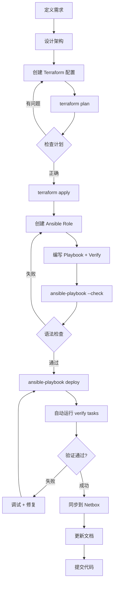

# Homelab IaC 系统架构文档

**Last Updated**: 2026-02-05  
**Status**: ✅ Active  
**Owner**: Homelab IaC Project

## 文档概览

本文档描述 Homelab Infrastructure as Code 项目的完整系统架构，包括基础设施层、编排层、配置管理层、服务层和网络拓扑。

### 文档目的

- 为新成员提供系统全貌的快速理解
- 作为架构决策的权威参考
- 指导新服务的集成和部署
- 记录关键设计决策和技术选型

### 相关文档

- [Ansible Vault 架构设计](ansible-vault-architecture.md) - 密码管理架构
- [Ansible Role 架构设计](ansible-role-architecture.md) - Role 组织模式
- [快速参考指南](../guides/QUICK-REFERENCE.md) - 常用命令速查

## 架构层次图

```
┌─────────────────────────────────────────────────────────────────────┐
│                        用户交互层 (User Layer)                        │
│  Homepage Dashboard • Tailscale VPN • Caddy Reverse Proxy           │
└─────────────────────────────────────────────────────────────────────┘
                                  │
┌─────────────────────────────────────────────────────────────────────┐
│                      应用服务层 (Application Layer)                   │
│  Netbox • Immich • n8n • Jenkins • RustDesk • Anki Sync             │
└─────────────────────────────────────────────────────────────────────┘
                                  │
┌─────────────────────────────────────────────────────────────────────┐
│                     配置管理层 (Configuration Layer)                  │
│  Ansible Playbooks + Roles + Inventory                              │
│  • Docker Runtime  • Service Deployment  • Health Checks             │
└─────────────────────────────────────────────────────────────────────┘
                                  │
┌─────────────────────────────────────────────────────────────────────┐
│                      编排层 (Orchestration Layer)                     │
│  Terraform + HCP Cloud Backend                                       │
│  • VM/LXC Provisioning  • Resource Management  • State Management    │
└─────────────────────────────────────────────────────────────────────┘
                                  │
┌─────────────────────────────────────────────────────────────────────┐
│                    基础设施层 (Infrastructure Layer)                  │
│  Proxmox VE Cluster • VMware ESXi • Oracle Cloud Infrastructure      │
│  • Physical Servers  • Network  • Storage                            │
└─────────────────────────────────────────────────────────────────────┘
                                  │
┌─────────────────────────────────────────────────────────────────────┐
│                      数据层 (Data & IPAM Layer)                       │
│  Netbox IPAM/DCIM • Proxmox Backup Server • Cloud Storage            │
└─────────────────────────────────────────────────────────────────────┘
```

## 核心架构原则

### 1. 职责分离 (Separation of Concerns)

| 层次 | 职责 | 工具 | 不负责 |
|------|------|------|--------|
| **Provisioning** | 创建 VM/LXC 资源 (CPU, RAM, Disk, Network) | Terraform | 软件安装、服务配置 |
| **Configuration** | 安装软件、配置服务、部署应用 | Ansible | 创建虚拟机、管理存储 |
| **Verification** | 健康检查、部署验证、端点测试 | Ansible (verify tags) | 实际部署操作 |

**设计决策**:
- ✅ Terraform 管理资源生命周期（create/update/destroy）
- ✅ Ansible 管理配置和应用状态（install/configure/verify）
- ✅ 清晰的边界防止职责混淆（例如：Terraform 不部署 Docker 容器）

### 2. 声明式配置 (Declarative Configuration)

所有基础设施和配置都是代码化、版本化、幂等的：

```hcl
# Terraform: 声明期望状态
module "netbox" {
  source       = "../modules/proxmox-vm"
  vm_name      = "netbox"
  target_node  = "pve0"
  cores        = 2
  memory       = 4096
}
```

```yaml
# Ansible: 声明配置期望
- name: Install Docker
  apt:
    name: docker.io
    state: present
```

### 3. 单一数据源 (Single Source of Truth)

| 数据类型 | 权威来源 | 同步机制 |
|----------|----------|----------|
| **密码凭证** | Ansible Vault (`vault.yml`) | `scripts/get-secrets.sh` → Terraform |
| **基础设施状态** | Terraform State (HCP Cloud) | Dynamic Inventory → Ansible |
| **网络/IPAM** | Netbox | Terraform → Netbox (push), 未来计划 pull |
| **备份配置** | Proxmox Backup Server | Ansible roles 配置 |

### 4. 自动化验证 (Automated Verification)

每个服务部署都包含内置健康检查：

```yaml
# 验证模式：所有 playbook 的第二个 play
- name: Verify Service Deployment
  hosts: service_name
  tags: [verify]
  tasks:
    - name: Wait for service port
      wait_for: port=8080 timeout=60
    - name: Test HTTP endpoint
      uri: url=http://localhost:8080
    - name: Check Docker health
      command: docker ps --filter health=healthy
```

## 基础设施层架构

### 物理拓扑

```
                      ┌──────────────────┐
                      │  Internet / WAN  │
                      └────────┬─────────┘
                               │
                    ┌──────────┴──────────┐
                    │   Gateway Router    │
                    │   192.168.1.1       │
                    └──────────┬──────────┘
                               │
        ┌──────────────────────┼──────────────────────┐
        │                      │                      │
┌───────┴────────┐   ┌─────────┴────────┐   ┌────────┴────────┐
│   Proxmox VE   │   │   VMware ESXi    │   │  Oracle Cloud   │
│   Cluster      │   │   Host           │   │  Infrastructure │
│   (pve0, ...)  │   │   (esxi-01)      │   │  (oci-01)       │
└────────────────┘   └──────────────────┘   └─────────────────┘
      │
      ├── vmbr0: Management Network (192.168.1.0/24)
      └── vmbr1: VM/LXC Network (192.168.1.0/24)
```

### Hypervisor 分布

| 平台 | 用途 | 管理工具 | Terraform Provider |
|------|------|----------|-------------------|
| **Proxmox VE** | 主要虚拟化平台，运行大部分服务 | Web UI (8006), CLI | `bpg/proxmox` 0.70.0 |
| **VMware ESXi** | PBS 备份服务器（专用） | vSphere Client | `vmware/vsphere` |
| **Oracle Cloud** | 公有云实例（未来扩展） | OCI Console | `oracle/oci` |

### 虚拟机类型

```
Proxmox VE Cluster
├── QEMU VMs (Ubuntu 22.04/24.04)
│   ├── netbox (VMID 104)        # IPAM/DCIM
│   ├── immich (VMID 105)        # 照片管理
│   ├── jenkins (VMID 106)       # CI/CD
│   ├── n8n (VMID 107)           # 工作流自动化
│   └── rustdesk (VMID 108)      # 远程桌面
│
└── LXC Containers (Debian 12)
    ├── homepage (VMID 103)      # Dashboard
    ├── anki (VMID 109)          # Anki 同步服务器
    └── caddy (VMID 110)         # 反向代理
```

### 存储架构

| 存储池 | 类型 | 用途 | 备份策略 |
|--------|------|------|----------|
| `local` | directory | ISO、模板、片段 | 不备份 |
| `vmdata` | LVM/ZFS | VM 磁盘 | PBS 每日备份 |
| `local:vztmpl` | directory | LXC 模板 | 不备份 |
| `pbs-storage` | Proxmox Backup Server | 备份存储 | 异地复制（未来） |

## 编排层架构 (Terraform)

### 目录组织结构

```
terraform/
├── proxmox/                      # Proxmox 环境
│   ├── versions.tf              # Terraform + Provider 版本
│   ├── provider.tf              # Proxmox provider 配置
│   ├── variables.tf             # 输入变量定义
│   ├── pve-cluster.tf           # 集群资源
│   ├── netbox.tf                # Netbox VM + Ansible 主机
│   ├── immich.tf                # Immich VM + Ansible 主机
│   ├── homepage.tf              # Homepage LXC + Ansible 主机
│   ├── anki.tf                  # Anki LXC + Ansible 主机
│   ├── jenkins.tf               # Jenkins VM + Ansible 主机
│   ├── n8n.tf                   # n8n VM + Ansible 主机
│   ├── rustdesk.tf              # RustDesk VM + Ansible 主机
│   ├── caddy.tf                 # Caddy LXC + Ansible 主机
│   └── provisioning.tf          # 共享资源（如 cloud-init 片段）
│
├── esxi/                         # ESXi 环境
│   ├── versions.tf
│   ├── provider.tf
│   ├── pbs.tf                   # Proxmox Backup Server VM
│   └── variables.tf
│
├── oci/                          # Oracle Cloud 环境
│   ├── versions.tf
│   ├── provider.tf
│   ├── compute.tf               # OCI 计算实例
│   └── variables.tf
│
├── netbox-integration/           # Netbox DCIM 数据管理
│   ├── versions.tf              # Netbox provider
│   ├── provider.tf
│   ├── main.tf                  # Site/Cluster 定义
│   ├── pvecluster.tf            # Proxmox 集群元数据
│   ├── infrastructure.tf        # 物理设备 + 网桥
│   ├── vm.tf                    # QEMU VM 清单
│   ├── containers.tf            # LXC 清单
│   ├── services.tf              # 服务端口映射
│   ├── connections.tf           # Cable 拓扑连接
│   └── resources.tf             # 角色、类型等基础数据
│
└── modules/                      # 可重用模块
    ├── proxmox-vm/              # Proxmox QEMU VM 模块
    │   ├── main.tf              # bpg/proxmox provider 资源
    │   ├── variables.tf         # 模块输入
    │   └── outputs.tf           # 模块输出（IP、VMID）
    │
    ├── proxmox-lxc/             # Proxmox LXC 模块
    │   ├── main.tf
    │   ├── variables.tf
    │   └── outputs.tf
    │
    └── esxi-vm/                 # ESXi VM 模块
        ├── main.tf
        ├── variables.tf
        └── outputs.tf
```

### Per-Service 文件模式

每个服务一个独立的 `.tf` 文件，包含三个资源：

```hcl
# terraform/proxmox/netbox.tf

# 1. 模块调用 - 创建 VM/LXC
module "netbox" {
  source = "../modules/proxmox-vm"
  
  vm_name      = "netbox"
  target_node  = "pve0"
  vmid         = 104
  ip_address   = "192.168.1.104/24"
  cores        = 2
  memory       = 4096
  disk_size    = "20G"
  storage_pool = var.storage_pool
  sshkeys      = var.sshkeys
}

# 2. Ansible 动态清单 - 桥接到配置管理
resource "ansible_host" "netbox" {
  name   = "netbox"
  groups = ["pve_vms"]
  variables = {
    ansible_user = "ubuntu"
    ansible_host = "192.168.1.104"
  }
}

# 3. 输出 - 便于引用和调试
output "netbox_ip" {
  value = module.netbox.default_ip
}
```

### Backend 配置

```hcl
# HCP Terraform Cloud - 远程状态管理
terraform {
  cloud {
    organization = "homelab-roseville"
    workspaces {
      name = "iac-proxmox-lab"  # 每个环境独立 workspace
    }
  }
}
```

**设计优势**:
- ✅ 状态文件加密存储
- ✅ 团队协作锁定机制
- ✅ 历史版本管理
- ✅ 敏感数据不落本地

### Provider 版本策略

| Provider | Version | 原因 |
|----------|---------|------|
| `bpg/proxmox` | 0.70.0 | 官方推荐，支持 Proxmox VE 8.x |
| `ansible/ansible` | ~> 1.3.0 | 动态清单集成 |
| `e-breuninger/netbox` | 3.10.0 | Netbox v4.1 兼容 |
| `vmware/vsphere` | latest | ESXi 标准 provider |

### Terraform → Ansible 桥接

```
Terraform State (HCP Cloud)
         │
         │ terraform output -json
         ▼
  Dynamic Inventory
  (terraform.tfstate.d/)
         │
         │ ansible-inventory --list
         ▼
  Ansible Playbooks
```

**刷新命令**:
```bash
./scripts/refresh-terraform-state.sh
```

## 配置管理层架构 (Ansible)

### Inventory 结构

```
ansible/inventory/
├── groups.yml                    # 组层次结构定义
├── terraform.yml                 # Terraform 动态清单配置
│
├── group_vars/                   # 组级别变量
│   ├── all/
│   │   ├── common.yml           # 全局通用变量
│   │   └── vault.yml            # 加密密码（18 个密码）
│   ├── proxmox_cluster.yml      # Proxmox 节点配置
│   ├── pve_vms.yml              # QEMU VM 通用配置
│   ├── pve_lxc.yml              # LXC 通用配置
│   ├── tailscale.yml            # Tailscale VPN 配置
│   ├── esxi_hosts.yml           # ESXi 主机配置
│   └── oci.yml                  # OCI 实例配置
│
└── host_vars/                    # 主机特定变量
    ├── homepage.yml             # Homepage 专属 API keys
    ├── netbox.yml               # Netbox 配置覆盖
    └── ...
```

### 组层次结构

```yaml
# groups.yml
all:
  children:
    proxmox_cluster:             # Proxmox 物理节点
    esxi_hosts:                  # ESXi 主机
    oci:                         # Oracle Cloud 实例
    
    tailscale:                   # Tailscale VPN 网络
      children:
        proxmox_cluster:
        pve_lxc:
        pve_vms:
        esxi_vms:
        oci:
    
    pve_vms:                     # Proxmox QEMU 虚拟机
    pve_lxc:                     # Proxmox LXC 容器
    esxi_vms:                    # ESXi 虚拟机
```

### Ansible Playbook 模式

标准的两阶段 playbook 模式：

```yaml
# ansible/playbooks/deploy-netbox.yml

# ======= 第一阶段：部署 =======
- name: Deploy Netbox Service
  hosts: netbox
  become: yes
  roles:
    - docker          # 安装 Docker
    - netbox          # 部署 Netbox

# ======= 第二阶段：验证 =======
- name: Verify Netbox Deployment
  hosts: netbox
  become: yes
  tags: [verify]
  tasks:
    - name: Wait for Netbox web server
      wait_for:
        port: 8080
        timeout: 60
    
    - name: Check Docker service status
      systemd:
        name: docker
      register: docker_status
    
    - name: Assert Docker is running
      assert:
        that:
          - docker_status.status.ActiveState == "active"
    
    - name: Test Netbox web interface
      uri:
        url: "http://localhost:8080"
        status_code: [200, 302]
    
    - name: Display deployment summary
      debug:
        msg: |
          ✅ Netbox Deployment Successful
          Web Interface: http://{{ ansible_host }}:8080
          Superuser: {{ netbox_superuser_name }}
```

### Role 目录结构

```
ansible/roles/
├── common/                      # 基础配置（时区、locale、工具）
│   ├── tasks/main.yml
│   └── defaults/main.yml
│
├── docker/                      # Docker 引擎安装
│   ├── tasks/main.yml
│   ├── handlers/main.yml
│   └── defaults/main.yml
│
├── tailscale/                   # Tailscale VPN 客户端
│   ├── tasks/main.yml
│   └── defaults/main.yml
│
├── netbox/                      # Netbox IPAM/DCIM
│   ├── tasks/main.yml
│   ├── defaults/main.yml
│   └── templates/
│
├── immich/                      # Immich 照片管理
│   ├── tasks/main.yml
│   ├── defaults/main.yml
│   └── templates/
│       └── docker-compose.yml.j2
│
├── pbs/                         # Proxmox Backup Server
│   ├── tasks/
│   │   ├── main.yml
│   │   ├── storage.yml
│   │   └── users.yml
│   └── defaults/main.yml
│
├── pbs-client/                  # PBS 客户端（备份任务）
│   ├── tasks/main.yml
│   └── defaults/main.yml
│
├── caddy/                       # Caddy 反向代理
│   ├── tasks/main.yml
│   ├── templates/
│   │   └── Caddyfile.j2
│   └── defaults/main.yml
│
├── homepage/                    # Homepage Dashboard
│   ├── tasks/main.yml
│   ├── templates/
│   │   ├── services.yaml.j2
│   │   └── docker-compose.yml.j2
│   └── defaults/main.yml
│
└── ...
```

### Role 设计原则

| 原则 | 说明 | 示例 |
|------|------|------|
| **单一职责** | 每个 role 只做一件事 | `docker` role 只安装 Docker，不部署容器 |
| **可组合性** | Role 可以被多个 playbook 复用 | `docker` role 被所有容器化服务 playbook 使用 |
| **参数化** | 只变量化**真正会变化**的值 | IP 地址、域名、路径 — 是；标准端口号、协议 — 否 |
| **幂等性** | 重复执行结果一致 | 使用 `creates:`、`when:`、`state: present` |
| **内置验证** | 关键步骤后验证结果 | `wait_for` 端口、`uri` 检查 HTTP |

## 应用服务层架构

### 服务清单

| 服务名 | 类型 | 端口 | 用途 | Docker Compose | Tailscale |
|--------|------|------|------|----------------|-----------|
| **Netbox** | VM | 8080 | IPAM/DCIM 网络管理 | ✅ | ✅ |
| **Immich** | VM | 2283 | 照片管理 + ML | ✅ | ✅ |
| **n8n** | VM | 5678 | 工作流自动化 | ✅ | ✅ |
| **Jenkins** | VM | 8090 | CI/CD 持续集成 | ✅ | ✅ |
| **RustDesk** | VM | 21115-21119 | 远程桌面服务 | ✅ | ✅ |
| **Anki Sync** | LXC | 27701 | Anki 卡片同步 | ❌ Systemd | ✅ |
| **Homepage** | LXC | 3000 | 服务 Dashboard | ✅ | ✅ |
| **Caddy** | LXC | 80/443 | 反向代理 + SSL | ❌ Native | ✅ |
| **PBS** | ESXi VM | 8007 | Proxmox 备份服务器 | ❌ Native | ❌ |

### 服务依赖图

```
                    ┌──────────────┐
                    │   Caddy      │  反向代理层
                    │  (TLS 终结)  │
                    └──────┬───────┘
                           │
        ┏━━━━━━━━━━━━━━━━━━┻━━━━━━━━━━━━━━━━━━┓
        ┃                                     ┃
   ┌────┴────┐                         ┌─────┴─────┐
   │ Netbox  │                         │  Homepage │
   │         │                         │ Dashboard │
   └────┬────┘                         └─────┬─────┘
        │                                    │
        │ API                           API Polling
        │                                    │
   ┌────┴────────────────────────────────────┴─────┐
   │                                                │
┌──┴───┐  ┌────────┐  ┌──────┐  ┌─────────┐  ┌───┴────┐
│Immich│  │   n8n  │  │Jenkins│ │RustDesk │  │  Anki  │
│      │  │        │  │       │  │         │  │  Sync  │
└──────┘  └────────┘  └───────┘  └─────────┘  └────────┘
   │                      │
   ├─ PostgreSQL         ├─ PostgreSQL
   ├─ Redis              └─ Shared Volumes
   ├─ Machine Learning
   └─ Typesense
```

### 服务部署模式

#### Docker Compose 服务模式

大多数服务使用 Docker Compose 部署：

```yaml
# roles/netbox/tasks/main.yml
- name: Clone Netbox Docker repository
  git:
    repo: "{{ netbox_git_repo }}"
    dest: "{{ netbox_install_dir }}"
    version: "{{ netbox_git_version }}"

- name: Create docker-compose.override.yml
  copy:
    dest: "{{ netbox_install_dir }}/docker-compose.override.yml"
    content: |
      services:
        netbox:
          image: "{{ netbox_image }}"
          ports:
            - "{{ netbox_port }}:8080"

- name: Start Netbox
  command: docker compose up -d
  args:
    chdir: "{{ netbox_install_dir }}"
```

#### Systemd 服务模式

LXC 内的轻量服务使用 systemd：

```yaml
# roles/anki/tasks/main.yml
- name: Deploy Anki Sync Server systemd service
  template:
    src: anki-sync-server.service.j2
    dest: /etc/systemd/system/anki-sync-server.service

- name: Enable and start Anki service
  systemd:
    name: anki-sync-server
    enabled: yes
    state: started
    daemon_reload: yes
```

### 网络架构

#### IP 地址分配

| 网段 | 用途 | DHCP | 管理工具 |
|------|------|------|----------|
| `192.168.1.1-99` | 物理设备、网关、核心服务 | ❌ 静态 | Netbox IPAM |
| `192.168.1.100-199` | Proxmox VM/LXC | ❌ 静态 | Terraform + Netbox |
| `192.168.1.200-254` | 动态设备 | ✅ DHCP | 路由器 |

#### Tailscale VPN 拓扑

```
Tailscale Network (100.x.x.x/32)
├── Exit Node: 无（当前仅内网互联）
├── Subnet Router: 无（未来计划暴露 192.168.1.0/24）
└── Nodes:
    ├── netbox.wyrm-wall.ts.net
    ├── immich.wyrm-wall.ts.net
    ├── homepage.wyrm-wall.ts.net
    ├── n8n.wyrm-wall.ts.net
    ├── jenkins.wyrm-wall.ts.net
    └── ...
```

**MagicDNS**: 启用，自动解析 `<hostname>.wyrm-wall.ts.net`

#### 端口映射策略

| 服务 | 内部端口 | Caddy 代理 | Tailscale 直连 | 公网暴露 |
|------|----------|-----------|---------------|----------|
| Netbox | 8080 | ✅ https://netbox.home.lan | ✅ | ❌ |
| Immich | 2283 | ✅ https://immich.home.lan | ✅ | ❌ |
| Homepage | 3000 | ✅ https://home.lan | ✅ | ❌ |
| n8n | 5678 | ❌ | ✅ | ❌ |
| Jenkins | 8090 | ❌ | ✅ | ❌ |

## 数据层架构

### Netbox IPAM/DCIM 集成

#### 数据流向

```
Proxmox/ESXi 实际基础设施
         │
         │ Terraform 读取状态
         ▼
  Terraform State (HCP)
         │
         │ Terraform Apply
         ▼
  Netbox Provider (e-breuninger/netbox)
         │
         │ REST API
         ▼
  Netbox Database (真实数据)
```

#### 数据模型层次

```
Site (homelab)
 └── Cluster (pve-cluster-01)
      ├── Devices (物理节点)
      │    ├── pve0
      │    │    ├── vmbr0 (interface)
      │    │    │    └── 192.168.1.10/24 (IP)
      │    │    └── vmbr1 (interface)
      │    │         └── 192.168.1.11/24 (IP)
      │    └── esxi-01
      │         └── vmnic0
      │              └── 192.168.1.20/24
      │
      └── Virtual Machines
           ├── netbox (role: vm)
           │    └── eth0
           │         └── 192.168.1.104/24
           ├── immich (role: vm)
           │    └── eth0
           │         └── 192.168.1.105/24
           └── LXC Containers
                ├── homepage (role: lxc)
                └── anki (role: lxc)
```

#### Netbox 集成文件结构

```
terraform/netbox-integration/
├── pvecluster.tf           # Site/Cluster 元数据
├── infrastructure.tf       # 物理设备 + 网桥接口
├── vm.tf                   # QEMU VM + 网络接口 + IP
├── containers.tf           # LXC + 网络接口 + IP
├── services.tf             # 应用服务 + 端口映射
└── connections.tf          # Cable 连接（vmbr ↔ VM eth0）
```

**设计原则**:
- ✅ Terraform 是**推送方** (push) — 基础设施变更后同步到 Netbox
- ⚠️ Netbox 不是数据源 (pull) — Terraform 不从 Netbox 读取配置（未来计划）
- ✅ 字段所有权清晰 — Terraform 管理规格，Netbox 补充标签/备注

### Proxmox Backup Server 架构

#### 备份拓扑

```
Proxmox VE Cluster (pve0)
 ├── VM: netbox
 ├── VM: immich
 ├── VM: jenkins
 └── LXC: homepage
         │
         │ PBS Client (pvesm backup)
         ▼
    PBS Server (esxi-01 上的 VM)
         │
         ├── Datastore: vmbackup (ZFS)
         │    ├── netbox-daily
         │    ├── immich-weekly
         │    └── ...
         │
         └── Retention Policy
              ├── Daily: keep-last 7
              ├── Weekly: keep-last 4
              └── Monthly: keep-last 6
```

#### PBS 集成方式

```yaml
# ansible/roles/pbs-client/tasks/main.yml
- name: Add PBS storage to Proxmox
  shell: >
    pvesm add pbs {{ pbs_storage_id }}
    --server {{ pbs_server }}
    --datastore {{ pbs_datastore }}
    --username {{ pbs_username }}
    --password {{ pbs_password }}
```

#### iSCSI 集成（Veeam Backup）

```
Windows VM (windows-server)
         │
         │ iSCSI Initiator
         ▼
    PBS iSCSI Target (LUN)
         │
         │ Veeam Backup & Replication
         ▼
    Backup Files → PBS Datastore
```

## 密码管理架构

详见 [Ansible Vault 架构设计文档](ansible-vault-architecture.md)。

### 快速概览

```
Ansible Vault (vault.yml) — 18 个加密密码
         │
         ├── Pattern A: Inventory 层间接引用
         │    ├── group_vars/tailscale.yml
         │    │    └── tailscale_auth_key: "{{ vault_tailscale_auth_key }}"
         │    └── host_vars/homepage.yml
         │         └── proxmox_api_password: "{{ vault_proxmox_api_password_homepage }}"
         │
         ├── Pattern B: Role Defaults 层间接引用
         │    ├── roles/caddy/defaults/main.yml
         │    │    └── cloudflare_api_token: "{{ vault_cloudflare_api_token }}"
         │    └── roles/pbs/defaults/main.yml
         │         └── pbs_root_password: "{{ vault_pbs_root_password }}"
         │
         └── Terraform 桥接 (scripts/get-secrets.sh)
              └── proxmox/secrets.auto.tfvars
                   ├── pm_password = "..."
                   ├── pm_api_token_id = "..."
                   └── pm_api_token_secret = "..."
```

## 部署工作流

### 新服务部署流程



### 典型部署命令序列

```bash
# 1. 准备环境
source .venv/bin/activate
./scripts/get-secrets.sh              # 同步 Vault 密码到 Terraform

# 2. 创建基础设施 (Terraform)
cd terraform/proxmox
terraform init
terraform validate
terraform plan                        # 预览变更
terraform apply                       # 执行变更
terraform output                      # 查看输出（IP 地址等）

# 3. 刷新 Ansible 动态清单
cd ../../ansible
../scripts/refresh-terraform-state.sh
ansible-inventory --list              # 验证主机清单

# 4. 部署服务 (Ansible)
ansible-playbook playbooks/deploy-netbox.yml --syntax-check
ansible-playbook playbooks/deploy-netbox.yml --check --diff
ansible-playbook playbooks/deploy-netbox.yml

# 5. 单独运行验证
ansible-playbook playbooks/deploy-netbox.yml --tags verify

# 6. 更新 Netbox (可选)
cd ../terraform/netbox-integration
terraform plan
terraform apply
```

### 故障排查流程

```bash
# Terraform 问题
terraform validate                    # 配置语法检查
terraform plan -detailed-exitcode     # 检查计划差异
terraform state list                  # 查看当前状态
terraform state show <resource>       # 查看资源详情

# Ansible 问题
ansible <host> -m ping                # 连接测试
ansible <host> -m setup               # 收集 facts
ansible-playbook <playbook> --check --diff  # 干跑
ansible-playbook <playbook> -vvv      # 调试输出
ansible <host> -m debug -a "var=<variable>"  # 变量解析

# 服务问题
ssh <host>
sudo systemctl status <service>       # systemd 服务
sudo journalctl -u <service> -n 50    # 查看日志
docker compose logs -f                # Docker 容器日志
docker ps --filter health=healthy     # 健康检查
ss -tlnp | grep <port>                # 端口监听
```

## 技术栈总览

### 核心技术

| 分类 | 技术 | 版本 | 用途 |
|------|------|------|------|
| **IaC 编排** | Terraform | 1.14+ | 基础设施即代码 |
| **配置管理** | Ansible | 2.16+ | 自动化配置 |
| **虚拟化** | Proxmox VE | 8.x | 主要虚拟化平台 |
| **虚拟化** | VMware ESXi | 8.x | 备份服务器专用 |
| **容器化** | Docker + Compose | 27.x | 应用容器化 |
| **VPN** | Tailscale | latest | 安全远程访问 |
| **反向代理** | Caddy | 2.x | HTTPS + 自动 SSL |
| **备份** | Proxmox Backup Server | 3.x | VM/LXC 备份 |
| **IPAM/DCIM** | Netbox | 4.1.x | 网络管理 |

### 开发环境

```
Devcontainer (Ubuntu 24.04)
├── Terraform 1.14.0
├── Python 3.12
│   └── venv (.venv/)
│        ├── ansible 2.16+
│        ├── ansible-lint
│        └── netaddr
├── Git
└── SSH Client
```

**自动化设置**:
```bash
# .devcontainer/postCreateCommand.sh
./scripts/setup-env.sh
```

### Terraform Providers

| Provider | Source | Version | 用途 |
|----------|--------|---------|------|
| **Proxmox** | `bpg/proxmox` | 0.70.0 | Proxmox VE 8.x 资源管理 |
| **Ansible** | `ansible/ansible` | ~> 1.3.0 | 动态清单集成 |
| **Netbox** | `e-breuninger/netbox` | 3.10.0 | IPAM/DCIM 数据推送 |
| **vSphere** | `vmware/vsphere` | latest | ESXi 管理 |
| **OCI** | `oracle/oci` | latest | Oracle Cloud |

### Ansible Collections

```yaml
# ansible/requirements.yml
collections:
  - name: community.general
    version: ">=3.0.0"
  - name: ansible.posix
    version: ">=1.0.0"
```

## 安全架构

### 访问控制

| 层次 | 认证方式 | 授权机制 |
|------|----------|----------|
| **Proxmox VE** | API Token (root@pam!terraform) | Role-based ACL |
| **ESXi** | Username/Password | vSphere Roles |
| **Ansible** | SSH Key | sudo / become |
| **Tailscale** | Auth Key | ACL Tags |
| **Netbox** | API Token | Object Permissions |

### 密码存储策略

```
生产密码
    ↓
Ansible Vault (AES256 加密)
    ↓
版本控制 (Git)
    ↓
自动解密 (.vault_pass - gitignored)
    ↓
Terraform/Ansible 消费
```

**永不提交**:
- `.vault_pass` — Vault 解密密码
- `*.auto.tfvars` — Terraform 密码文件
- `*.tfstate` — Terraform 状态文件（包含敏感数据）

### 网络隔离

| 网络 | 访问控制 | 用途 |
|------|----------|------|
| **Management (vmbr0)** | 物理隔离 | Proxmox 管理接口 |
| **VM/LXC (vmbr1)** | 防火墙规则 | 虚拟机互联 |
| **Tailscale VPN** | ACL 策略 | 安全远程访问 |

## 监控与可观测性（规划中）

### 未来计划

```
Prometheus (metrics)
    ↑
    ├── Node Exporter (主机指标)
    ├── cAdvisor (容器指标)
    ├── Proxmox Exporter (虚拟化指标)
    └── Blackbox Exporter (端点健康)
    
Grafana (可视化)
    ├── Infrastructure Dashboard
    ├── Service Health Dashboard
    └── Backup Status Dashboard

Loki (日志聚合)
    ├── systemd-journal
    ├── Docker logs
    └── Proxmox logs
```

### 当前验证机制

所有服务包含内置健康检查：

```yaml
- wait_for: port={{ service_port }}    # 端口监听
- uri: url=http://localhost:{{ port }} # HTTP 响应
- systemd: name={{ service }}          # 服务状态
- docker ps --filter health=healthy   # 容器健康
```

## 性能与扩展性

### 当前容量

| 资源类型 | 当前使用 | 最大容量 | 利用率 |
|----------|----------|----------|--------|
| **VMs** | ~8 | ~50 | 16% |
| **LXCs** | ~3 | ~100 | 3% |
| **vCPU** | ~20 | ~64 | 31% |
| **RAM** | ~32GB | ~128GB | 25% |
| **Storage** | ~200GB | ~2TB | 10% |

### 扩展策略

**水平扩展**:
- ✅ 添加新 Proxmox 节点到集群
- ✅ 在新节点上部署 VM/LXC
- ✅ Ansible 组自动包含新主机

**垂直扩展**:
- ✅ 增加单个 VM 的 CPU/RAM（需 Terraform 变更）
- ✅ 扩展磁盘空间（Proxmox Web UI）

**服务扩展**:
- 新服务遵循 per-service `.tf` 文件模式
- Role-based 设计支持快速复制和定制

## 灾难恢复计划

### 备份策略

| 数据类型 | 备份频率 | 保留策略 | 存储位置 |
|----------|----------|----------|----------|
| **VM/LXC** | 每日 | 7 daily, 4 weekly, 6 monthly | PBS (ZFS) |
| **IaC 代码** | 实时 | Git 历史 | GitHub |
| **Terraform 状态** | 实时 | 版本化 | HCP Cloud |
| **Ansible Vault** | 实时 | Git 历史 | GitHub (加密) |
| **应用数据** | 每日 | 服务相关 | PBS 或应用内置 |

### 恢复流程

**完全重建**:
```bash
# 1. 恢复代码
git clone <repo>
cd IaC

# 2. 恢复 Vault 密码
echo "<password>" > ansible/.vault_pass

# 3. 重建基础设施
cd terraform/proxmox
terraform init
terraform plan    # 检查差异
terraform apply   # 重建所有 VM/LXC

# 4. 恢复配置
cd ../../ansible
ansible-playbook playbooks/site.yml

# 5. 从 PBS 恢复数据
# 通过 Proxmox Web UI 或 CLI 恢复备份
```

**单服务恢复**:
```bash
# 1. 从 PBS 恢复 VM
pct restore <vmid> /path/to/backup

# 2. 重新运行配置
ansible-playbook playbooks/deploy-<service>.yml
```

## 已知限制与技术债

### 当前限制

| 限制 | 影响 | 计划 |
|------|------|------|
| **Netbox 单向推送** | 无法从 Netbox 拉取配置 | 未来支持受控读取 |
| **手动清单刷新** | 需手动运行 refresh-terraform-state.sh | 自动化 webhook |
| **无集中日志** | 日志分散在各服务 | 部署 Loki |
| **无集中监控** | 依赖内置健康检查 | 部署 Prometheus |
| **LXC 模板手动更新** | 需手动下载新模板 | Packer 自动化 |

### 技术债

1. **Terraform 模块版本化** — 模块使用本地路径，未发布到 Registry
2. **Ansible Role 测试** — 缺少 Molecule 测试框架
3. **文档一致性** — 部分文档滞后于代码更新
4. **变量命名一致性** — 部分旧代码未遵循新命名规范

## 未来路线图

### 短期（1-3 个月）

- [ ] 完善 Netbox 双向同步（受控 pull）
- [ ] 部署 Prometheus + Grafana 监控
- [ ] 自动化 LXC 模板构建（Packer）
- [ ] CI/CD 流水线集成（GitHub Actions）

### 中期（3-6 个月）

- [ ] 多节点 Proxmox 集群部署
- [ ] PBS 异地复制配置
- [ ] Cloudflared Tunnel 公网暴露
- [ ] 基于 Ansible AWX 的 Web UI

### 长期（6-12 个月）

- [ ] Kubernetes 集群部署（替换部分 Docker Compose）
- [ ] GitOps 工作流（ArgoCD）
- [ ] 自动化容量规划
- [ ] 完整的灾难恢复演练自动化

## 参考文档

### 内部文档

- [README.md](../../README.md) — 项目概览
- [AGENTS.md](../../AGENTS.md) — AI Agent 指令
- [Ansible Vault 架构](ansible-vault-architecture.md)
- [Ansible 模式和最佳实践](../guides/ansible-patterns-and-best-practices.md)
- [Terraform Proxmox 完整指南](../guides/terraform-proxmox-complete-guide.md)
- [快速参考](../guides/QUICK-REFERENCE.md)

### 外部资源

- [Proxmox VE 文档](https://pve.proxmox.com/wiki/Main_Page)
- [Terraform Proxmox Provider (bpg)](https://registry.terraform.io/providers/bpg/proxmox/latest/docs)
- [Ansible 官方文档](https://docs.ansible.com/)
- [Netbox 文档](https://docs.netbox.dev/)
- [Tailscale 文档](https://tailscale.com/kb/)

## 变更历史

| 日期 | 版本 | 变更内容 | 作者 |
|------|------|----------|------|
| 2026-02-05 | 1.0 | 初始版本 - 完整系统架构文档 | AI Agent |

---

**维护说明**: 本文档应随架构演进持续更新。重大变更需更新变更历史和相关章节。
