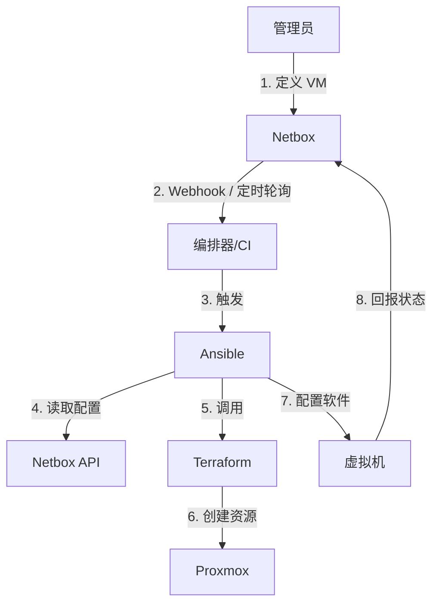

# 设计方案：Netbox 驱动的自动化部署 (Netbox-Driven Provisioning)

**日期**: 2025-12-04
**状态**: 草案 (Draft)

## 1. 目标与愿景

目前我们的工作流是 **Code-First** (Terraform -> Netbox)。
新的目标是转向 **Netbox-First** (Netbox -> Automation -> Infrastructure)。

即：**Netbox 作为唯一的真理来源 (Source of Truth)**。
管理员在 Netbox 界面上规划一台新 VM（定义 IP、资源、服务），自动化系统检测到这个“意图 (Intent)”，并自动在 Proxmox 上创建它。

## 2. 架构概览



## 3. 核心组件与实现路径

### 3.1 第一阶段：Netbox 作为动态 Inventory (已成熟)

Ansible 原生支持将 Netbox 作为 Inventory 源。这意味着我们不再需要维护 `hosts.yml`。

*   **配置**: 使用 `netbox.netbox.nb_inventory` 插件。
*   **效果**: Ansible 运行时，自动查询 Netbox，获取所有状态为 `active` 或 `planned` 的主机，并根据 Site/Role 分组。
*   **优势**: 实现了“在 Netbox 加一台机器，Ansible 就能立刻连上它（如果它存在的话）”。

### 3.2 第二阶段：资源创建 (Provisioning) - 难点

这是你提到的“工程量比较大”的部分。因为 Ansible 擅长配置**已存在**的主机，而不擅长**凭空创造**主机（虽然也能做，但不如 Terraform 优雅）。

**方案 A：Ansible 包装 Terraform (推荐)**
1.  **数据源**: Ansible 从 Netbox 读取所有标记为 `planned` 或 `staged` 的 VM 列表。
2.  **变量传递**: Ansible 将这些 VM 的参数（CPU, Mem, IP, Disk）提取出来，生成一个 `terraform.tfvars.json` 文件。
3.  **执行**: Ansible 调用 `terraform apply`。
4.  **Terraform**: 使用通用的 `proxmox_vm` 模块，根据传入的变量列表，批量创建 VM。

**方案 B：纯 Ansible (Proxmox 模块)**
1.  Ansible 直接使用 `community.general.proxmox_kvm` 模块。
2.  **缺点**: 状态管理不如 Terraform。如果你在 Netbox 删了一个 VM，Ansible 很难自动去 Proxmox 删除它（除非写复杂的逻辑）。Terraform 则天然支持销毁。

### 3.3 第三阶段：触发机制 (Trigger)

如何告诉系统“Netbox 变了，快去干活”？

1.  **Webhook (实时)**:
    *   Netbox 配置 Webhook：当 `VirtualMachine` 创建/更新时，发送 POST 请求到 Jenkins/GitLab CI/AWX。
    *   **优点**: 响应快。
    *   **缺点**: 需要部署一个接收端服务。

2.  **定时任务 (Cron/Scheduled Pipeline) (起步推荐)**:
    *   每 15 分钟运行一次 CI Pipeline。
    *   Pipeline 步骤：
        1.  Ansible 从 Netbox 拉取“预期状态”。
        2.  Terraform 检查“实际状态”是否一致。
        3.  如果不一致，执行变更。

## 4. 实施步骤规划

1.  **配置 Dynamic Inventory**:
    *   创建 `inventory/netbox.yml` 配置文件。
    *   验证 Ansible 能否看到 Netbox 里的主机。

2.  **重构 Terraform**:
    *   目前的 Terraform 是硬编码的 (`resource "netbox_virtual_machine" "anki" ...`)。
    *   需要改为**数据驱动**：Terraform 不再定义“有哪些 VM”，而是定义“如何创建 VM”。
    *   Terraform 代码将变成类似：
        ```hcl
        variable "vms_from_netbox" { type = list(...) }
        
        module "vm" {
          for_each = var.vms_from_netbox
          source   = "./modules/proxmox-vm"
          # ...
        }
        ```

3.  **编写“胶水”层 (Ansible/Python)**:
    *   编写脚本从 Netbox API 提取数据，转换为 Terraform 需要的变量格式。

## 5. 潜在风险与注意事项

*   **循环依赖**: Netbox 定义了 VM -> Terraform 创建 VM -> Terraform 更新 Netbox (IP等)。需要小心处理，避免死循环。建议 Terraform **只读** Netbox 的定义，**只写** Proxmox。Netbox 的回写（如分配到的 IP）由 Ansible 在 OS 层面完成后上报。
*   **权限控制**: 自动化系统需要 Proxmox 的 Root/Admin 权限，安全至关重要。

## 6. 结论

这个方案将极大地提升自动化水平，实现 **Intent-Based Networking/Infrastructure**。
建议先从 **3.1 动态 Inventory** 开始，这步最容易落地且立竿见影。
